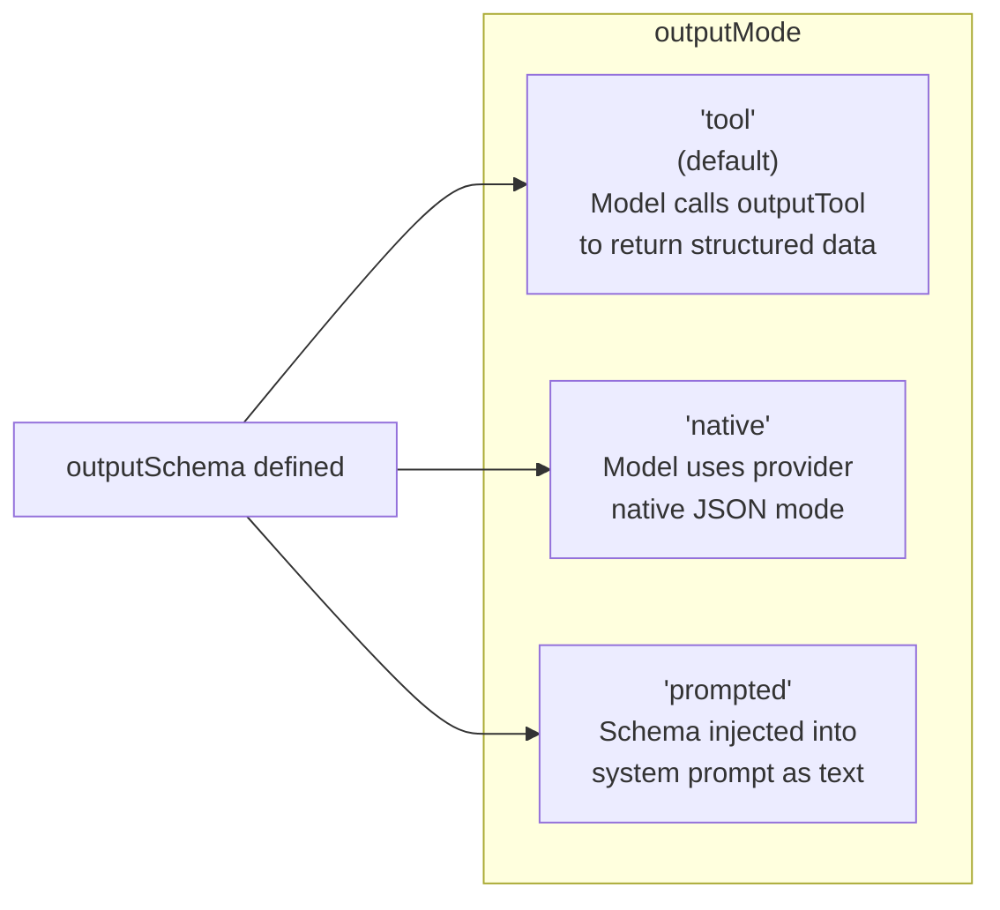

<objective>
Create four concept pages - toolsets, results, messages, and streaming - and update docs.json to add all eight new concept pages to the Concepts navigation group.

Purpose: Complete the Phase 2 concept set. These four pages cover advanced agent configuration (toolsets), output handling (results), conversation history (messages), and real-time streaming. The docs.json update makes all 8 pages navigable.

Output: Four MDX files under docs/concepts/ and an updated docs.json with correct Concepts navigation.
</objective>

<execution_context>
@/Users/atul/.claude/get-shit-done/workflows/execute-plan.md
@/Users/atul/.claude/get-shit-done/templates/summary.md
</execution_context>

<context>
@.planning/PROJECT.md
@.planning/phases/02-core-concepts-part-1/02-RESEARCH.md

<!-- Key source files for verified API examples -->
@lib/types/events.ts
@lib/types/results.ts
@lib/types/output_mode.ts
@lib/history/processor.ts
@lib/history/serialization.ts
@lib/toolsets/function_toolset.ts
@lib/toolsets/prepared_toolset.ts
@mod.ts

<!-- Existing docs with content to improve -->
@docs/reference/core/toolsets.mdx
@docs/reference/core/streaming.mdx
@docs/reference/core/structured-output.mdx
@docs/reference/core/result-validators.mdx
@docs/reference/advanced/message-history.mdx

<!-- docs.json to update -->
@docs/docs.json
</context>

<interfaces>
<!-- Verified types from RESEARCH.md - use exactly as documented -->

AgentStreamEvent (from lib/types/events.ts) - discriminated union on event.KIND (NOT event.type):
  "turn-start"      → { turn: number }
  "text-delta"      → { delta: string }
  "tool-call-start" → { toolName, toolCallId, args }
  "tool-call-result"→ { toolCallId, toolName, result }
  "partial-output"  → { partial: unknown }
  "usage-update"    → { usage: Usage }
  "final-result"    → { output: TOutput }
  "error"           → { error: unknown }

StreamResult<TOutput> (from lib/types/results.ts) - COMPLETE interface:
  textStream: AsyncIterable<string>
  partialOutput: AsyncIterable<TOutput>   (tool outputMode only)
  output: Promise<TOutput>
  messages: Promise<ModelMessage[]>
  newMessages: Promise<ModelMessage[]>    (DO NOT OMIT - this was missing in old docs)
  usage: Promise<Usage>

OutputMode (from lib/types/output_mode.ts): 'tool' | 'native' | 'prompted'

History processors (from lib/history/processor.ts):
  trimHistoryProcessor(maxMessages: number)
  tokenTrimHistoryProcessor(maxTokens: number)
  summarizeHistoryProcessor(model, options?)
  privacyFilterProcessor(rules: PrivacyRule[])

Serialization (from lib/history/serialization.ts):
  serializeMessages(messages: ModelMessage[]): string
  deserializeMessages(json: string): ModelMessage[]

Toolset types (all from mod.ts exports):
  FunctionToolset, CombinedToolset, FilteredToolset, PrefixedToolset,
  RenamedToolset, PreparedToolset, WrapperToolset, ApprovalRequiredToolset, ExternalToolset
</interfaces>

<tasks>

<task type="auto">
  <name>Task 1: Create toolsets.mdx and results.mdx</name>
  <files>docs/concepts/toolsets.mdx, docs/concepts/results.mdx</files>
  <action>
Create two MDX files.

--- docs/concepts/toolsets.mdx ---

1. Frontmatter: title "Toolsets", description "Toolsets are collections of tools resolved per turn..."

2. Opening: Explain toolsets as dynamic, per-turn tool groups. Unlike the static tools array, toolsets are resolved at runtime and can depend on context (deps, user state, etc).

3. Mermaid diagram - paste verbatim from RESEARCH.md "CONCEPT-05: Toolset Composition":
   Shows agent per-turn → resolveTools → agent.tools (static) + agent.toolsets → each toolset type resolving → flat ToolDefinition list sent to model

4. Section "FunctionToolset - Basic Toolset" - show new FunctionToolset([searchTool, fetchTool]) and myToolset.addTool(anotherTool). Use for simple grouping of related tools.

5. Section "FilteredToolset - Conditional Tools" - show new FilteredToolset(innerToolset, (ctx) => ctx.deps.isAdmin). The entire toolset is hidden when predicate returns false.

6. Section "PreparedToolset - Per-Turn Filtering" - show the PreparedToolset example from RESEARCH.md (filter out 'delete' tool unless ctx.deps.confirmed). Explain the difference from FilteredToolset: PreparedToolset can return a subset of tools, FilteredToolset is all-or-nothing.

7. Section "CombinedToolset - Merging Toolsets" - show new CombinedToolset([toolsetA, toolsetB]). Note: last name wins on conflict.

8. Section "PrefixedToolset - Namespacing" - show new PrefixedToolset(innerToolset, "admin_"). All tool names get the prefix.

9. Section "RenamedToolset - Custom Names" - show new RenamedToolset(innerToolset, { old_name: "new_name" }).

10. Section "WrapperToolset - Middleware" - brief description. WrapperToolset wraps another toolset and intercepts execute calls. Use for logging, tracing, or input/output transformation.

11. Section "ApprovalRequiredToolset - Mark All for Approval" - brief description. Wraps a toolset and marks every tool as requiresApproval: true. Use when you want to require approval for a whole group of tools.

12. Section "ExternalToolset - Tools Without Zod Schemas" - brief description. For tools with pre-existing JSON schemas (e.g., from MCP). Parameters are passed as raw JSON.

13. Closing cards: link to concepts/tools, concepts/dependencies.

--- docs/concepts/results.mdx ---

1. Frontmatter: title "Results", description "Agent runs return RunResult or StreamResult..."

2. Opening: Explain that agent.run() returns RunResult and agent.stream() / agent.runStreamEvents() produce StreamResult. Both carry the output, message history, and token usage.

3. Mermaid diagram - output mode comparison using a simple table-style flowchart:

4. Section "Structured Output with outputSchema" - show Agent with outputSchema: z.object({ answer: z.string(), confidence: z.number() }). Show accessing result.output. Note output is typed based on the Zod schema.

5. Section "Output Modes" - explain each of the 3 modes from the interfaces block. Show code: outputMode: 'tool' (default), 'native', 'prompted'. Note: outputTemplate: true (boolean!) controls schema injection into system prompt.

6. Section "Union Types as outputSchema" - show outputSchema: [SchemaA, SchemaB] for discriminated unions. The model picks which schema applies.

7. Section "Result Validators" - explain ResultValidator as a post-parse validation function. Show: resultValidators: [(ctx, output) => { if (output.confidence < 0.5) throw new Error("Low confidence"); }]. Note maxRetries controls how many times the agent retries on validation failure.

8. Section "RunResult Interface" - reference table:
   output: TOutput, messages: ModelMessage[], newMessages: ModelMessage[], usage: Usage

9. Section "StreamResult Interface" - reference table with COMPLETE fields (include newMessages):
   textStream: AsyncIterable<string>, partialOutput: AsyncIterable<TOutput> (tool mode), output: Promise<TOutput>, messages: Promise<ModelMessage[]>, newMessages: Promise<ModelMessage[]>, usage: Promise<Usage>

10. Mintlify Warning callout: "outputTemplate is a boolean, not a string. Setting outputTemplate: true (the default) tells Vibes to inject the JSON schema description into the system prompt. You cannot customize the injected text."

11. Closing cards: link to concepts/streaming, concepts/messages.
  </action>
  <verify>
    <automated>test -f /Users/atul/Projects/personal/vibes/packages/framework/docs/concepts/toolsets.mdx && test -f /Users/atul/Projects/personal/vibes/packages/framework/docs/concepts/results.mdx && grep "PreparedToolset" /Users/atul/Projects/personal/vibes/packages/framework/docs/concepts/toolsets.mdx && grep "newMessages" /Users/atul/Projects/personal/vibes/packages/framework/docs/concepts/results.mdx</automated>
  </verify>
  <done>docs/concepts/toolsets.mdx exists with the composition Mermaid diagram and all 9 toolset types. docs/concepts/results.mdx exists with all 3 output modes documented and the complete StreamResult interface (including newMessages).</done>
</task>

<task type="auto">
  <name>Task 2: Create messages.mdx and streaming.mdx</name>
  <files>docs/concepts/messages.mdx, docs/concepts/streaming.mdx</files>
  <action>
Create two MDX files.

--- docs/concepts/messages.mdx ---

1. Frontmatter: title "Messages and Chat History", description "Managing conversation context with result.messages and history processors..."

2. Opening: Explain that every agent run produces a list of ModelMessage objects. Passing these back in the next run continues the conversation. History processors allow transforming, trimming, or filtering messages before each turn.

3. Mermaid sequence diagram - paste verbatim from RESEARCH.md "CONCEPT-07: Multi-Turn Sequence Diagram":
   Shows App → Agent (run "My name is Alice.") → Model → Agent → App (RunResult messages), then App → Agent (run "What is my name?" with messageHistory) → Model with full history → Agent → App (RunResult with messages + newMessages)

4. Section "Multi-Turn Conversations" - show the multi-turn example from RESEARCH.md CONCEPT-07:
   const first = await agent.run("My name is Alice.");
   const second = await agent.run("What is my name?", { messageHistory: first.messages });
   Explain result.messages (full history) vs result.newMessages (only new messages from this run).

5. Section "Message Serialization" - show serializeMessages and deserializeMessages usage:
   const json = serializeMessages(result.messages);  // store to DB or file
   const messages = deserializeMessages(json);         // restore for next session
   Import from "@vibes/framework".

6. Section "History Processors" - explain that historyProcessors run before each turn and can trim, summarize, or filter messages. They receive (messages: ModelMessage[], ctx: RunContext<TDeps>) and return transformed messages.

7. Subsection "trimHistoryProcessor" - keep the last N messages: trimHistoryProcessor(20)
8. Subsection "tokenTrimHistoryProcessor" - trim to token budget: tokenTrimHistoryProcessor(4000)
9. Subsection "summarizeHistoryProcessor" - summarize old messages: summarizeHistoryProcessor(model, { maxMessages: 10 })
10. Subsection "privacyFilterProcessor" - filter sensitive content. Show CORRECT PrivacyRule shapes (from interfaces block - same patterns as dependencies.mdx):
    { pattern: /\d{4}-\d{4}-\d{4}-\d{4}/g, replacement: "[CARD]" }   // RegexPrivacyRule
    { messageType: "tool", fieldPath: "content.0.result.ssn" }         // FieldPrivacyRule
    CRITICAL: Do NOT use { type: "regex", redactValue: ... } syntax.

11. Section "Custom History Processors" - show a simple custom processor function: (messages, ctx) => messages.filter(m => ...).

12. Closing cards: link to concepts/streaming, concepts/agents.

--- docs/concepts/streaming.mdx ---

1. Frontmatter: title "Streaming", description "Real-time token and event streaming with agent.stream() and agent.runStreamEvents()..."

2. Opening: Explain two streaming modes: agent.stream() for simple text/output streaming, agent.runStreamEvents() for granular event-level control. Use stream() for most cases; runStreamEvents() for building observability or custom UIs.

3. Mermaid sequence diagram - paste verbatim from RESEARCH.md "CONCEPT-08: Streaming Event Timeline":
   Shows App → Agent (runStreamEvents) → turn-start → Agent → Model (generateText streaming) → text-delta events → tool-call-start → tool-call-result → usage-update → second turn → turn-start → text-delta → final-result → usage-update

4. Section "agent.stream() - Simple Streaming" - show the full StreamResult usage from RESEARCH.md CONCEPT-08:
   - for await...of stream.textStream to print tokens
   - await stream.output for final output
   - await stream.messages for full message history
   - await stream.newMessages for new messages
   - await stream.usage for token usage
   - for await...of stream.partialOutput for progressive structured output (tool outputMode only)

5. Section "agent.runStreamEvents() - Event Stream" - show the complete switch statement from RESEARCH.md CONCEPT-08 that handles all 8 event kinds.
   CRITICAL: Use event.kind NOT event.type. The correct event names are:
   "turn-start", "text-delta", "tool-call-start", "tool-call-result", "partial-output", "usage-update", "final-result", "error"
   NOT "run-complete", NOT "tool-call" - those are wrong names from the old docs.

6. Section "AgentStreamEvent Reference" - table from RESEARCH.md API Reference section:
   turn-start, text-delta, tool-call-start, tool-call-result, partial-output, usage-update, final-result, error - with Extra Fields and When Emitted columns.

7. Section "When to Use Which" - comparison table:
   | Use Case | API |
   |----------|-----|
   | Stream text to user UI | agent.stream() + textStream |
   | Await final structured output | agent.stream() + output |
   | Observe tool calls in real time | agent.runStreamEvents() |
   | Build custom progress indicators | agent.runStreamEvents() |
   | Log every turn and tool for debugging | agent.runStreamEvents() |

8. Mintlify Warning callout: "The event discriminant is event.kind, not event.type. The existing reference/core/streaming.mdx page has this bug - always use event.kind."

9. Closing cards: link to concepts/messages, concepts/results.
  </action>
  <verify>
    <automated>test -f /Users/atul/Projects/personal/vibes/packages/framework/docs/concepts/messages.mdx && test -f /Users/atul/Projects/personal/vibes/packages/framework/docs/concepts/streaming.mdx && grep "event\.kind" /Users/atul/Projects/personal/vibes/packages/framework/docs/concepts/streaming.mdx && grep -v "event\.type" /Users/atul/Projects/personal/vibes/packages/framework/docs/concepts/streaming.mdx</automated>
  </verify>
  <done>docs/concepts/messages.mdx exists with multi-turn sequence diagram, all 4 history processors with correct PrivacyRule shapes, and serializeMessages/deserializeMessages. docs/concepts/streaming.mdx exists with event timeline diagram and uses event.kind (not event.type) with correct event names.</done>
</task>

<task type="auto">
  <name>Task 3: Update docs.json to add all 8 concept pages to navigation</name>
  <files>docs/docs.json</files>
  <action>
Update docs/docs.json to add all 8 new concept pages to the Concepts navigation group.

Read the current docs.json (it has the Concepts group with only 3 pages: concepts/how-agents-work, concepts/dependency-injection, concepts/error-handling).

Replace the Concepts group pages array with all 11 pages in pedagogical order:
  1. concepts/agents           (new - replaces how-agents-work conceptually but keep old page)
  2. concepts/models           (new)
  3. concepts/dependencies     (new - replaces dependency-injection conceptually but keep old page)
  4. concepts/tools            (new)
  5. concepts/toolsets         (new)
  6. concepts/results          (new)
  7. concepts/messages         (new)
  8. concepts/streaming        (new)
  9. concepts/how-agents-work  (existing - keep for now, Phase 6 removes it)
  10. concepts/dependency-injection (existing - keep for now, Phase 6 removes it)
  11. concepts/error-handling  (existing - keep for now, Phase 6 removes it)

Do NOT delete or move the Reference: Core, Reference: Advanced, Integrations, or Meta groups - those stay until Phase 6.

The updated navigation.groups Concepts entry should look like:
{
  "group": "Concepts",
  "pages": [
    "concepts/agents",
    "concepts/models",
    "concepts/dependencies",
    "concepts/tools",
    "concepts/toolsets",
    "concepts/results",
    "concepts/messages",
    "concepts/streaming",
    "concepts/how-agents-work",
    "concepts/dependency-injection",
    "concepts/error-handling"
  ]
}

Write the updated docs.json back preserving all other content exactly (schema, theme, name, colors, topbarCtaButton, anchors, all other nav groups, footerSocials).
  </action>
  <verify>
    <automated>grep "concepts/agents" /Users/atul/Projects/personal/vibes/packages/framework/docs/docs.json && grep "concepts/streaming" /Users/atul/Projects/personal/vibes/packages/framework/docs/docs.json && node -e "JSON.parse(require('fs').readFileSync('/Users/atul/Projects/personal/vibes/packages/framework/docs/docs.json','utf8')); console.log('valid JSON')"</automated>
  </verify>
  <done>docs.json is valid JSON and the Concepts nav group contains all 8 new concept pages plus the 3 existing pages. No other nav groups are changed.</done>
</task>

</tasks>

<verification>
After all tasks:
1. Run: `ls /Users/atul/Projects/personal/vibes/packages/framework/docs/concepts/*.mdx` - should show 8 new files plus the 3 existing ones
2. Run: `grep -c "mermaid" /Users/atul/Projects/personal/vibes/packages/framework/docs/concepts/streaming.mdx` - should be >= 1
3. Run: `grep "event\.type" /Users/atul/Projects/personal/vibes/packages/framework/docs/concepts/streaming.mdx` - should return nothing (no wrong discriminant)
4. Run: `grep "event\.kind" /Users/atul/Projects/personal/vibes/packages/framework/docs/concepts/streaming.mdx` - should return matches
5. Run: `grep "newMessages" /Users/atul/Projects/personal/vibes/packages/framework/docs/concepts/streaming.mdx` - should return matches (StreamResult completeness)
6. Run: `node -e "JSON.parse(require('fs').readFileSync('docs/docs.json','utf8')); console.log('valid')"` from docs dir - should print "valid"
7. Run: `grep "concepts/agents" /Users/atul/Projects/personal/vibes/packages/framework/docs/docs.json` - should show the entry
</verification>

<success_criteria>
- docs/concepts/toolsets.mdx exists with composition Mermaid diagram and all 9 toolset types
- docs/concepts/results.mdx exists with all 3 output modes, outputTemplate correctly documented as boolean, and complete StreamResult interface with newMessages
- docs/concepts/messages.mdx exists with multi-turn sequence Mermaid diagram, all 4 history processors, correct PrivacyRule shapes, and serializeMessages/deserializeMessages
- docs/concepts/streaming.mdx exists with event timeline Mermaid diagram, uses event.kind (not event.type), lists correct event names (final-result not run-complete, tool-call-start not tool-call)
- docs/docs.json is valid JSON with all 8 new concept pages in the Concepts navigation group
</success_criteria>

<output>
After completion, create `.planning/phases/02-core-concepts-part-1/02-02-SUMMARY.md`
</output>
