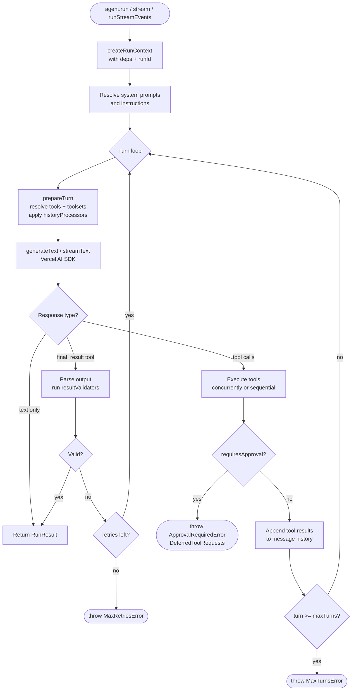
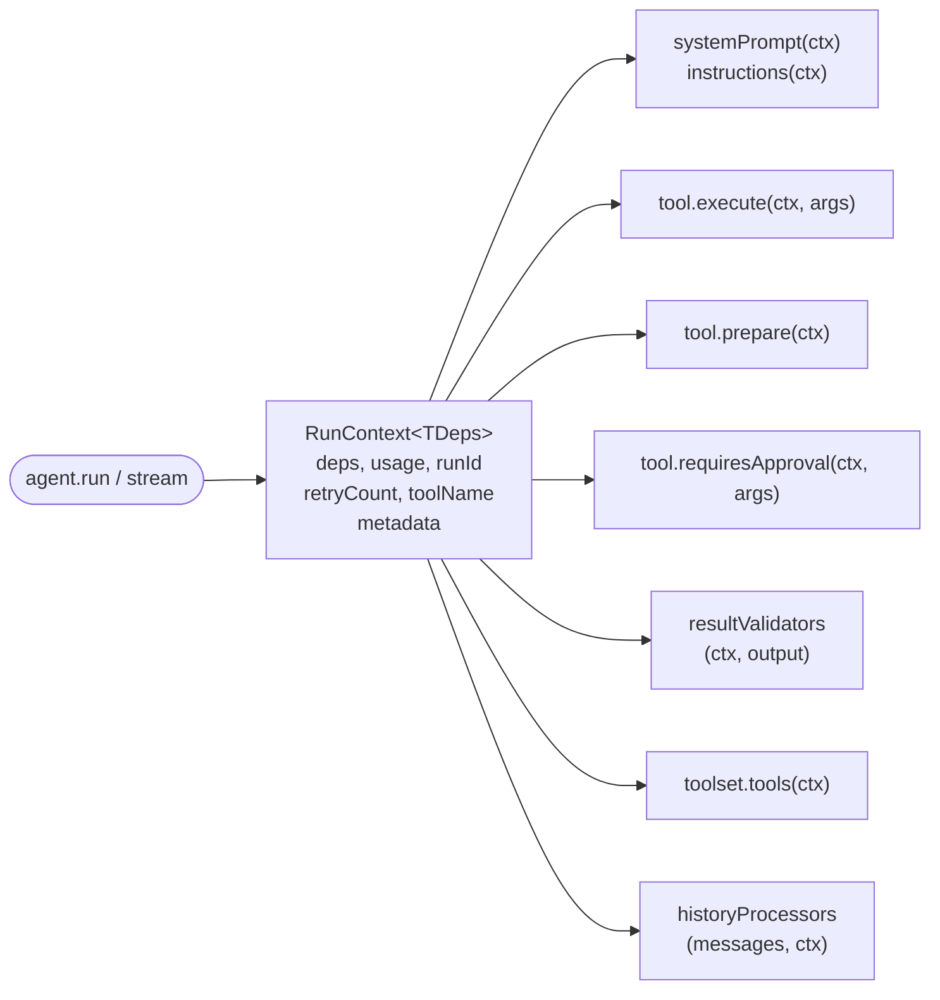
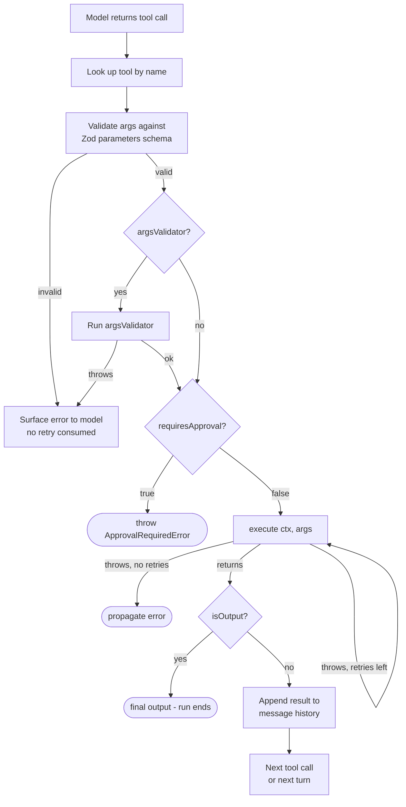
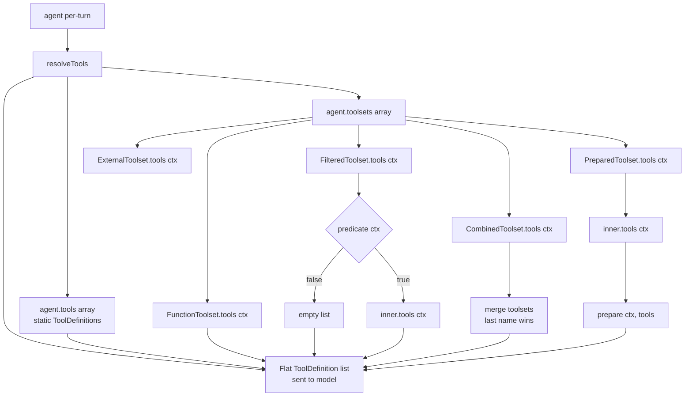
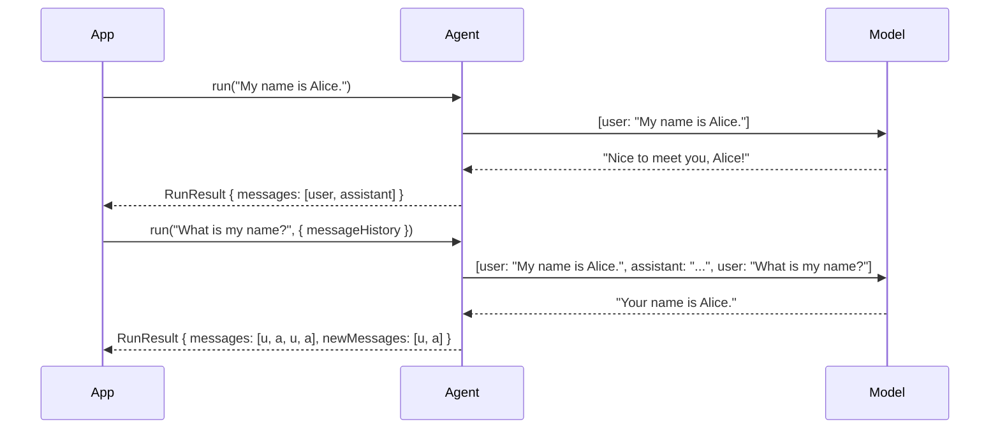
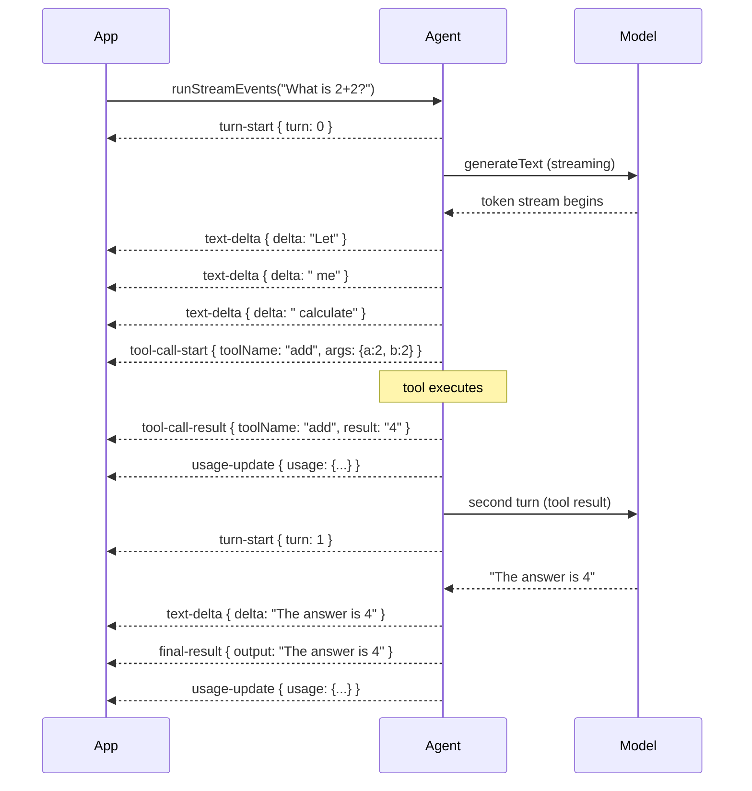

# Phase 2: Core Concepts Part 1 - Research

**Researched:** 2026-03-14
**Domain:** Vibes Agent Framework API documentation - 8 concept pages (agents, models, deps, tools, toolsets, results, messages, streaming)
**Confidence:** HIGH

---

## Summary

Phase 2 creates eight deep-dive concept pages that form the pedagogical core of the Vibes documentation. Every page covers one major abstraction of `@vibes/framework`, with a teaching narrative, at least one Mermaid diagram, and working code examples verified against the actual `mod.ts` exports.

The existing docs have most of this content scattered across `docs/reference/core/`, `docs/concepts/`, and `docs/reference/advanced/`. Phase 2 consolidates and rewrites these pages under a unified `docs/concepts/` structure following the Pydantic AI teaching style: explain the concept → show the Mermaid flow → walk through each API feature → close with a complete real-world example.

All eight pages share the same base API contract: every code example must use actual exports from `mod.ts`. No invented APIs. The key inaccuracy in the current `docs/reference/core/streaming.mdx` is that `AgentStreamEvent` uses `event.kind` as the discriminant (NOT `event.type`), and the event names differ from what is documented (e.g., `"tool-call-start"` not `"tool-call"`, `"final-result"` not `"run-complete"`). This must be fixed in the new Streaming page.

**Primary recommendation:** Create all eight pages under `docs/concepts/` with new MDX files. Reuse good content from the existing reference pages but correct API inaccuracies, add Mermaid diagrams, and expand thin sections.

---

<phase_requirements>
## Phase Requirements

| ID | Description | Research Support |
|----|-------------|-----------------|
| CONCEPT-01 | Agents page - Agent class deep dive, constructor options, type params `<TDeps,TOutput>`, system prompts, instructions, `agent.override()`, full agent loop Mermaid flowchart | `lib/agent.ts` fully analyzed; `AgentOptions`, `RunOptions`, `AgentOverrideOptions`, all methods documented below |
| CONCEPT-02 | Models page - Vercel AI SDK model layer, quickstarts for 7 providers, ModelSettings | `lib/types/model_settings.ts` read; provider table from `docs/getting-started/install.mdx` reusable; Vercel AI SDK is `npm:ai@^6` per `deno.json` |
| CONCEPT-03 | Dependencies page - RunContext DI as signature feature, fan-out diagram | `lib/types/context.ts` fully read; existing `docs/concepts/dependency-injection.mdx` has most content but needs Mermaid fan-out diagram |
| CONCEPT-04 | Tools page - all 4 tool factories, `prepare`, `argsValidator`, `requiresApproval`, `sequential`, execution pipeline diagram | `lib/tool.ts` fully read; existing `docs/reference/core/tools.mdx` has most content; needs execution pipeline Mermaid |
| CONCEPT-05 | Toolsets page - all toolset types, composition diagram, per-turn resolution sequence | `lib/toolsets/*.ts` all read; existing `docs/reference/core/toolsets.mdx` has good content; needs composition and resolution sequence diagrams |
| CONCEPT-06 | Results page - `outputSchema`, union types, 3 output modes, result validators, retry flow | `lib/types/output_mode.ts`, `lib/types/results.ts`, `lib/execution/output_schema.ts` analyzed; existing structured-output and result-validators pages cover this |
| CONCEPT-07 | Messages and Chat History page - `result.messages`, `result.newMessages`, 4 history processors, `serializeMessages`/`deserializeMessages`, multi-turn sequence diagram | `lib/history/processor.ts` and `lib/history/serialization.ts` fully read; existing `message-history.mdx` has good content; needs multi-turn sequence Mermaid |
| CONCEPT-08 | Streaming page - `agent.stream()`, `agent.runStreamEvents()`, `textStream`, `partialOutput`, all event kinds, event timeline sequence diagram | `lib/types/events.ts` and `lib/types/results.ts` read; existing streaming page has bug (`event.type` should be `event.kind`); needs correction and event timeline Mermaid |
</phase_requirements>

---

## Standard Stack

### Doc Tooling
| Library | Version | Purpose | Why Standard |
|---------|---------|---------|--------------|
| Mintlify | current | Documentation site | Already configured, 34 MDX pages live |
| MDX | - | Page format | Mintlify's format |
| Mermaid | - | Diagrams | Natively rendered via ` ```mermaid ` code fences; no plugins needed |

### Framework API Surface (used in examples)

All of these are actual exports from `mod.ts` - verified:

| Export | Purpose | Used In |
|--------|---------|---------|
| `Agent` | Core agent class | All 8 pages |
| `tool` | Tool factory with RunContext | CONCEPT-01, CONCEPT-04 |
| `plainTool` | Tool factory without RunContext | CONCEPT-04 |
| `outputTool` | Terminal tool factory | CONCEPT-04 |
| `fromSchema` | Tool from raw JSON Schema | CONCEPT-04 |
| `RunContext` (type) | DI context interface | CONCEPT-03 |
| `RunResult` (type) | Non-streaming result | CONCEPT-06 |
| `StreamResult` (type) | Streaming result | CONCEPT-08 |
| `AgentStreamEvent` (type) | Event union for runStreamEvents | CONCEPT-08 |
| `HistoryProcessor` (type) | Message transform function | CONCEPT-07 |
| `trimHistoryProcessor` | Built-in history processor | CONCEPT-07 |
| `tokenTrimHistoryProcessor` | Built-in history processor | CONCEPT-07 |
| `summarizeHistoryProcessor` | Built-in history processor | CONCEPT-07 |
| `privacyFilterProcessor` | Built-in history processor | CONCEPT-07 |
| `serializeMessages` | Serialize messages to JSON | CONCEPT-07 |
| `deserializeMessages` | Deserialize messages from JSON | CONCEPT-07 |
| `Toolset` (type) | Toolset interface | CONCEPT-05 |
| `FunctionToolset` | Simple toolset wrapper | CONCEPT-05 |
| `CombinedToolset` | Merge toolsets | CONCEPT-05 |
| `FilteredToolset` | Conditional toolset | CONCEPT-05 |
| `PrefixedToolset` | Namespaced toolset | CONCEPT-05 |
| `RenamedToolset` | Renamed tool names | CONCEPT-05 |
| `PreparedToolset` | Per-turn tool list modifier | CONCEPT-05 |
| `WrapperToolset` | Middleware-style tool interception | CONCEPT-05 |
| `ApprovalRequiredToolset` | Mark all tools as approval-required | CONCEPT-05 |
| `ExternalToolset` | Tools without Zod schemas | CONCEPT-05 |
| `ResultValidator` (type) | Output validator function | CONCEPT-06 |
| `ModelSettings` (type) | Temperature, maxTokens, etc. | CONCEPT-02 |
| `OutputMode` (type) | `'tool' \| 'native' \| 'prompted'` | CONCEPT-06 |
| `ModelMessage` (type, re-exported from `ai`) | Message type | CONCEPT-07 |
| `z` (Zod) | Schema definition | All pages with schemas |

### Provider Packages (used in Models page quickstarts)

| Provider | Package | Env Var |
|----------|---------|---------|
| Anthropic | `@ai-sdk/anthropic` | `ANTHROPIC_API_KEY` |
| OpenAI | `@ai-sdk/openai` | `OPENAI_API_KEY` |
| Google Gemini | `@ai-sdk/google` | `GOOGLE_GENERATIVE_AI_API_KEY` |
| Groq | `@ai-sdk/groq` | `GROQ_API_KEY` |
| Mistral | `@ai-sdk/mistral` | `MISTRAL_API_KEY` |
| Ollama | `ollama-ai-provider` | (none - local) |
| OpenAI-compatible | `@ai-sdk/openai` with custom `baseURL` | varies |

---

## Architecture Patterns

### Recommended Page Structure for Phase 2

```
docs/concepts/
  agents.mdx             # NEW - replaces concepts/how-agents-work.mdx
  models.mdx             # NEW - no equivalent exists yet
  dependencies.mdx       # NEW - replaces concepts/dependency-injection.mdx
  tools.mdx              # NEW - replaces reference/core/tools.mdx
  toolsets.mdx           # NEW - replaces reference/core/toolsets.mdx
  results.mdx            # NEW - merges reference/core/structured-output.mdx + reference/core/result-validators.mdx
  messages.mdx           # NEW - replaces reference/advanced/message-history.mdx
  streaming.mdx          # NEW - replaces reference/core/streaming.mdx
```

Each page URL is `concepts/{slug}` which becomes the nav path in `docs.json`.

### Pattern: Pydantic AI Teaching Flow Per Page

Each concept page follows this structure:
1. Frontmatter (`title`, `description`)
2. 1-2 sentence intro - "what is this and why does it exist"
3. Mermaid diagram showing the concept visually
4. Core usage sections with code examples
5. Reference table of all options/fields
6. Anti-patterns / common pitfalls callout
7. "Next" card links to related pages

### Anti-Patterns to Avoid

- **Don't write reference-only pages:** Concept pages must teach, not just enumerate options. The existing `reference/core/agents.mdx` does not have a Mermaid diagram or teach the agent loop - avoid repeating that.
- **Don't invent API fields:** Cross-check every code example against `mod.ts`. The existing `streaming.mdx` uses `event.type` (wrong) and `"run-complete"` (wrong) - the real discriminant is `event.kind` and the event is `"final-result"`.
- **Don't duplicate the install page:** The Models page should link to `getting-started/install` for setup steps, not repeat them.

---

## Don't Hand-Roll

| Problem | Don't Build | Use Instead | Why |
|---------|-------------|-------------|-----|
| Mermaid diagrams | Custom SVG | Mermaid code fences in MDX | Mintlify renders natively |
| Provider auth examples | Custom OAuth | Environment variable snippets | That's the actual pattern |
| Type documentation | Markdown tables re-typed manually | Extract directly from source files | Prevents drift |

---

## Common Pitfalls

### Pitfall 1: Wrong AgentStreamEvent Discriminant Key

**What goes wrong:** Using `event.type` as the switch key instead of `event.kind`.
**Why it happens:** The existing `docs/reference/core/streaming.mdx` has this bug. The old doc says `event.type` and lists events like `"run-complete"` and `"tool-call"`. The actual `lib/types/events.ts` declares `event.kind` with values `"turn-start"`, `"text-delta"`, `"tool-call-start"`, `"tool-call-result"`, `"partial-output"`, `"final-result"`, `"usage-update"`, `"error"`.
**How to avoid:** Always derive event examples directly from `lib/types/events.ts`.
**Warning signs:** Any example using `event.type` or `event.kind === "run-complete"` is wrong.

### Pitfall 2: Wrong outputTemplate Type

**What goes wrong:** Documenting `outputTemplate` as accepting a string template.
**Why it happens:** The `docs/reference/core/structured-output.mdx` shows `outputTemplate: "Respond ONLY with a JSON object..."` as a string, but `lib/agent.ts` declares it as `outputTemplate?: boolean`. The boolean controls whether the framework injects the schema into the system prompt at all, not what text to use.
**How to avoid:** Read `lib/agent.ts` AgentOptions carefully. `outputTemplate` is `boolean`, defaults to `true`.
**Warning signs:** Any example passing a string to `outputTemplate`.

### Pitfall 3: StreamResult.newMessages Missing from Docs

**What goes wrong:** Omitting `newMessages` from the StreamResult API table.
**Why it happens:** The existing streaming page documents `textStream`, `output`, `messages`, `usage` but omits `newMessages`. The actual `StreamResult<TOutput>` interface in `lib/types/results.ts` includes `newMessages: Promise<ModelMessage[]>`.
**How to avoid:** Use the full interface from `lib/types/results.ts` as the source of truth.

### Pitfall 4: Dependencies Page Using Wrong privacyFilterProcessor Rule Shape

**What goes wrong:** Using `{ type: "regex", pattern: ..., redactValue: ... }` syntax.
**Why it happens:** The existing `docs/concepts/dependency-injection.mdx` historyProcessors section uses this incorrect shape. The real `PrivacyRule` type in `lib/history/processor.ts` uses `{ pattern: RegExp, replacement?: string }` for regex rules (no `type` key, no `redactValue`).
**How to avoid:** Read `lib/history/processor.ts` for the correct `PrivacyRule` union types.

### Pitfall 5: RunContext Metadata Fields Missing

**What goes wrong:** Documenting `RunContext` with only `deps`, `usage`, `runId`, `metadata` but omitting `retryCount`, `toolName`, `toolResultMetadata`, and `attachMetadata()`.
**Why it happens:** The existing `concepts/how-agents-work.mdx` RunContext section lists only 4 fields. The actual interface in `lib/types/context.ts` has 7 fields + 1 method.
**How to avoid:** Use the full interface from `lib/types/context.ts`.

---

## Code Examples

All code examples in Phase 2 pages must use these verified patterns.

### CONCEPT-01: Minimal Agent

```typescript
// Source: lib/agent.ts - AgentOptions interface
import { Agent } from "@vibes/framework";
import { anthropic } from "@ai-sdk/anthropic";

const agent = new Agent({
  model: anthropic("claude-haiku-4-5-20251001"),
  systemPrompt: "You are a helpful assistant.",
});

const result = await agent.run("Hello!");
console.log(result.output);
```

### CONCEPT-01: Agent with Type Parameters

```typescript
// Source: lib/agent.ts - Agent<TDeps, TOutput>
type Deps = { db: Database };

const agent = new Agent<Deps, string>({
  model: anthropic("claude-haiku-4-5-20251001"),
  systemPrompt: (ctx) => `Helping user from ${ctx.deps.db.region}`,
});
```

### CONCEPT-01: agent.override()

```typescript
// Source: lib/agent.ts - override() method
const result = await agent
  .override({ model: testModel, maxTurns: 3 })
  .run("Test prompt", { deps: fakeDeps });
```

### CONCEPT-02: Provider Quickstart (Anthropic)

```typescript
// Source: docs/getting-started/install.mdx pattern
import { Agent } from "@vibes/framework";
import { anthropic } from "@ai-sdk/anthropic";

const agent = new Agent({
  model: anthropic("claude-sonnet-4-6"),
  systemPrompt: "You are helpful.",
});
```

### CONCEPT-02: OpenAI-Compatible Provider

```typescript
// Source: Vercel AI SDK createOpenAI pattern
import { createOpenAI } from "@ai-sdk/openai";

const custom = createOpenAI({
  baseURL: "https://my-provider.example.com/v1",
  apiKey: Deno.env.get("MY_API_KEY"),
});

const agent = new Agent({
  model: custom("my-model"),
});
```

### CONCEPT-03: RunContext Full Interface (Correct)

```typescript
// Source: lib/types/context.ts
interface RunContext<TDeps = undefined> {
  deps: TDeps;                                    // injected dependencies
  usage: Usage;                                   // token usage so far
  retryCount: number;                             // result validation retries
  toolName: string | null;                        // current tool name (or null)
  runId: string;                                  // unique run identifier
  metadata: Record<string, unknown>;              // per-run metadata from caller
  toolResultMetadata: Map<string, Record<string, unknown>>; // metadata attached by tools
  attachMetadata(toolCallId: string, meta: Record<string, unknown>): void;
}
```

### CONCEPT-04: tool() Factory

```typescript
// Source: lib/tool.ts
import { tool } from "@vibes/framework";
import { z } from "zod";

type Deps = { db: Database };

const search = tool<Deps>({
  name: "search",
  description: "Search the database",
  parameters: z.object({ query: z.string() }),
  execute: async (ctx, { query }) => ctx.deps.db.search(query),
  argsValidator: ({ query }) => {
    if (query.length < 3) throw new Error("Query too short");
  },
  prepare: async (ctx) => ctx.deps.db.isConnected() ? undefined : null,
  requiresApproval: false,
  sequential: false,
  maxRetries: 1,
});
```

### CONCEPT-04: plainTool() Factory

```typescript
// Source: lib/tool.ts
import { plainTool } from "@vibes/framework";

const add = plainTool({
  name: "add",
  description: "Add two numbers",
  parameters: z.object({ a: z.number(), b: z.number() }),
  execute: async ({ a, b }) => String(a + b),
});
```

### CONCEPT-04: outputTool() Factory

```typescript
// Source: lib/tool.ts
import { outputTool } from "@vibes/framework";

const done = outputTool({
  name: "done",
  description: "Return the final answer",
  parameters: z.object({ answer: z.string(), confidence: z.number() }),
  execute: async (_ctx, args) => args,
});
```

### CONCEPT-04: fromSchema() Factory

```typescript
// Source: lib/tool.ts
import { fromSchema } from "@vibes/framework";

const legacy = fromSchema({
  name: "legacy_api",
  description: "Call a legacy API",
  jsonSchema: {
    type: "object",
    properties: { endpoint: { type: "string" } },
    required: ["endpoint"],
  },
  execute: async (_ctx, args) => callApi(args.endpoint as string),
});
```

### CONCEPT-05: FunctionToolset

```typescript
// Source: lib/toolsets/function_toolset.ts
import { FunctionToolset } from "@vibes/framework";

const myToolset = new FunctionToolset([searchTool, fetchTool]);
myToolset.addTool(anotherTool);
```

### CONCEPT-05: PreparedToolset

```typescript
// Source: lib/toolsets/prepared_toolset.ts
import { PreparedToolset } from "@vibes/framework";

const safe = new PreparedToolset(
  adminTools,
  (ctx, tools) => ctx.deps.confirmed
    ? tools
    : tools.filter((t) => t.name !== "delete"),
);
```

### CONCEPT-06: Results - outputSchema with outputMode

```typescript
// Source: lib/agent.ts AgentOptions + lib/types/output_mode.ts
const agent = new Agent<undefined, z.infer<typeof Schema>>({
  model,
  outputSchema: Schema,
  outputMode: "tool",   // default; alternatives: "native", "prompted"
  outputTemplate: true, // default; set false to suppress schema injection
});
```

### CONCEPT-07: Multi-Turn with Messages

```typescript
// Source: lib/types/results.ts RunResult interface
const first = await agent.run("My name is Alice.");
const second = await agent.run("What is my name?", {
  messageHistory: first.messages,  // continue the conversation
});
// result.newMessages = only messages added in this run
```

### CONCEPT-07: privacyFilterProcessor - Correct Rule Shape

```typescript
// Source: lib/history/processor.ts - PrivacyRule type
import { privacyFilterProcessor } from "@vibes/framework";

const agent = new Agent({
  model,
  historyProcessors: [
    privacyFilterProcessor([
      { pattern: /\d{4}-\d{4}-\d{4}-\d{4}/g, replacement: "[CARD]" }, // RegexPrivacyRule
      { messageType: "tool", fieldPath: "content.0.result.ssn" },       // FieldPrivacyRule
    ]),
  ],
});
```

### CONCEPT-08: stream() - Full StreamResult Interface

```typescript
// Source: lib/types/results.ts StreamResult<TOutput>
const stream = agent.stream("Tell me a story.");

// textStream: AsyncIterable<string>
for await (const chunk of stream.textStream) {
  process.stdout.write(chunk);
}

// Await the promises after consuming textStream
const output = await stream.output;          // Promise<TOutput>
const messages = await stream.messages;      // Promise<ModelMessage[]>
const newMessages = await stream.newMessages; // Promise<ModelMessage[]>
const usage = await stream.usage;            // Promise<Usage>

// partialOutput: AsyncIterable<TOutput> (only in 'tool' outputMode)
for await (const partial of stream.partialOutput) {
  console.log("Partial:", partial);
}
```

### CONCEPT-08: runStreamEvents() - Correct event.kind

```typescript
// Source: lib/types/events.ts AgentStreamEvent discriminated union
import type { AgentStreamEvent } from "@vibes/framework";

for await (const event of agent.runStreamEvents("What is 2 + 2?")) {
  switch (event.kind) {  // NOTE: .kind not .type
    case "turn-start":
      console.log(`Turn ${event.turn} started`);
      break;
    case "text-delta":
      process.stdout.write(event.delta);
      break;
    case "tool-call-start":
      console.log(`Calling ${event.toolName}`, event.args);
      break;
    case "tool-call-result":
      console.log(`Result from ${event.toolName}:`, event.result);
      break;
    case "partial-output":
      console.log("Partial output:", event.partial);
      break;
    case "usage-update":
      console.log("Usage:", event.usage);
      break;
    case "final-result":
      console.log("Done:", event.output);
      break;
    case "error":
      console.error("Error:", event.error);
      break;
  }
}
```

---

## Mermaid Diagrams

### CONCEPT-01: Agent Loop Flowchart



### CONCEPT-03: RunContext Fan-Out Diagram



### CONCEPT-04: Tool Execution Pipeline



### CONCEPT-05: Toolset Composition



### CONCEPT-07: Multi-Turn Sequence Diagram



### CONCEPT-08: Streaming Event Timeline



---

## API Reference: Complete Field Lists

### AgentOptions (CONCEPT-01)

| Field | Type | Default | Description |
|-------|------|---------|-------------|
| `name` | `string?` | - | Human-readable agent name |
| `model` | `LanguageModel` | required | Vercel AI SDK model instance |
| `systemPrompt` | `string \| (ctx) => string` | - | Base system prompt |
| `instructions` | `string \| (ctx) => string` | - | Per-run additions after systemPrompt |
| `tools` | `ToolDefinition<TDeps>[]` | `[]` | Static tools |
| `toolsets` | `Toolset<TDeps>[]` | `[]` | Dynamic per-turn tool groups |
| `outputSchema` | `ZodType \| ZodType[]` | - | Schema for structured output |
| `outputMode` | `'tool' \| 'native' \| 'prompted'` | `'tool'` | How to request structured output |
| `outputTemplate` | `boolean` | `true` | Whether to inject schema into system prompt |
| `resultValidators` | `ResultValidator<TDeps, TOutput>[]` | `[]` | Post-parse validators |
| `maxRetries` | `number` | `3` | Max validation retries |
| `maxTurns` | `number` | `10` | Max tool-call round trips |
| `usageLimits` | `UsageLimits?` | - | Cap token/request usage |
| `historyProcessors` | `HistoryProcessor<TDeps>[]` | `[]` | Per-turn message transforms |
| `modelSettings` | `ModelSettings?` | - | Temperature, maxTokens, etc. |
| `endStrategy` | `'early' \| 'exhaustive'` | `'early'` | When to stop after final_result |
| `maxConcurrency` | `number?` | unlimited | Max concurrent tool executions per turn |
| `telemetry` | `TelemetrySettings?` | - | OTel settings |

### RunContext<TDeps> (CONCEPT-03)

| Field | Type | Description |
|-------|------|-------------|
| `deps` | `TDeps` | User-supplied dependencies |
| `usage` | `Usage` | Accumulated token usage |
| `retryCount` | `number` | How many validation retries so far |
| `toolName` | `string \| null` | Current tool name (null outside tool.execute) |
| `runId` | `string` | Unique run identifier |
| `metadata` | `Record<string, unknown>` | Per-run caller metadata |
| `toolResultMetadata` | `Map<string, Record<string, unknown>>` | Metadata attached by tools |
| `attachMetadata(id, meta)` | `void` | Attach metadata for a tool call |

### AgentStreamEvent kinds (CONCEPT-08)

| `event.kind` | Extra Fields | When Emitted |
|-------------|-------------|--------------|
| `"turn-start"` | `turn: number` | Beginning of each model turn |
| `"text-delta"` | `delta: string` | Each text token from model |
| `"tool-call-start"` | `toolName, toolCallId, args` | Model requests a tool call |
| `"tool-call-result"` | `toolCallId, toolName, result` | Tool finished executing |
| `"partial-output"` | `partial: unknown` | Progressive structured output (tool mode only) |
| `"usage-update"` | `usage: Usage` | After each turn completes |
| `"final-result"` | `output: TOutput` | Run completed successfully |
| `"error"` | `error: unknown` | Unrecoverable error, stream ends |

---

## State of the Art

| Old Approach | Current Approach | Impact |
|--------------|------------------|--------|
| Fragmented reference pages under `reference/core/` | Unified teaching pages under `concepts/` | Better pedagogical flow |
| `event.type` in streaming docs | `event.kind` (actual API) | Bug fix |
| `outputTemplate` documented as string | `outputTemplate: boolean` (actual) | Bug fix |
| `PrivacyRule` with `type: "regex"` key | `{ pattern, replacement? }` (actual) | Bug fix |
| RunContext missing `retryCount`, `toolName`, `toolResultMetadata` | Full 7-field + 1-method interface | Completeness fix |
| `StreamResult` missing `newMessages` | Add `newMessages: Promise<ModelMessage[]>` | Completeness fix |

---

## Open Questions

1. **Navigation restructure**
   - What we know: Phase 2 creates 8 new `docs/concepts/` pages but doesn't restructure `docs.json` nav until Phase 6 (NAV-01).
   - What's unclear: Should new concept pages be added to `docs.json` during Phase 2, or left unnavigated until Phase 6?
   - Recommendation: Add concept pages to the existing `"Concepts"` nav group in `docs.json` as part of Phase 2 - having unreachable pages is worse than an imperfect nav. Do NOT restructure the full nav (that's Phase 6 scope).

2. **Old reference pages**
   - What we know: `docs/reference/core/tools.mdx`, `streaming.mdx`, `toolsets.mdx`, `structured-output.mdx`, `result-validators.mdx` and `docs/reference/advanced/message-history.mdx` overlap with Phase 2 pages.
   - What's unclear: Should they be deleted during Phase 2 or kept until Phase 6 (NAV-02)?
   - Recommendation: Keep old reference pages in Phase 2 (don't break existing links). Phase 6 handles deletion (NAV-02).

3. **WrapperToolset and ExternalToolset documentation depth**
   - What we know: Both are exported from `mod.ts`. `WrapperToolset` is middleware-style tool interception; `ExternalToolset` is for tools without Zod schemas.
   - What's unclear: How much depth to give these in the Toolsets page vs. just listing them.
   - Recommendation: Include brief examples (3-5 lines each) in the Toolsets page's "Other Toolsets" section. Full deep-dives can come in Phase 3 if needed.

---

## Validation Architecture

No test infrastructure exists for documentation pages. All validation is visual/manual: render the docs and verify code examples compile and Mermaid diagrams render. No automated test commands apply to MDX content.

### Wave 0 Gaps
None - docs validation is manual for this project.

---

## Sources

### Primary (HIGH confidence)
- `lib/agent.ts` - `AgentOptions`, `RunOptions`, `AgentOverrideOptions`, `EndStrategy`, all methods
- `lib/tool.ts` - `tool()`, `plainTool()`, `outputTool()`, `fromSchema()`, `ToolDefinition`, `toAISDKTools()`
- `lib/types/context.ts` - `RunContext<TDeps>`, `Usage`, `createUsage()`
- `lib/types/results.ts` - `RunResult<TOutput>`, `StreamResult<TOutput>`, `ResultValidator`
- `lib/types/events.ts` - `AgentStreamEvent<TOutput>` discriminated union (all 8 kinds)
- `lib/types/output_mode.ts` - `OutputMode` = `'tool' | 'native' | 'prompted'`
- `lib/types/model_settings.ts` - `ModelSettings` (8 fields)
- `lib/history/processor.ts` - `HistoryProcessor`, all 4 built-in processors, `PrivacyRule` shape
- `lib/history/serialization.ts` - `serializeMessages`, `deserializeMessages`
- `lib/toolsets/*.ts` - all 9 toolset implementations
- `mod.ts` - complete public API surface verified
- `deno.json` - dependency versions (`ai@^6`, `zod@^4`)
- `docs/getting-started/install.mdx` - 7 provider table (reusable content)
- `docs/concepts/how-agents-work.mdx` - existing content to build on
- `docs/concepts/dependency-injection.mdx` - existing content (has bug in PrivacyRule example)
- `docs/reference/core/streaming.mdx` - existing content (has event.kind/event.type bug)
- `docs/reference/core/tools.mdx` - existing content (good, needs pipeline diagram)
- `docs/reference/core/toolsets.mdx` - existing content (good, needs composition diagram)
- `docs/reference/advanced/message-history.mdx` - existing content (good, needs sequence diagram)
- `docs/reference/core/structured-output.mdx` - existing content (outputTemplate bug)
- `.planning/codebase/ARCHITECTURE.md` - layer descriptions and data flow
- `.planning/codebase/CONCERNS.md` - known bugs list

### Secondary (MEDIUM confidence)
- Pydantic AI teaching style observed from Phase 1 research (concept page structure)

---

## Metadata

**Confidence breakdown:**
- Standard stack: HIGH - all exports verified against `mod.ts` and source files
- Architecture: HIGH - read all relevant source files directly
- Pitfalls: HIGH - bugs identified by comparing existing docs against source code
- Mermaid diagrams: HIGH - diagrams drafted from source code data flow analysis

**Research date:** 2026-03-14
**Valid until:** 2026-06-14 (stable framework; no breaking changes expected before v1.0)
