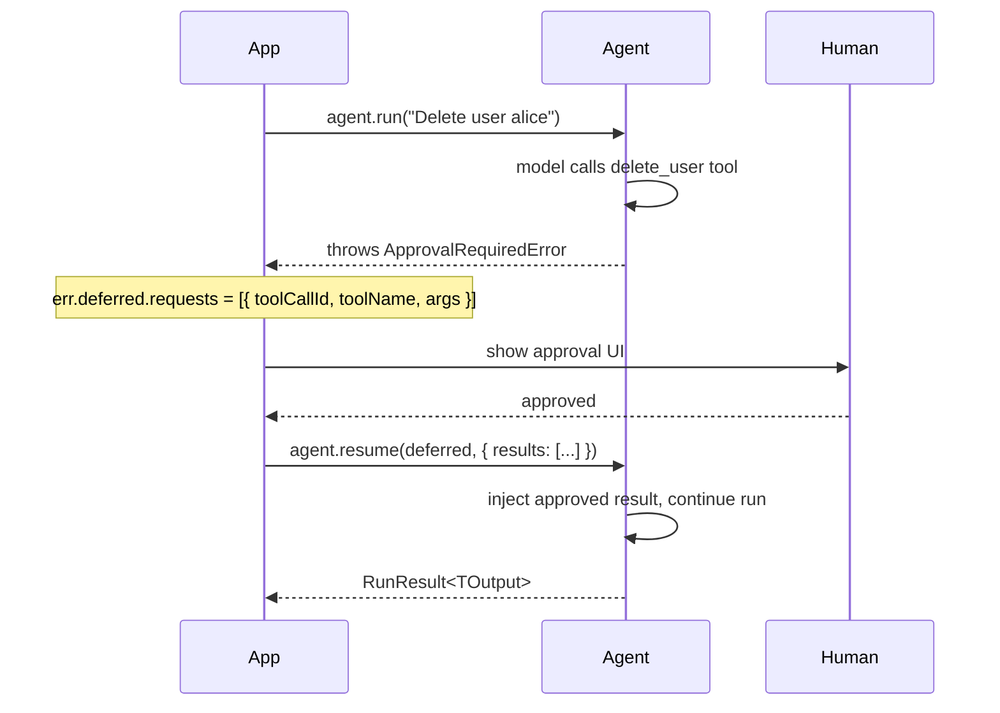
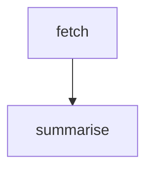
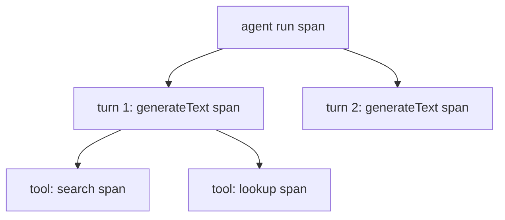

# Phase 3: Core Concepts Part 2 - Research

**Researched:** 2026-03-14
**Domain:** Mintlify MDX documentation — advanced agent patterns (HITL, testing, debugging, multi-agent, graph, thinking)
**Confidence:** HIGH

<phase_requirements>
## Phase Requirements

| ID | Description | Research Support |
|----|-------------|-----------------|
| CONCEPT-09 | Human-in-the-Loop page — `requiresApproval`, `ApprovalRequiredError`, `DeferredToolRequests`, `DeferredToolResults`, `agent.resume()`, `ExternalToolset`, approval sequence Mermaid diagram | Full API verified from `lib/execution/deferred.ts`, `lib/types/errors.ts`, `lib/toolsets/external_toolset.ts`, `lib/agent.ts` |
| CONCEPT-10 | Testing page — `TestModel`, `createTestModel()`, `FunctionModel`, `setAllowModelRequests(false)`, `captureRunMessages()`, `agent.override()`, real test code examples | Full API verified from `lib/testing/test_model.ts`, `lib/testing/function_model.ts`, `lib/testing/mod.ts`, `lib/agent.ts` |
| CONCEPT-11 | Debugging and Monitoring page — `instrumentAgent()`, `TelemetrySettings`, OTel span hierarchy Mermaid diagram, content exclusion | Full API verified from `lib/otel/instrumentation.ts`, `lib/otel/otel_types.ts` |
| CONCEPT-12 | Multi-Agent page — agent-as-tool pattern, usage aggregation, programmatic handoff, agent delegation sequence diagram | Existing content verified in `docs/reference/advanced/multi-agent.mdx` — needs diagram and restructuring |
| CONCEPT-13 | Graph page — `BaseNode`, `Graph`, `GraphRun`, fixed API (constructor + free functions), `toMermaid()`, `runIter()`, `FileStatePersistence`, FSM Mermaid diagram | Full API verified from `lib/graph/` — bugs from CONCERNS.md confirmed and fix approach documented |
| CONCEPT-14 | Thinking page — extended reasoning config for Anthropic (`thinking.budgetTokens`) and Google models | No framework-level API exists; config is via Vercel AI SDK `providerOptions` — pattern documented below |
</phase_requirements>

## Summary

Phase 3 produces six new MDX concept pages in `docs/concepts/`. All six topics have source code already in `lib/` — the documentation work is pure authoring against verified APIs. No framework code needs to change except that the Graph page must fix the two documented API bugs (wrong constructor signature + wrong `this.next()` instance method pattern).

The most important discovery is that the Graph page has two concrete confirmed bugs: the old docs used `new Graph({ nodes: [...] })` (should be `new Graph([...])`), and `this.next()` / `this.output()` as instance methods (should be imported free functions `next()` / `output()` from `lib/graph/types.ts`). The new `concepts/graph.mdx` must present the corrected API throughout.

The Thinking page is a special case — `@vibes/framework` has no dedicated `thinking` config API. Extended reasoning is configured by passing `providerOptions` directly to the Vercel AI SDK model constructor (e.g. `anthropic("claude-opus-4-5", { thinking: { type: "enabled", budgetTokens: 10000 } })`). The Thinking page documents this pass-through pattern.

**Primary recommendation:** Author all six pages against the verified source APIs. Prioritize the Graph page carefully to ensure both bugs are fixed. Use the Streaming page (`docs/concepts/streaming.mdx`) as the style template — it is the canonical example of the Phase 2 format.

## Standard Stack

### Core (same as Phase 2 — no new dependencies)

| Library | Version | Purpose | Why Standard |
|---------|---------|---------|--------------|
| Mintlify MDX | hosted | Doc pages | Project-locked (Mintlify platform) |
| Mermaid | native | Diagrams via fenced code blocks | Mintlify renders natively — no install needed |
| `@vibes/framework` | 0.1.0 | All framework APIs being documented | The subject of the docs |
| `@ai-sdk/anthropic` | latest | Anthropic model constructor for code examples | Standard provider, used in all existing pages |
| `zod` | ^4 | Schema definitions in code examples | Already in `deno.json` imports |

### No New Dependencies
Phase 3 requires no new libraries. All APIs are already implemented in the framework.

## Architecture Patterns

### Recommended File Locations

```
docs/concepts/
├── human-in-the-loop.mdx   # CONCEPT-09
├── testing.mdx              # CONCEPT-10 (replaces fragmented testing pages)
├── debugging.mdx            # CONCEPT-11
├── multi-agent.mdx          # CONCEPT-12
├── graph.mdx                # CONCEPT-13
└── thinking.mdx             # CONCEPT-14
```

**Delete (Phase 3 replacements):**
- `docs/reference/advanced/multi-agent.mdx` → replaced by `docs/concepts/multi-agent.mdx`
- `docs/reference/advanced/deferred-tools.mdx` → content merged into `docs/concepts/human-in-the-loop.mdx`
- `docs/reference/integrations/graph.mdx` → replaced by `docs/concepts/graph.mdx`
- `docs/reference/core/testing.mdx` + `docs/getting-started/testing.mdx` → replaced by `docs/concepts/testing.mdx`
- `docs/reference/integrations/otel.mdx` → replaced by `docs/concepts/debugging.mdx`

Note: Deletion of old pages is Phase 6 (NAV-02). Phase 3 only creates new pages.

### MDX Page Template (from Phase 2 style)

```mdx
---
title: [Concept Name]
description: [One sentence benefit description]
---

[Opening paragraph: what this feature is and when to use it]

## [Main Diagram]

```mermaid
[diagram]
```

## [Primary Section]

[explanatory prose]

```typescript
// verified code example
```

## [API Reference Table]

| Field | Type | Description |
...

---

<CardGroup cols={2}>
  <Card title="..." icon="..." href="...">...</Card>
  <Card title="..." icon="..." href="...">...</Card>
</CardGroup>
```

### Mermaid Format

**CRITICAL:** Use `flowchart TD` (not `stateDiagram-v2`) for graph diagrams — this matches what `graph.toMermaid()` actually generates. Use `sequenceDiagram` for interaction flows. Mintlify renders both natively via fenced code blocks with `mermaid` language tag.

### Code Example Import Convention

All examples use npm/JSR import style:
```typescript
import { Agent, tool, ... } from "@vibes/framework";
import { anthropic } from "@ai-sdk/anthropic";
import { z } from "zod";
```

## Don't Hand-Roll

| Problem | Don't Build | Use Instead | Why |
|---------|-------------|-------------|-----|
| Mock model for tests | Custom model class | `TestModel` / `createTestModel()` | Auto-generates schema-valid args, handles final_result tool, supports streaming |
| Custom function model | Manual mock | `FunctionModel` | Per-turn control with `messages`, `tools`, `turn` params |
| OTel span injection | Wrap every run() call | `instrumentAgent()` | Uses `agent.override()` internally — no mutation, handles all three run methods |
| External tool definitions | Zod-based tools with manual approval logic | `ExternalToolset` | Automatically sets `requiresApproval: true`, handles JSON Schema input |
| Graph visualization | Custom Mermaid generation | `graph.toMermaid()` | Built-in, respects `nextNodes` declarations |
| Graph state snapshots | Manual file I/O | `FileStatePersistence` / `MemoryStatePersistence` | Handles serialization, file safety, clear-on-complete |

## Common Pitfalls

### Pitfall 1: Graph Constructor Wrong Signature
**What goes wrong:** Using `new Graph({ nodes: [...] })` (object with `nodes` key).
**Why it happens:** Old docs showed the wrong signature.
**How to avoid:** Correct signature is `new Graph([node1, node2])` — nodes are the first positional array argument, options are an optional second argument `{ maxIterations? }`.
**Warning signs:** TypeScript error: "Argument of type '{ nodes: ... }' is not assignable to parameter of type 'BaseNode[]'"

### Pitfall 2: BaseNode `this.next()` / `this.output()` Do Not Exist
**What goes wrong:** Calling `this.next(nodeId, state)` or `this.output(value)` inside a `BaseNode.run()` method.
**Why it happens:** Old docs showed instance methods. These are NOT methods on `BaseNode`.
**How to avoid:** Import `next` and `output` as named exports from `@vibes/framework`. Call them as free functions:
```typescript
import { next, output } from "@vibes/framework";
// Inside run():
return next("node-b", newState);
// or:
return output(finalValue);
```
**Warning signs:** TypeScript error: "Property 'next' does not exist on type 'MyNode'"

### Pitfall 3: Graph Mermaid Uses `flowchart TD` not `stateDiagram-v2`
**What goes wrong:** Docs examples use `stateDiagram-v2` syntax.
**Why it happens:** Old docs mistakenly used state diagram format.
**How to avoid:** `graph.toMermaid()` generates `flowchart TD`. Use `flowchart TD` for all graph diagrams.

### Pitfall 4: `setAllowModelRequests(false)` Global State
**What goes wrong:** Tests that call `setAllowModelRequests(false)` affect other tests in the same process.
**Why it happens:** The flag is module-level global state.
**How to avoid:** Only use this guard at the top of a test file's setup. `agent.override({ model })` bypasses the guard automatically (`_bypassModelRequestsCheck: true`).

### Pitfall 5: `agent.override()` Returns Runner, Not Agent
**What goes wrong:** Trying to call `agent.override(...).run(...)` while storing the override result in a variable typed as `Agent`.
**How to avoid:** `agent.override()` returns `{ run, stream, runStreamEvents }` — not an `Agent` instance. It cannot be passed where an `Agent` is expected.

### Pitfall 6: Thinking Config Is on Model Constructor, Not Agent
**What goes wrong:** Looking for a `thinking` option on `AgentOptions` or `ModelSettings`.
**Why it happens:** Framework has no dedicated thinking API.
**How to avoid:** Pass `providerOptions` to the model provider constructor:
```typescript
import { anthropic } from "@ai-sdk/anthropic";
const model = anthropic("claude-opus-4-5", {
  thinking: { type: "enabled", budgetTokens: 10000 }
});
```

### Pitfall 7: `captureRunMessages` is Async, Scoped
**What goes wrong:** Trying to use `captureRunMessages` for parallel/concurrent agent runs expecting correct capture across all.
**Why it happens:** `_captureStore` is a module-level variable reset to `null` after each `captureRunMessages` call — not safe for concurrent use.
**How to avoid:** Use `captureRunMessages` for sequential test assertions only. Don't run concurrent agents inside the same `captureRunMessages` callback.

### Pitfall 8: `ExternalToolset` vs `requiresApproval: true` on regular tool
**What goes wrong:** Using `tool({ ..., requiresApproval: true })` for tools that are fully defined but need approval, vs using `ExternalToolset` for tools defined without Zod schemas.
**How to avoid:**
- Use `requiresApproval: true` on `tool()` when you have a Zod schema and a server-side execute function, but want human approval before it runs.
- Use `ExternalToolset` when the tool execution happens client-side/externally and you have a raw JSON Schema instead of Zod.

## Code Examples

Verified directly from source code:

### CONCEPT-09: Human-in-the-Loop — Full Approval Flow

```typescript
// Source: lib/execution/deferred.ts, lib/types/errors.ts, lib/agent.ts
import { Agent, ApprovalRequiredError, tool } from "@vibes/framework";
import { z } from "zod";

const deleteTool = tool({
  name: "delete_user",
  description: "Permanently delete a user account",
  parameters: z.object({ userId: z.string() }),
  execute: async (_ctx, { userId }) => `User ${userId} deleted.`,
  requiresApproval: true,   // causes ApprovalRequiredError before execute
});

const agent = new Agent({
  model: anthropic("claude-sonnet-4-6"),
  tools: [deleteTool],
});

try {
  await agent.run("Delete user alice123");
} catch (err) {
  if (err instanceof ApprovalRequiredError) {
    const { deferred } = err;
    // deferred.requests: DeferredToolRequest[]
    // Each: { toolCallId, toolName, args }

    const approved = await askHumanApproval(deferred.requests);

    const results = {
      results: approved.map(req => ({
        toolCallId: req.toolCallId,
        result: "approved",          // inject result directly
        // OR: argsOverride: { ... } // re-execute with different args
      })),
    };

    const finalResult = await agent.resume(deferred, results);
    console.log(finalResult.output);
  }
}
```

### CONCEPT-09: ExternalToolset

```typescript
// Source: lib/toolsets/external_toolset.ts
import { Agent, ApprovalRequiredError, ExternalToolset } from "@vibes/framework";

const clientTools = new ExternalToolset([
  {
    name: "read_file",
    description: "Read a file from the user's local filesystem",
    jsonSchema: {
      type: "object",
      properties: { path: { type: "string" } },
      required: ["path"],
    },
  },
]);

const agent = new Agent({ model, toolsets: [clientTools] });
```

### CONCEPT-10: TestModel

```typescript
// Source: lib/testing/test_model.ts, lib/testing/mod.ts
import { setAllowModelRequests, TestModel, createTestModel } from "@vibes/framework/testing";

// At top of test file — prevent accidental real API calls
setAllowModelRequests(false);

// TestModel: auto-generates tool calls then final_result
const model = new TestModel();
const result = await agent.override({ model }).run("Hello");
// override() bypasses setAllowModelRequests(false) guard

// createTestModel: convenience factory with typed output schema
const OutputSchema = z.object({ answer: z.string() });
const model2 = createTestModel({ outputSchema: OutputSchema });

// Options:
// callTools: boolean (default true) — call all non-final_result tools first
// text: string (default "test response") — text when no output schema
```

### CONCEPT-10: FunctionModel

```typescript
// Source: lib/testing/function_model.ts
import { FunctionModel } from "@vibes/framework/testing";

let turn = 0;
const model = new FunctionModel(({ messages, tools, turn: t }) => {
  if (t === 0) {
    // First turn: return a tool call
    return {
      content: [{ type: "tool-call", toolCallId: "tc-1",
                  toolName: "search", input: JSON.stringify({ q: "hello" }) }],
      finishReason: { unified: "tool-calls", raw: undefined },
      usage: { inputTokens: { total: 1, noCache: 1, cacheRead: 0 },
               outputTokens: { total: 1 } },
      warnings: [],
    };
  }
  // Second turn: return text
  return {
    content: [{ type: "text", text: "The answer is 42" }],
    finishReason: { unified: "stop", raw: undefined },
    usage: { inputTokens: { total: 1, noCache: 1, cacheRead: 0 },
             outputTokens: { total: 1 } },
    warnings: [],
  };
});
```

### CONCEPT-10: captureRunMessages

```typescript
// Source: lib/testing/mod.ts
import { captureRunMessages } from "@vibes/framework/testing";

const { result, messages } = await captureRunMessages(() =>
  agent.override({ model }).run("Hello")
);
// messages[0] = ModelMessage[] sent to model on turn 0
// messages[1] = ModelMessage[] sent to model on turn 1 (if multi-turn)
```

### CONCEPT-11: instrumentAgent

```typescript
// Source: lib/otel/instrumentation.ts
import { instrumentAgent } from "@vibes/framework/otel";

const instrumented = instrumentAgent(myAgent, {
  functionId: "my-agent",           // stable span name
  metadata: { version: "1.0" },     // span attributes
  excludeContent: true,             // don't record prompts/outputs (GDPR)
  isEnabled: true,                  // default true
});

// Use exactly like agent:
const result = await instrumented.run("Hello");
const stream = instrumented.stream("Hello");
for await (const event of instrumented.runStreamEvents("Hello")) { ... }
```

### CONCEPT-11: Direct telemetry on AgentOptions

```typescript
// Source: lib/agent.ts AgentOptions.telemetry
import type { TelemetrySettings } from "ai";

const agent = new Agent({
  model,
  telemetry: {
    isEnabled: true,
    functionId: "my-agent",
    recordInputs: true,
    recordOutputs: true,
  },
});
```

### CONCEPT-12: Agent-as-Tool (from existing docs — verified correct)

```typescript
// Source: docs/reference/advanced/multi-agent.mdx (API verified correct)
const researchTool = tool({
  name: "research",
  description: "Delegate a research question to the research specialist",
  parameters: z.object({ question: z.string() }),
  execute: async (_ctx, { question }) => {
    const result = await researchAgent.run(question);
    return result.output;
  },
});
```

### CONCEPT-13: Graph — Corrected API

```typescript
// Source: lib/graph/graph.ts, lib/graph/node.ts, lib/graph/types.ts
import { BaseNode, Graph, next, output } from "@vibes/framework";

type State = { url: string; content?: string };

class FetchNode extends BaseNode<State, string> {
  readonly id = "fetch";
  readonly nextNodes = ["summarise"];   // optional — for toMermaid() edges

  async run(state: State) {
    const content = await fetch(state.url).then(r => r.text());
    return next<State, string>("summarise", { ...state, content });
    //    ^^^^ imported free function, NOT this.next()
  }
}

class SummariseNode extends BaseNode<State, string> {
  readonly id = "summarise";

  async run(state: State) {
    const summary = await agent.run(`Summarise: ${state.content}`);
    return output<State, string>(summary.output);
    //     ^^^^ imported free function, NOT this.output()
  }
}

// Constructor: positional array of nodes, not { nodes: [...] }
const graph = new Graph<State, string>(
  [new FetchNode(), new SummariseNode()],
  { maxIterations: 50 }   // optional second arg
);

const result = await graph.run({ url: "https://example.com" }, "fetch");
```

### CONCEPT-13: runIter (step-by-step)

```typescript
// Source: lib/graph/graph.ts GraphRun
const run = graph.runIter({ url: "..." }, "fetch");
let step = await run.next();
while (step !== null && step.kind === "node") {
  console.log("At node:", step.nodeId, "state:", step.state);
  step = await run.next();
}
if (step?.kind === "output") console.log("Done:", step.output);
```

### CONCEPT-13: FileStatePersistence

```typescript
// Source: lib/graph/persistence.ts
import { FileStatePersistence, Graph } from "@vibes/framework";

const persistence = new FileStatePersistence<State>("./graph-state");
const result = await graph.run(
  { url: "https://example.com" },
  "fetch",
  { persistence, graphId: "run-123" }   // resumes if state file exists
);
```

### CONCEPT-13: toMermaid()

```typescript
// Source: lib/graph/mermaid.ts — generates flowchart TD (not stateDiagram-v2)
const diagram = graph.toMermaid();
// Example output:
// flowchart TD
//   fetch[fetch]
//   summarise[summarise]
//   fetch --> summarise
```

### CONCEPT-14: Thinking — Anthropic

```typescript
// Source: Vercel AI SDK docs + @ai-sdk/anthropic
// NOTE: No framework-level API — configured at model constructor level
import { anthropic } from "@ai-sdk/anthropic";
import { Agent } from "@vibes/framework";

const model = anthropic("claude-opus-4-5", {
  // providerOptions passed to generateText by AI SDK automatically
});

// For extended thinking, pass thinking via providerOptions in model settings
// OR configure at model-level via the @ai-sdk/anthropic provider:
const thinkingModel = anthropic("claude-opus-4-5");
const agent = new Agent({
  model: thinkingModel,
  modelSettings: {
    // maxTokens must be set high enough for thinking budget
    maxTokens: 16000,
  },
});

// Pass thinking config via RunOptions.modelSettings at call site:
// NOTE: framework's ModelSettings does not have a thinking field.
// Use the model constructor's providerOptions for thinking config.
```

**Key finding:** `lib/types/model_settings.ts` does NOT include a `thinking` or `providerOptions` field. The framework passes `ModelSettings` fields through to `generateText` as top-level options. To enable thinking, users must configure it at the Vercel AI SDK provider level (in the model constructor call), not in framework `modelSettings`. The Thinking page must explain this pass-through architecture clearly.

## State of the Art

| Old Approach | Current Approach | When Changed | Impact |
|--------------|------------------|--------------|--------|
| `new Graph({ nodes: [...] })` | `new Graph([...nodes])` | N/A (always wrong in docs) | Compile error if using old docs |
| `this.next(nodeId, state)` | `import { next } from "@vibes/framework"` | N/A (always wrong in docs) | Compile error if using old docs |
| `stateDiagram-v2` for graph diagrams | `flowchart TD` (what `toMermaid()` generates) | N/A (always wrong in docs) | Wrong diagram format in old docs |

**Deprecated/outdated patterns from old docs:**
- `docs/reference/integrations/graph.mdx`: Constructor bug + `this.next()` + `stateDiagram-v2` — all wrong, all fixed in new `concepts/graph.mdx`
- `docs/reference/advanced/deferred-tools.mdx`: Missing `agent.resume()` flow diagram — new HITL page adds this
- `docs/getting-started/testing.mdx` + `docs/reference/core/testing.mdx`: Split across two files, no `captureRunMessages` — merged into `concepts/testing.mdx`
- `docs/reference/integrations/otel.mdx`: Needs OTel span hierarchy diagram — new `concepts/debugging.mdx` adds this

## Open Questions

1. **Thinking page — providerOptions pass-through**
   - What we know: `ModelSettings` has no `thinking` field; `modelSettingsToAISDKOptions()` only maps the 8 documented fields
   - What's unclear: Whether users can pass arbitrary extra keys through `modelSettings` (since the function only copies known keys) — they CANNOT, the function is selective
   - Recommendation: Thinking page must document that thinking config goes on the model constructor (`anthropic("...", { thinking: ... })`), NOT in `modelSettings`. The Vercel AI SDK handles passing `providerOptions` to the model provider automatically.

2. **OTel span hierarchy — what spans are actually created**
   - What we know: The framework delegates entirely to Vercel AI SDK's `experimental_telemetry`. The AI SDK creates spans for model calls and tool invocations.
   - What's unclear: The exact span names/attributes the AI SDK emits (varies by AI SDK version)
   - Recommendation: Document the AI SDK delegation pattern rather than claiming specific span names. Include a conceptual span hierarchy diagram based on the execution architecture (one span per model call, one span per tool invocation).

## Validation Architecture

### Test Framework

| Property | Value |
|----------|-------|
| Framework | Deno native test runner |
| Config file | `deno.json` (tasks.test = `deno test -A`) |
| Quick run command | `deno test -A tests/graph_test.ts` |
| Full suite command | `deno test -A` |

### Phase Requirements → Test Map

Phase 3 is documentation-only. There are no new framework APIs being implemented, only doc pages being authored. Test coverage applies to verifying the documented code examples compile and run correctly, not to new source code.

| Req ID | Behavior | Test Type | Automated Command | File Exists? |
|--------|----------|-----------|-------------------|-------------|
| CONCEPT-09 | HITL approval flow compiles | Manual review | `deno test -A tests/deferred_tools_test.ts` | ✅ |
| CONCEPT-09 | ExternalToolset compiles | Manual review | `deno test -A tests/external_toolset_test.ts` | ✅ |
| CONCEPT-10 | TestModel/FunctionModel examples compile | Manual review | `deno test -A tests/test_model_test.ts` | ✅ |
| CONCEPT-10 | captureRunMessages example compiles | Manual review | `deno test -A tests/testing_helpers_test.ts` | ✅ |
| CONCEPT-11 | OTel instrumentation compiles | Manual review | `deno test -A tests/otel_test.ts` | ✅ |
| CONCEPT-12 | Agent-as-tool example compiles | Manual review | `deno test -A tests/agent_test.ts` | ✅ |
| CONCEPT-13 | Graph with corrected API compiles | Manual review | `deno test -A tests/graph_test.ts` | ✅ |
| CONCEPT-13 | FileStatePersistence example compiles | Manual review | `deno test -A tests/graph_persistence_test.ts` | ✅ |
| CONCEPT-14 | Thinking config pattern is valid TS | Manual review | N/A — provider constructor option | N/A |

### Sampling Rate
- **Per task commit:** `deno test -A tests/{relevant_test}.ts` (verify examples match real behavior)
- **Per wave merge:** `deno test -A` (full suite)
- **Phase gate:** Full suite green before `/gsd:verify-work`

### Wave 0 Gaps
None — existing test infrastructure covers all phase requirements. Phase 3 is documentation-only; all APIs have existing tests.

## Mermaid Diagrams Required (per success criteria)

### CONCEPT-09: HITL Approval Sequence Diagram


### CONCEPT-13: Graph FSM Diagram (flowchart TD, matching toMermaid() output)


### CONCEPT-11: OTel Span Hierarchy (conceptual)


### CONCEPT-12: Agent Delegation Sequence Diagram
Standard sequenceDiagram showing orchestrator → delegate tool → child agent → result returned.

## Sources

### Primary (HIGH confidence)
- `/lib/execution/deferred.ts` — `DeferredToolRequest`, `DeferredToolResult`, `DeferredToolResults`, `DeferredToolRequests` class
- `/lib/types/errors.ts` — `ApprovalRequiredError` class, `ModelRequestsDisabledError`
- `/lib/toolsets/external_toolset.ts` — `ExternalToolset`, `ExternalToolDefinition`
- `/lib/agent.ts` — `Agent.resume()`, `Agent.override()`, `AgentOverrideOptions`
- `/lib/testing/mod.ts` — `setAllowModelRequests()`, `captureRunMessages()`
- `/lib/testing/test_model.ts` — `TestModel`, `createTestModel()`, `TestModelOptions`
- `/lib/testing/function_model.ts` — `FunctionModel`, `ModelFunction`, `ModelFunctionParams`
- `/lib/graph/graph.ts` — `Graph`, `GraphRun`, `GraphStep`, `GraphOptions`, `GraphRunOptions`
- `/lib/graph/node.ts` — `BaseNode` (confirmed: no `next`/`output` methods)
- `/lib/graph/types.ts` — `next()`, `output()` free functions, `NodeResult`
- `/lib/graph/persistence.ts` — `StatePersistence`, `MemoryStatePersistence`, `FileStatePersistence`
- `/lib/graph/mermaid.ts` — `toMermaid()` (confirmed: generates `flowchart TD`)
- `/lib/otel/instrumentation.ts` — `instrumentAgent()`, `createTelemetrySettings()`
- `/lib/otel/otel_types.ts` — `InstrumentationOptions`, `TelemetrySettings`
- `/lib/types/model_settings.ts` — `ModelSettings` (confirmed: no `thinking` field)
- `/lib/execution/_run_utils.ts` — `modelSettingsToAISDKOptions()` (confirmed: selective mapping)
- `.planning/codebase/CONCERNS.md` — confirmed Graph API bugs
- `docs/reference/advanced/multi-agent.mdx` — existing multi-agent content (verified correct API)
- `docs/concepts/streaming.mdx` — Phase 2 style reference

### Secondary (MEDIUM confidence)
- Vercel AI SDK docs: thinking/extended reasoning is configured at model provider level via `providerOptions` passed to model constructors — not a framework-level option. This is consistent with how `@ai-sdk/anthropic` and `@ai-sdk/google` expose their provider-specific options.

## Metadata

**Confidence breakdown:**
- Standard stack: HIGH — no new dependencies, same Mintlify/Mermaid stack as Phase 2
- HITL API (CONCEPT-09): HIGH — verified from `deferred.ts`, `errors.ts`, `external_toolset.ts`, `agent.ts`
- Testing API (CONCEPT-10): HIGH — verified from `test_model.ts`, `function_model.ts`, `mod.ts`
- Debugging API (CONCEPT-11): HIGH — verified from `instrumentation.ts`, `otel_types.ts`
- Multi-agent patterns (CONCEPT-12): HIGH — verified from existing `multi-agent.mdx` and `agent.ts`
- Graph API (CONCEPT-13): HIGH — verified from `graph.ts`, `node.ts`, `types.ts`, `persistence.ts`, `mermaid.ts`, `CONCERNS.md`
- Thinking config (CONCEPT-14): MEDIUM — framework has no dedicated API; pattern is Vercel AI SDK pass-through; exact provider constructor options depend on `@ai-sdk/anthropic` and `@ai-sdk/google` package versions

**Research date:** 2026-03-14
**Valid until:** 2026-04-14 (stable framework, 30-day validity)
