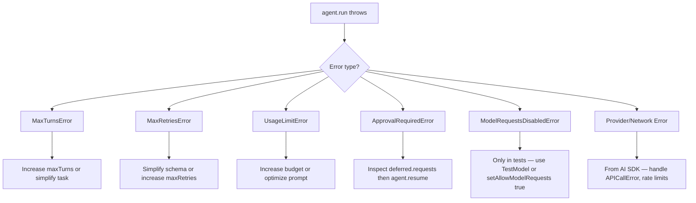

<objective>
Create the three Advanced Topics pages: Multimodal (ADV-01), Error Handling rewrite (ADV-02), and Direct Model Requests (ADV-03). These pages fill the final content gaps in the documentation.

Purpose: Developers need teaching pages for multimodal content, error recovery, and direct model usage — three topics that have either stale reference pages or no coverage at all.
Output: Three new MDX files under docs/advanced/ with teaching narratives, code examples using source-verified APIs, and 2 Mermaid diagrams each (6 total) to bridge the gap to the DIAG-01 target of 30.
</objective>

<execution_context>
@/Users/atul/.claude/get-shit-done/workflows/execute-plan.md
@/Users/atul/.claude/get-shit-done/templates/summary.md
</execution_context>

<context>
@.planning/PROJECT.md
@.planning/ROADMAP.md
@.planning/phases/06-advanced-topics-meta-and-navigation/06-RESEARCH.md

# Verified API signatures (from source — DO NOT change):
# imageMessage(image: string | Uint8Array | URL, text?: string, mediaType?: string): UserModelMessage
# audioMessage(audio: string | Uint8Array, mediaType: string, text?: string): UserModelMessage
# fileMessage(data: string | Uint8Array, mediaType: string, text?: string): UserModelMessage
# UploadedFile.type === "uploaded_file" (underscore, NOT hyphen)
#
# Correct error names (lib/types/errors.ts):
# MaxTurnsError, MaxRetriesError, UsageLimitError (NOT UsageLimitExceededError), ApprovalRequiredError, ModelRequestsDisabledError
# UsageLimitError fields: err.limitKind ("requests"|"inputTokens"|"outputTokens"|"totalTokens"), err.current, err.limit

<interfaces>
<!-- Mintlify MDX conventions confirmed from existing pages -->

Frontmatter pattern:
```mdx
---
title: "Page Title"
description: "One-sentence description"
---
```

Callout components:
- <Info>...</Info> — supplementary tips
- <Warning>...</Warning> — API gotchas
- <Note>...</Note> — informational asides
- <CodeGroup> with named code blocks — side-by-side variants

Mermaid diagrams: fenced ```mermaid code blocks, rendered natively in Mintlify.

Internal links use relative paths or absolute paths from docs root:
- /concepts/human-in-the-loop
- /concepts/results
- /concepts/tools
</interfaces>
</context>

<tasks>

<task type="auto">
  <name>Task 1: Create docs/advanced/multimodal.mdx (ADV-01)</name>
  <files>docs/advanced/multimodal.mdx</files>
  <action>
Create docs/advanced/multimodal.mdx as a new teaching page covering all four modalities. Use ONLY the source-verified API signatures from the research doc — do NOT copy from the old reference/advanced/multi-modal.mdx (it has wrong signatures).

Structure:
1. Frontmatter: title "Multimodal", description covering images/audio/video/documents
2. Opening paragraph: what multimodal means in the Vibes context (sending rich content to models, receiving binary content from tools)
3. **Diagram 1 — Content type routing flowchart (Mermaid flowchart LR):**
   Show the four input modalities (image/audio/video/document) flowing through the message helpers into UserModelMessage, which feeds the model.
4. **Images section:** imageMessage() with correct signature `imageMessage(image, text?, mediaType?)`. Show 3 examples: URL string, base64 string, Uint8Array. Include MIME type note.
5. **Audio section:** audioMessage() with correct signature `audioMessage(audio, mediaType, text?)`. Show example with base64 audio and "audio/mpeg" mediaType.
6. **Video section:** Note that video support depends on model provider capability; follow the same pattern as audio using fileMessage with a video/* MIME type.
7. **Documents section:** fileMessage() with correct signature `fileMessage(data, mediaType, text?)`. Show PDF example.
8. **UploadedFile section:** Explain UploadedFile for provider file uploads (when the provider has already stored the file). Show type discriminant: `type: "uploaded_file"` (underscore). Show uploadedFileSchema for tool parameters.
9. **Tool returns section:** BinaryContent returned from tool execute functions. Brief example returning an image from a tool.
10. **Diagram 2 — Tool multi-modal return flow (Mermaid sequenceDiagram):**
    Show: Agent calls tool → tool execute() returns BinaryContent → Agent passes binary result to model → model uses it in response.

All code blocks must use `import { imageMessage, audioMessage, fileMessage } from "@vibes/framework"`.
MIME types to show: "image/jpeg", "image/png", "audio/mpeg", "application/pdf".
Do NOT use depsFactory, this.next(), or any deprecated API.
  </action>
  <verify>
    <automated>test -f /Users/atul/Projects/personal/vibes/packages/framework/docs/advanced/multimodal.mdx && [ "$(grep -c 'mermaid' /Users/atul/Projects/personal/vibes/packages/framework/docs/advanced/multimodal.mdx)" -ge 2 ]</automated>
  </verify>
  <done>docs/advanced/multimodal.mdx exists, contains coverage of all 4 modalities (image, audio, video, document), uses correct API signatures (imageMessage/audioMessage/fileMessage with source-verified parameter order), UploadedFile.type is "uploaded_file" (underscore), and has 2 Mermaid diagrams</done>
</task>

<task type="auto">
  <name>Task 2: Create docs/advanced/error-handling.mdx (ADV-02)</name>
  <files>docs/advanced/error-handling.mdx</files>
  <action>
Create docs/advanced/error-handling.mdx as a rewritten teaching page. The old concepts/error-handling.mdx has the wrong error name (UsageLimitExceededError) — this new page uses only source-verified names.

Structure:
1. Frontmatter: title "Error Handling", description explaining error taxonomy and recovery
2. Opening paragraph: agent.run() and agent.stream() throw typed errors; wrap in try/catch and switch on error type for targeted recovery.
3. **Diagram 1 — Error taxonomy (Mermaid graph TD — use the exact pattern from the research doc):**

4. **Per-error sections** (one subsection each):
   - MaxTurnsError: what it means, how to catch, show err.turns field if it exists, recovery = increase maxTurns in AgentOptions
   - MaxRetriesError: structured output validation failures, recovery = simplify outputSchema or increase maxRetries
   - UsageLimitError: fields err.limitKind / err.current / err.limit, recovery = increase UsageLimits budget or optimize prompt. CRITICAL: use UsageLimitError NOT UsageLimitExceededError
   - ApprovalRequiredError: link to /concepts/human-in-the-loop for full docs, show that err.deferred.requests contains the deferred tool calls and agent.resume() continues
   - ModelRequestsDisabledError: testing context only — setAllowModelRequests(false) is set in tests; link to /concepts/testing
   - Provider errors: these come from Vercel AI SDK (APICallError, rate limits) — wrap in final catch
5. **Diagram 2 — Error recovery sequence (Mermaid sequenceDiagram):**
   Show: App calls agent.run() → agent throws ApprovalRequiredError → App catches, inspects err.deferred.requests → App calls agent.resume(deferred) → agent continues and returns result. This demonstrates the most complex recovery flow.
6. **Complete try/catch example** showing a switch/instanceof pattern for all 5 error types.
7. Import statement at top: `import { MaxTurnsError, MaxRetriesError, UsageLimitError, ApprovalRequiredError, ModelRequestsDisabledError } from "@vibes/framework"`

Do NOT include any links to reference/core/errors or reference/advanced/* — those pages will be deleted.
  </action>
  <verify>
    <automated>test -f /Users/atul/Projects/personal/vibes/packages/framework/docs/advanced/error-handling.mdx && [ "$(grep -c 'mermaid' /Users/atul/Projects/personal/vibes/packages/framework/docs/advanced/error-handling.mdx)" -ge 2 ]</automated>
  </verify>
  <done>docs/advanced/error-handling.mdx exists, uses UsageLimitError (not UsageLimitExceededError), has 2 Mermaid diagrams (taxonomy + recovery sequence), covers all 5 error types with recovery patterns, and links only to surviving pages (/concepts/human-in-the-loop, /concepts/testing, /concepts/results)</done>
</task>

<task type="auto">
  <name>Task 3: Create docs/advanced/direct-model-requests.mdx (ADV-03)</name>
  <files>docs/advanced/direct-model-requests.mdx</files>
  <action>
Create docs/advanced/direct-model-requests.mdx explaining when and how to call the Vercel AI SDK directly, bypassing the Agent wrapper.

Structure:
1. Frontmatter: title "Direct Model Requests", description about calling AI models without the agent overhead
2. Opening paragraph: The Vibes Agent wrapper adds tools, structured output, result validators, multi-turn conversation management, and RunContext DI. Sometimes you want none of that — just a model call.
3. **Diagram 1 — Decision flowchart (Mermaid flowchart TD):**
   Start node "Need model output?" → branches:
   - "Tools / structured output / multi-turn / validators / deps?" → Yes → "Use Agent (agent.run / agent.stream)"
   - "One-shot generation, no tools, simple prompt?" → Yes → "Use generateText / streamText directly"
   Include a note box: "generateText and streamText are from the Vercel AI SDK — @vibes/framework re-exports nothing; import from 'ai' and '@ai-sdk/anthropic'"
4. **When to use Agent** (bulleted list): tools, outputSchema / structured output, multi-turn with message history, result validators, RunContext dependencies, human-in-the-loop flows
5. **When to use direct model calls** (bulleted list): one-shot text generation, classification tasks, template filling, simple summarization with no side effects, scripts where agent overhead isn't needed
6. **generateText example:**
```typescript
import { generateText } from "ai";
import { anthropic } from "@ai-sdk/anthropic";

const { text } = await generateText({
  model: anthropic("claude-opus-4-5"),
  prompt: "Summarize this in one sentence: ...",
});
```
7. **streamText example:**
```typescript
import { streamText } from "ai";
import { anthropic } from "@ai-sdk/anthropic";

const result = streamText({
  model: anthropic("claude-opus-4-5"),
  prompt: "Write a haiku about TypeScript",
});

for await (const chunk of result.textStream) {
  process.stdout.write(chunk);
}
```
8. **Diagram 2 — Sequence comparison (Mermaid sequenceDiagram):**
   Two alternative sequences side by side using `alt Agent path` and `else Direct path`:
   - Agent path: App → Agent.run() → Agent loop (tools / validators) → result
   - Direct path: App → generateText() → model → text
9. **Using both in the same project** section: explain it's valid — use Agent for complex user flows, generateText/streamText for background tasks or utility functions.
10. Link to Vercel AI SDK docs for full generateText/streamText options.

Note: Vibes does NOT re-export generateText or streamText. Import them from 'ai' directly.
  </action>
  <verify>
    <automated>test -f /Users/atul/Projects/personal/vibes/packages/framework/docs/advanced/direct-model-requests.mdx && [ "$(grep -c 'mermaid' /Users/atul/Projects/personal/vibes/packages/framework/docs/advanced/direct-model-requests.mdx)" -ge 2 ]</automated>
  </verify>
  <done>docs/advanced/direct-model-requests.mdx exists, has 2 Mermaid diagrams (decision tree + sequence comparison), shows both generateText and streamText examples, and correctly imports from 'ai' (not from '@vibes/framework')</done>
</task>

</tasks>

<verification>
After all three tasks complete:

1. All three files exist:
   - `test -f docs/advanced/multimodal.mdx`
   - `test -f docs/advanced/error-handling.mdx`
   - `test -f docs/advanced/direct-model-requests.mdx`

2. Error page uses correct error name:
   - `grep 'UsageLimitError' docs/advanced/error-handling.mdx` — must find matches
   - `grep 'UsageLimitExceededError' docs/advanced/error-handling.mdx` — must find NO matches

3. Multimodal page uses correct API signatures:
   - `grep 'audioMessage' docs/advanced/multimodal.mdx` — must find matches
   - `grep 'uploaded_file' docs/advanced/multimodal.mdx` — must find the underscore form

4. Diagram count (this plan adds 6 diagrams):
   - `grep -r 'mermaid' docs/ --include="*.mdx" | wc -l` — should be 30 (was 24, +6)

5. No stale links to deleted reference pages in new files:
   - `grep 'reference/core\|reference/advanced\|reference/integrations\|guides/' docs/advanced/*.mdx` — must return empty
</verification>

<success_criteria>
- docs/advanced/multimodal.mdx: covers imageMessage/audioMessage/fileMessage/BinaryContent/UploadedFile with correct API signatures, 2 Mermaid diagrams
- docs/advanced/error-handling.mdx: covers all 5 error types, uses UsageLimitError (not UsageLimitExceededError), 2 Mermaid diagrams including the required taxonomy diagram
- docs/advanced/direct-model-requests.mdx: explains agent vs direct model tradeoffs, shows generateText and streamText, 2 Mermaid diagrams
- Total Mermaid diagram count across docs/ reaches 30 (was 24, this plan adds 6)
</success_criteria>

<output>
After completion, create `.planning/phases/06-advanced-topics-meta-and-navigation/06-01-SUMMARY.md`
</output>
