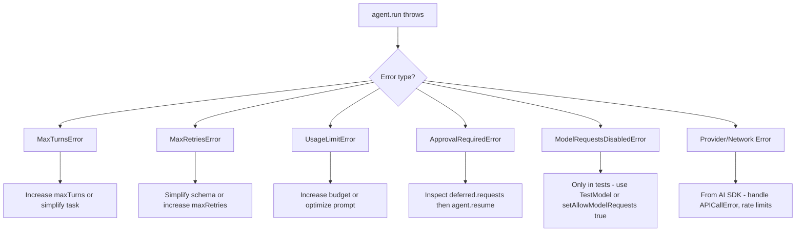

# Phase 6: Advanced Topics, Meta, and Navigation - Research

**Researched:** 2026-03-14
**Domain:** MDX documentation authoring, Mintlify navigation, Vibes framework API surface
**Confidence:** HIGH

## Summary

Phase 6 closes out the documentation project. It has three distinct work streams that can partially run in parallel: (1) write three new content pages (Multimodal, Error Handling rewrite, Direct Model Requests), (2) create three meta pages (Acknowledgments, Contributing, Changelog), and (3) restructure navigation, delete old pages, audit links, and hit the 30-diagram threshold.

The current diagram count is **24** across all docs. The target is 30+. Phase 6 must add at least **6 new Mermaid diagrams** - the Error Handling page (1 required taxonomy diagram), the Multimodal page (1 recommended flow diagram), and remaining diagrams can be distributed across the new advanced pages or retrofitted where gaps exist.

The most risk-laden task is NAV-02 + NAV-03 together: deleting 23 old files and auditing all internal links. The existing docs contain broken-link landmines: `concepts/error-handling.mdx` links to `reference/advanced/deferred-tools` and `reference/core/errors` (both scheduled for deletion); `concepts/how-agents-work.mdx` and `concepts/dependency-injection.mdx` have multiple stale `reference/` links; `toolsets.mdx` links to `guides/human-in-the-loop`. All of these will break when old pages are deleted. The delete + fix must happen atomically in one plan.

**Primary recommendation:** Structure Phase 6 as two plans: Plan 1 creates all new content pages (ADV-01, ADV-02, ADV-03, META-01, META-02, META-03), Plan 2 restructures navigation, deletes old pages, fixes all broken links, and verifies the diagram count (NAV-01 through NAV-04, DIAG-01).

<phase_requirements>
## Phase Requirements

| ID | Description | Research Support |
|----|-------------|-----------------|
| ADV-01 | Multimodal page covering images, audio, video, and documents with examples for each modality | Full API confirmed in source: `BinaryContent`, `UploadedFile`, `imageMessage`, `audioMessage`, `fileMessage`, `binaryContentSchema`, `uploadedFileSchema`, MIME type guards. Reference page exists at `reference/advanced/multi-modal.mdx` to draw from, but needs teaching narrative and examples for all four modalities |
| ADV-02 | Error Handling page rewrite with full error taxonomy Mermaid diagram and recovery patterns per error type | Existing `concepts/error-handling.mdx` has content but no diagram. Source-confirmed error types: `MaxTurnsError`, `MaxRetriesError`, `UsageLimitError` (note: NOT `UsageLimitExceededError` - the reference page has the wrong name), `ApprovalRequiredError`, `ModelRequestsDisabledError`, plus provider errors from AI SDK |
| ADV-03 | Direct model requests page - calling model directly without agent wrapper | This is a Pydantic AI concept (calling `model.request()` directly). In Vibes, the equivalent is using Vercel AI SDK `generateText`/`streamText` directly. Page should explain when to use the agent wrapper vs. raw AI SDK calls, with examples |
| META-01 | Acknowledgments page - thank-you to Pydantic AI and Vercel AI SDK | Content-only page, no technical research required. Should mention Samuel Colvin / Pydantic team and Vercel AI SDK team explicitly |
| META-02 | Contributing page - how to contribute to the framework | Standard contributing guide: repo structure, running tests, submitting PRs |
| META-03 | Changelog page - version history | Needs to pull from package version history |
| NAV-01 | docs.json restructured: landing, intro, getting started, concepts, integrations, examples, advanced, meta | Full new structure designed below based on existing pages + new pages from this phase |
| NAV-02 | Delete all old fragmented reference pages | 23 files to delete across guides/, reference/core/, reference/advanced/, reference/integrations/. Plus 3 old concept pages: how-agents-work.mdx, dependency-injection.mdx, error-handling.mdx (replaced by rewritten version) |
| NAV-03 | Zero broken internal links | 6+ known broken links in existing pages that will break when old reference pages are deleted. All must be fixed before deletion |
| NAV-04 | features.mdx (reference/features) updated to link to new page locations | The features page has ~20 links to reference/core/*, reference/advanced/*, guides/* - all need updating to new locations |
| DIAG-01 | Minimum 30 Mermaid diagrams across concept and integration pages | Currently 24 diagrams. Need 6 more. ADV-02 requires 1 (error taxonomy). ADV-01 should have 1 (modality flow). ADV-03 should have 1 (when to use agent vs direct). Remaining 3 can be added to new pages or existing pages that lack them |
</phase_requirements>

## Standard Stack

### Core (Confirmed HIGH confidence)
| Tool | Purpose | Notes |
|------|---------|-------|
| Mintlify MDX | Documentation format | All pages are `.mdx` with frontmatter `title` and `description` |
| Mermaid | Diagrams | Rendered via ` ```mermaid ` fenced code blocks in Mintlify |
| `docs.json` | Navigation config | `navigation.groups[].pages[]` arrays control sidebar |
| Vibes `mod.ts` exports | Source of truth for API names | Always verify API names against source, not against old reference pages |

### Mintlify Component Patterns (confirmed from existing pages)
| Component | Syntax | Use |
|-----------|--------|-----|
| Info callout | `<Info>...</Info>` | Supplementary tips |
| Warning callout | `<Warning>...</Warning>` | API gotchas and breaking differences |
| Note callout | `<Note>...</Note>` | Informational asides |
| CodeGroup | `<CodeGroup>` with named code blocks | Side-by-side code variants |
| Card | `<Card title="" href="">` | Navigation cards in landing pages |

## Architecture Patterns

### Recommended File Locations for New Pages

```
docs/
├── advanced/                    # NEW directory - ADV-01, ADV-02, ADV-03
│   ├── multimodal.mdx           # ADV-01
│   ├── error-handling.mdx       # ADV-02 (replaces concepts/error-handling.mdx)
│   └── direct-model-requests.mdx # ADV-03
├── meta/                        # NEW directory - META-01, META-02, META-03
│   ├── acknowledgments.mdx      # META-01
│   ├── contributing.mdx         # META-02
│   └── changelog.mdx            # META-03
└── reference/
    └── features.mdx             # STAYS but links updated (NAV-04)
```

**Decision note:** The existing `concepts/error-handling.mdx` is a stale reference page in disguise - it belongs in the new `advanced/` section as a rewritten teaching page. Creating `advanced/error-handling.mdx` as a net-new file and deleting the old one avoids confusion.

### Target docs.json Navigation Structure (NAV-01)

```json
{
  "navigation": {
    "groups": [
      {
        "group": "Getting Started",
        "pages": ["index", "introduction", "getting-started/install", "getting-started/hello-world"]
      },
      {
        "group": "Concepts",
        "pages": [
          "concepts/agents", "concepts/models", "concepts/dependencies",
          "concepts/tools", "concepts/toolsets", "concepts/results",
          "concepts/messages", "concepts/streaming", "concepts/human-in-the-loop",
          "concepts/testing", "concepts/debugging", "concepts/multi-agent",
          "concepts/graph", "concepts/thinking"
        ]
      },
      {
        "group": "Integrations",
        "pages": [
          "integrations/mcp-client", "integrations/mcp-server", "integrations/ag-ui",
          "integrations/a2a", "integrations/temporal", "integrations/vercel-ai-ui"
        ]
      },
      {
        "group": "Examples",
        "pages": [
          "examples/index", "examples/hello-world", "examples/weather-agent",
          "examples/chat-app", "examples/bank-support", "examples/rag",
          "examples/graph-workflow", "examples/human-in-the-loop", "examples/a2a"
        ]
      },
      {
        "group": "Advanced",
        "pages": [
          "advanced/multimodal",
          "advanced/error-handling",
          "advanced/direct-model-requests"
        ]
      },
      {
        "group": "Meta",
        "pages": [
          "meta/acknowledgments",
          "meta/contributing",
          "meta/changelog",
          "reference/features"
        ]
      }
    ]
  }
}
```

**What is removed:** The old `Guides`, `Reference: Core`, `Reference: Advanced`, and `Integrations` (second duplicate group for `reference/integrations/`) groups are entirely removed.

### Pages to Delete (NAV-02)

**Old concept pages (superseded by new concept pages created in Phases 1-3):**
- `docs/concepts/how-agents-work.mdx`
- `docs/concepts/dependency-injection.mdx`
- `docs/concepts/error-handling.mdx` (replaced by `advanced/error-handling.mdx`)

**Guides section (superseded by new concept pages):**
- `docs/guides/human-in-the-loop.mdx`
- `docs/guides/multi-agent-systems.mdx`

**Reference: Core (superseded by new concept pages):**
- `docs/reference/core/agents.mdx`
- `docs/reference/core/dependencies.mdx`
- `docs/reference/core/errors.mdx`
- `docs/reference/core/result-validators.mdx`
- `docs/reference/core/run-context.mdx`
- `docs/reference/core/streaming.mdx`
- `docs/reference/core/structured-output.mdx`
- `docs/reference/core/testing.mdx`
- `docs/reference/core/tools.mdx`
- `docs/reference/core/toolsets.mdx`

**Reference: Advanced (superseded by new concept pages):**
- `docs/reference/advanced/deferred-tools.mdx`
- `docs/reference/advanced/message-history.mdx`
- `docs/reference/advanced/model-settings.mdx`
- `docs/reference/advanced/multi-agent.mdx`
- `docs/reference/advanced/multi-modal.mdx`
- `docs/reference/advanced/usage-limits.mdx`

**Reference: Integrations (superseded by new integrations pages):**
- `docs/reference/integrations/ag-ui.mdx`
- `docs/reference/integrations/graph.mdx`
- `docs/reference/integrations/mcp.mdx`
- `docs/reference/integrations/otel.mdx`
- `docs/reference/integrations/temporal.mdx`

**Total to delete: 23 files** (3 old concept + 2 guides + 10 reference/core + 6 reference/advanced + 5 reference/integrations) + the `reference/core/` and `reference/advanced/` and `reference/integrations/` directories themselves once empty.

**KEEP:** `docs/reference/features.mdx` - it stays in the Meta nav group (NAV-04 updates its links).

### Known Broken Links to Fix (NAV-03)

Before deleting old pages, all internal links must be updated. Verified broken links:

| File | Old Link | New Target |
|------|----------|------------|
| `concepts/error-handling.mdx` | `../reference/advanced/deferred-tools` | `../concepts/human-in-the-loop` |
| `concepts/error-handling.mdx` | `../reference/core/errors` | (remove or self-reference) |
| `concepts/error-handling.mdx` | `../reference/advanced/usage-limits` | `../concepts/results` (usage limits covered there) |
| `concepts/how-agents-work.mdx` | `../reference/advanced/message-history` | `../concepts/messages` |
| `concepts/how-agents-work.mdx` | `../reference/advanced/deferred-tools` | `../concepts/human-in-the-loop` |
| `concepts/how-agents-work.mdx` | `../reference/core/streaming` | `../concepts/streaming` |
| `concepts/dependency-injection.mdx` | `../reference/core/run-context` | `../concepts/dependencies` |
| `concepts/dependency-injection.mdx` | `../reference/core/tools` | `../concepts/tools` |
| `concepts/dependency-injection.mdx` | `../reference/core/toolsets` | `../concepts/toolsets` |
| `concepts/dependency-injection.mdx` | `../reference/core/result-validators` | `../concepts/results` |
| `concepts/toolsets.mdx` | `/guides/human-in-the-loop` | `/concepts/human-in-the-loop` |
| `reference/features.mdx` | ~20 links to `reference/core/*`, `reference/advanced/*`, `guides/*` | All must map to new locations |

**Important:** Since `concepts/how-agents-work.mdx` and `concepts/dependency-injection.mdx` are being DELETED, their broken links will vanish automatically. The link fixes that matter are in files that SURVIVE: `concepts/toolsets.mdx` (stays), `concepts/streaming.mdx` comment (internal text ref, not a hyperlink so harmless), and `reference/features.mdx` (stays).

**Actual surviving files with stale links:**
1. `concepts/toolsets.mdx` line 151: `/guides/human-in-the-loop` → `/concepts/human-in-the-loop`
2. `reference/features.mdx`: All ~20 reference/core, reference/advanced, and guides links need remapping

The new `advanced/error-handling.mdx` should NOT link to any reference pages (they will be gone). It should link to `concepts/human-in-the-loop` and `concepts/results` instead.

## Don't Hand-Roll

| Problem | Don't Build | Use Instead | Why |
|---------|-------------|-------------|-----|
| Error taxonomy diagram | Custom ASCII art | Mermaid `graph TD` | Renders natively in Mintlify |
| Multimodal flow diagram | Text description | Mermaid `flowchart LR` or `sequenceDiagram` | Consistent with existing pages |
| Navigation structure | Manually calculated | Copy from research target above | Already fully mapped |
| API reference tables | Re-reading all source files again | Use the tables in this research doc | Already extracted from source |

## Common Pitfalls

### Pitfall 1: Wrong Error Type Names
**What goes wrong:** The old `concepts/error-handling.mdx` uses `UsageLimitExceededError` but the actual export from `lib/types/errors.ts` is `UsageLimitError`. Similarly, the reference page `reference/core/errors.mdx` uses `UsageLimitError` correctly. The rewritten error page must use `UsageLimitError`.
**Why it happens:** The old page was written before the final API was locked.
**How to avoid:** Always import from the verified source: `lib/types/errors.ts` exports `MaxTurnsError`, `MaxRetriesError`, `UsageLimitError`, `ModelRequestsDisabledError`, `ApprovalRequiredError`.
**Warning signs:** Any code block that says `UsageLimitExceededError` is wrong.

### Pitfall 2: Wrong audioMessage Signature
**What goes wrong:** The old `reference/advanced/multi-modal.mdx` shows `audioMessage({ data: audio, mimeType: "audio/mpeg" }, "Transcribe this.")` but the actual function signature from `lib/multimodal/content.ts` is `audioMessage(audio: string | Uint8Array, mediaType: string, text?: string)`.
**Why it happens:** The reference page was written against a different draft API.
**How to avoid:** Use the verified signatures from source: `audioMessage(audio, mediaType, text?)` and `fileMessage(data, mediaType, text?)`. Note that `imageMessage` signature is `imageMessage(image, text?, mediaType?)`.

### Pitfall 3: UploadedFile type discriminant
**What goes wrong:** Old reference page shows `type: "uploaded-file"` (hyphen) but the actual source uses `type: "uploaded_file"` (underscore).
**Why it happens:** Inconsistency between docs and source.
**How to avoid:** Source-confirmed: `UploadedFile.type === "uploaded_file"` (underscore).

### Pitfall 4: Deleting pages still referenced in docs.json
**What goes wrong:** Deleting MDX files without removing them from `docs.json` causes Mintlify build errors.
**Why it happens:** Two-step operation (delete file + update docs.json) done incompletely.
**How to avoid:** Delete file and update docs.json in the same commit. Use the target docs.json structure from this research document.

### Pitfall 5: Missing diagram count
**What goes wrong:** Reaching Phase 6 end with fewer than 30 diagrams.
**Why it happens:** Current count is 24. Three new advanced pages each adding 1 diagram = 27. Still 3 short.
**How to avoid:** Plan for 6 new diagrams minimum. Each of the 3 advanced pages should have at least 1 diagram. The remaining 3 can be added to concept pages that currently have 0 diagrams (e.g., `concepts/thinking.mdx` has 0, `concepts/dependency-injection.mdx` is being deleted anyway). Alternatively, add diagrams to the meta pages or the Direct Model Requests page (a comparison flowchart is natural there).

### Pitfall 6: features.mdx link mapping errors
**What goes wrong:** The features page has ~20 links to old reference paths. Missing even one causes a 404.
**Why it happens:** Large table with many links, easy to miss one during a bulk find-replace.
**How to avoid:** Audit every single link in `reference/features.mdx` against the final docs.json structure.

## Code Examples

Verified API from source (`lib/multimodal/content.ts` and `lib/multimodal/binary_content.ts`):

### Correct imageMessage signature
```typescript
// Source: lib/multimodal/content.ts
imageMessage(image: string | Uint8Array | URL, text?: string, mediaType?: string): UserModelMessage
```

### Correct audioMessage signature
```typescript
// Source: lib/multimodal/content.ts
audioMessage(audio: string | Uint8Array, mediaType: string, text?: string): UserModelMessage
```

### Correct fileMessage signature
```typescript
// Source: lib/multimodal/content.ts
fileMessage(data: string | Uint8Array, mediaType: string, text?: string): UserModelMessage
```

### Correct UploadedFile type
```typescript
// Source: lib/multimodal/binary_content.ts
type UploadedFile = {
  type: "uploaded_file";  // underscore, not hyphen
  fileId: string;
  mimeType: string;
  filename?: string;
};
```

### Correct error type names (all confirmed in lib/types/errors.ts)
```typescript
import {
  ApprovalRequiredError,
  MaxRetriesError,
  MaxTurnsError,
  ModelRequestsDisabledError,
  // Note: it's UsageLimitError, NOT UsageLimitExceededError
} from "@vibes/framework";

// UsageLimitError fields (confirmed from source):
// err.limitKind: "requests" | "inputTokens" | "outputTokens" | "totalTokens"
// err.current: number
// err.limit: number
```

### Direct Model Requests (ADV-03 pattern)
```typescript
// Source: Vercel AI SDK (this is the pattern for calling the model directly)
import { generateText, streamText } from "ai";
import { anthropic } from "@ai-sdk/anthropic";

// When you want model output without agent overhead:
const { text } = await generateText({
  model: anthropic("claude-3-5-sonnet-20241022"),
  prompt: "Hello world",
});

// Use Agent when: tools, structured output, multi-turn, result validators, deps
// Use generateText/streamText when: one-shot generation, no tools, simple prompt
```

### Error Taxonomy Mermaid Diagram (pattern for ADV-02)


## State of the Art

| Old Approach | Current Approach | Notes |
|--------------|------------------|-------|
| `reference/advanced/multi-modal.mdx` | `advanced/multimodal.mdx` | Old page has wrong API signatures (see pitfalls); new page must use source-verified APIs |
| `concepts/error-handling.mdx` | `advanced/error-handling.mdx` | Old page has wrong `UsageLimitExceededError` name; new page uses `UsageLimitError` |
| Duplicate "Integrations" group in docs.json | Single "Integrations" group | Current docs.json has two groups named "Integrations" (lines 129-138) - the second references `reference/integrations/*` which will be deleted |

**Deprecated patterns:**
- `reference/` directory structure: entirely removed in Phase 6 (except `reference/features.mdx` which stays)
- `guides/` directory: entirely removed in Phase 6
- `concepts/how-agents-work.mdx` and `concepts/dependency-injection.mdx`: deleted (superseded by Phase 2/3 pages)

## Open Questions

1. **Does the `advanced/` content go in `advanced/error-handling.mdx` or stay as `concepts/error-handling.mdx`?**
   - What we know: The requirement says "Error Handling page" - doesn't specify location. NAV-01 shows an "Advanced" nav group. NAV-02 says to delete the old `concepts/error-handling` page.
   - What's unclear: Whether the rewrite produces `advanced/error-handling.mdx` or replaces `concepts/error-handling.mdx` in place.
   - Recommendation: Create `advanced/error-handling.mdx` as new file, delete `concepts/error-handling.mdx`. This matches the target nav structure cleanly and avoids having a stale page at the old location.

2. **Diagram count: is 30 the floor or a hard target?**
   - What we know: Current count is 24. DIAG-01 says "minimum 30 Mermaid diagrams."
   - What's unclear: Whether diagrams on deleted pages count (they don't - deleted pages are gone).
   - Recommendation: Plan for 30+ diagrams in SURVIVING pages. Target 31+ to have margin. The 3 new advanced pages (1 diagram each) + the 3 meta pages (optional) + potentially 3 more added to existing pages with 0 diagrams.

3. **What page should `concepts/error-handling.mdx` redirect to?**
   - What we know: Mintlify doesn't support server-side redirects in docs.json in the standard way.
   - What's unclear: Whether there's a Mintlify redirect mechanism to use.
   - Recommendation: Simply delete the old page; since we're updating docs.json to remove it from nav, 404s will only occur if someone has bookmarked the old URL directly. Acceptable risk for a framework docs site.

## Diagram Count Analysis

Current diagrams: **24** (across concept, integration, getting-started, index pages)

Distribution:
- `index.mdx`: 1
- `getting-started/install.mdx`: 1
- `concepts/` pages: 14 pages total, 13 have diagrams (all except `thinking.mdx` which has 0)
- `integrations/` pages: 6 pages, all have diagrams (mcp-client:1, mcp-server:1, ag-ui:2, a2a:2, temporal:1, vercel-ai-ui:1 = 8 total)

Wait - recalculating: index(1) + install(1) + 13 concept diagrams + 8 integration diagrams = 23... vs grep showing 24. One page has 2 diagrams.

Phase 6 adds:
- `advanced/multimodal.mdx`: 1 diagram (modality flow)
- `advanced/error-handling.mdx`: 1 diagram (error taxonomy - REQUIRED by ADV-02)
- `advanced/direct-model-requests.mdx`: 1 diagram (agent vs direct model decision flowchart)

After Phase 6 adds: 24 + 3 = **27 diagrams** - still 3 short of 30.

**Gap mitigation required:** The planner must account for 3 additional diagrams. Options:
- Add a diagram to `concepts/thinking.mdx` (currently 0 - extended reasoning decision flowchart)
- Add 2 more diagrams to the meta pages (e.g., a contribution workflow diagram, a version history timeline - these feel forced)
- Add additional diagrams to the advanced pages (e.g., multimodal content routing diagram, direct model vs agent decision tree are both natural)

**Recommendation for planner:** Each advanced page should target 2 diagrams, not 1. This reaches 24 + 6 = 30 exactly. Or: `advanced/multimodal.mdx` gets 2 diagrams (content type routing + tool return flow), `advanced/error-handling.mdx` gets 2 diagrams (taxonomy + recovery flow), `advanced/direct-model-requests.mdx` gets 2 diagrams (decision tree + sequence comparison). Total: 24 + 6 = **30 diagrams** exactly.

## Validation Architecture

nyquist_validation is enabled in `.planning/config.json`. However, this is a **documentation-only phase** with no TypeScript code being written. All work is MDX content, docs.json configuration, and file deletion.

### Test Framework
| Property | Value |
|----------|-------|
| Framework | None for MDX content - verification is structural |
| Config file | N/A |
| Quick run command | `grep -r 'mermaid' docs/ --include="*.mdx" \| wc -l` |
| Full suite command | Link audit script (see below) |

### Phase Requirements → Test Map
| Req ID | Behavior | Test Type | Automated Command | File Exists? |
|--------|----------|-----------|-------------------|-------------|
| ADV-01 | Multimodal page exists with all 4 modalities | smoke | `test -f docs/advanced/multimodal.mdx && grep -c "audio\|video\|image\|document" docs/advanced/multimodal.mdx` | Wave 0 |
| ADV-02 | Error Handling page has Mermaid taxonomy diagram | smoke | `test -f docs/advanced/error-handling.mdx && grep -c 'mermaid' docs/advanced/error-handling.mdx` | Wave 0 |
| ADV-03 | Direct model requests page exists | smoke | `test -f docs/advanced/direct-model-requests.mdx` | Wave 0 |
| META-01 | Acknowledgments page exists and mentions Pydantic AI | smoke | `test -f docs/meta/acknowledgments.mdx && grep -c 'Pydantic AI' docs/meta/acknowledgments.mdx` | Wave 0 |
| META-02 | Contributing page exists | smoke | `test -f docs/meta/contributing.mdx` | Wave 0 |
| META-03 | Changelog page exists | smoke | `test -f docs/meta/changelog.mdx` | Wave 0 |
| NAV-01 | docs.json has the 6 required nav groups | smoke | `node -e "const d=JSON.parse(require('fs').readFileSync('docs/docs.json')); const groups=d.navigation.groups.map(g=>g.group); console.log(groups.join(','))"` | ✅ |
| NAV-02 | Old reference pages deleted | smoke | `test ! -f docs/reference/core/agents.mdx && test ! -f docs/guides/human-in-the-loop.mdx` | ✅ (files exist now, pass when deleted) |
| NAV-03 | No broken internal links to deleted pages | smoke | `grep -r 'reference/core\|reference/advanced\|reference/integrations\|guides/' docs/ --include="*.mdx" \| grep -v "^docs/reference/features\|Binary\|^--"` | ✅ |
| NAV-04 | features.mdx links to new locations | smoke | `grep -c 'reference/core\|reference/advanced\|guides/' docs/reference/features.mdx` (should output 0) | ✅ |
| DIAG-01 | At least 30 Mermaid diagrams | smoke | `grep -r 'mermaid' docs/ --include="*.mdx" \| wc -l` (must be >= 30) | ✅ |

### Sampling Rate
- **Per task commit:** Check the specific requirement's smoke command
- **Per wave merge:** Run full suite: all smoke commands above
- **Phase gate:** All smoke commands pass before `/gsd:verify-work`

### Wave 0 Gaps
- [ ] `docs/advanced/` directory - create in Plan 1
- [ ] `docs/meta/` directory - create in Plan 1
- [ ] All advanced and meta MDX files - created in Plan 1

## Sources

### Primary (HIGH confidence)
- `lib/types/errors.ts` - canonical error class definitions
- `lib/multimodal/binary_content.ts` - BinaryContent, UploadedFile types, guards, Zod schemas
- `lib/multimodal/content.ts` - imageMessage, audioMessage, fileMessage signatures
- `mod.ts` - full public API export surface
- `docs/docs.json` - current navigation structure
- All existing MDX files - link audit source

### Secondary (MEDIUM confidence)
- `docs_parity.md` - ADV-03 gap identified as "Direct Model Requests - Missing"
- `reference/features.mdx` - confirms which APIs need remapping in NAV-04

### Tertiary (LOW confidence)
- None - all findings are based on direct source inspection

## Metadata

**Confidence breakdown:**
- Standard stack: HIGH - all APIs verified against TypeScript source
- Architecture: HIGH - target nav structure derived from requirements + existing files
- Pitfalls: HIGH - API bugs confirmed by comparing old reference pages against source
- Diagram count: HIGH - exact grep count performed

**Research date:** 2026-03-14
**Valid until:** Until source files change (stable - these are framework docs)
