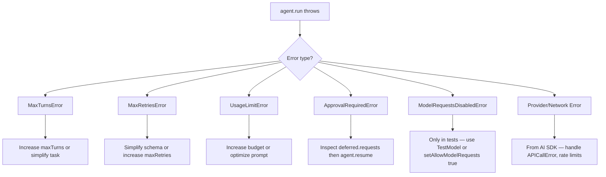
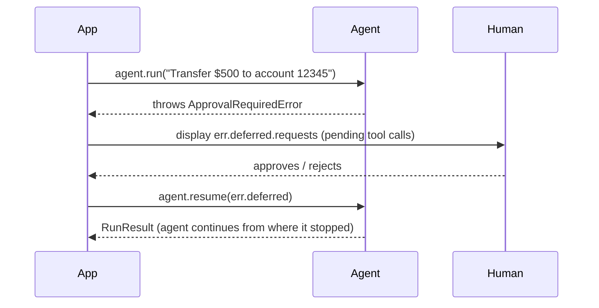

Both `agent.run()` and `agent.stream()` throw typed errors when the agent loop cannot complete normally. Wrap every agent call in a `try/catch` and switch on the error type to apply targeted recovery. A single generic `catch (err)` is a code smell — different errors require completely different responses.

```typescript
import {
  MaxTurnsError,
  MaxRetriesError,
  UsageLimitError,
  ApprovalRequiredError,
  ModelRequestsDisabledError,
} from "@vibes/framework";
```

## Error Taxonomy



---

## MaxTurnsError

Thrown when the agent loop exceeds the `maxTurns` limit set in `AgentOptions`. Each tool call–response pair counts as a turn.

**When it happens:** Complex tasks that require many tool calls, or tasks where the model is not converging (e.g., calling tools in a loop without making progress).

**Recovery:** Increase `maxTurns`, simplify the task, or add instructions to the system prompt guiding the model to finish sooner.

```typescript
import { agent } from "@vibes/framework";
import { MaxTurnsError } from "@vibes/framework";

const myAgent = agent({
  model: "claude-opus-4-5",
  maxTurns: 10,
  system: "You are a helpful assistant.",
});

try {
  const result = await myAgent.run("Perform a complex multi-step analysis...");
  console.log(result.output);
} catch (err) {
  if (err instanceof MaxTurnsError) {
    console.error(`Agent stopped after ${err.turns} turns. Simplify the task or increase maxTurns.`);
    // Option: retry with a simpler reformulated prompt
  } else {
    throw err;
  }
}
```

---

## MaxRetriesError

Thrown when the model fails to produce a valid response for structured output after the maximum number of retries. This most commonly occurs when `outputSchema` is complex and the model's output repeatedly fails Zod validation.

**When it happens:** The model produces JSON that is syntactically valid but fails schema validation, and after `maxRetries` attempts it still cannot produce a conforming response.

**Recovery:** Simplify the `outputSchema`, add field descriptions to guide the model, or increase `maxRetries` in `AgentOptions`.

```typescript
import { agent } from "@vibes/framework";
import { MaxRetriesError } from "@vibes/framework";
import { z } from "zod";

const myAgent = agent({
  model: "claude-opus-4-5",
  outputSchema: z.object({
    sentiment: z.enum(["positive", "negative", "neutral"]),
    confidence: z.number().min(0).max(1),
  }),
  maxRetries: 3,
});

try {
  const result = await myAgent.run("Analyze the sentiment of this review...");
} catch (err) {
  if (err instanceof MaxRetriesError) {
    console.error("Model could not produce a valid structured output after retries.");
    // Consider a fallback: run without outputSchema and parse manually
  } else {
    throw err;
  }
}
```

---

## UsageLimitError

Thrown when a `UsageLimits` budget defined in `AgentOptions` is exceeded mid-run. This is a cost-control mechanism — the agent stops before the model can incur more spend.

**Fields:**

| Field | Type | Description |
| ----- | ---- | ----------- |
| `err.limitKind` | `"requests" \| "inputTokens" \| "outputTokens" \| "totalTokens"` | Which budget was exceeded |
| `err.current` | `number` | Current usage at the point of failure |
| `err.limit` | `number` | The budget ceiling that was set |

<Warning>
The correct class name is `UsageLimitError` — **not** `UsageLimitExceededError`. Always import from `@vibes/framework` and rely on TypeScript autocomplete to confirm the name.
</Warning>

**Recovery:** Increase the budget in `UsageLimits`, break the task into smaller subtasks, or optimize the prompt to reduce token consumption. See [Results and Usage Limits](/concepts/results) for how to configure limits.

```typescript
import { agent } from "@vibes/framework";
import { UsageLimitError } from "@vibes/framework";

const myAgent = agent({
  model: "claude-opus-4-5",
  usageLimits: { totalTokens: 5000 },
});

try {
  const result = await myAgent.run("Process this large document...");
} catch (err) {
  if (err instanceof UsageLimitError) {
    console.error(
      `Usage limit exceeded: ${err.limitKind} is ${err.current} (limit: ${err.limit})`
    );
    // Log the overage and alert the user to try with a shorter prompt
  } else {
    throw err;
  }
}
```

---

## ApprovalRequiredError

Thrown when the agent encounters a tool call that has been marked as requiring human approval, and no approval has been granted yet. The error object carries the deferred tool calls so you can inspect them, prompt a human, and resume the agent.

**When it happens:** You configured a tool with `requiresApproval: true` (or equivalent), the model called it, and the agent cannot proceed without explicit permission.

**Recovery:** Inspect `err.deferred.requests`, display the pending calls to a human reviewer, then call `agent.resume(err.deferred)` to continue.

For the full human-in-the-loop pattern including UI integration, see [Human in the Loop](/concepts/human-in-the-loop).

```typescript
import { agent } from "@vibes/framework";
import { ApprovalRequiredError } from "@vibes/framework";

try {
  const result = await myAgent.run("Transfer $500 to account 12345");
} catch (err) {
  if (err instanceof ApprovalRequiredError) {
    // Show pending calls to a human reviewer
    console.log("Pending tool calls requiring approval:");
    for (const req of err.deferred.requests) {
      console.log(` - ${req.toolName}(${JSON.stringify(req.args)})`);
    }

    const approved = await promptHumanForApproval(err.deferred.requests);
    if (approved) {
      const result = await myAgent.resume(err.deferred);
      console.log(result.output);
    }
  } else {
    throw err;
  }
}
```

---

## ModelRequestsDisabledError

Thrown only in test environments when `setAllowModelRequests(false)` has been called to prevent accidental real API calls during tests. You will never see this in production.

**When it happens:** A test file calls `setAllowModelRequests(false)` at the top, and some code path triggers a real model request instead of using `TestModel`.

**Recovery:** Replace the real model with a `TestModel` in the affected test, or call `setAllowModelRequests(true)` before the code under test runs.

For the full testing guide and `TestModel` usage, see [Testing](/concepts/testing).

```typescript
import { agent, TestModel, setAllowModelRequests } from "@vibes/framework";
import { ModelRequestsDisabledError } from "@vibes/framework";

// In your test setup:
setAllowModelRequests(false);

try {
  // This will throw if a real model is used
  const result = await myAgent.run("Hello");
} catch (err) {
  if (err instanceof ModelRequestsDisabledError) {
    console.error("Test tried to make a real model request — use TestModel instead.");
  }
}
```

---

## Provider and Network Errors

All other errors during a model call come from the Vercel AI SDK and pass through the agent loop unmodified. The most common are `APICallError` (4xx/5xx from the provider) and rate-limit errors.

```typescript
import { APICallError } from "ai";

try {
  const result = await myAgent.run("...");
} catch (err) {
  if (err instanceof APICallError) {
    console.error(`Provider error ${err.statusCode}: ${err.message}`);
    // Implement exponential backoff for rate limits (429)
  }
}
```

Refer to the [Vercel AI SDK error documentation](https://sdk.vercel.ai/docs/reference/ai-sdk-errors) for the full list of SDK error types.

---

## Complete Error Handler

A production-ready pattern that handles all five Vibes error types plus provider errors:

```typescript
import {
  MaxTurnsError,
  MaxRetriesError,
  UsageLimitError,
  ApprovalRequiredError,
  ModelRequestsDisabledError,
} from "@vibes/framework";
import { APICallError } from "ai";

async function runWithRecovery(prompt: string) {
  try {
    const result = await myAgent.run(prompt);
    return result.output;
  } catch (err) {
    if (err instanceof MaxTurnsError) {
      throw new Error(`Agent hit turn limit (${err.turns} turns). Simplify the task.`);
    }

    if (err instanceof MaxRetriesError) {
      throw new Error("Model could not produce valid structured output. Simplify your schema.");
    }

    if (err instanceof UsageLimitError) {
      throw new Error(
        `Budget exceeded: ${err.limitKind} at ${err.current}/${err.limit}. Reduce prompt size.`
      );
    }

    if (err instanceof ApprovalRequiredError) {
      // Delegate to human approval flow — see /concepts/human-in-the-loop
      return await handleApproval(err);
    }

    if (err instanceof ModelRequestsDisabledError) {
      // Only in tests — should never reach production
      throw new Error("Test configuration error: real model called with requests disabled.");
    }

    if (err instanceof APICallError) {
      throw new Error(`Provider error (${err.statusCode}): ${err.message}`);
    }

    // Unknown error — rethrow
    throw err;
  }
}
```

---

## ApprovalRequiredError Recovery Sequence



This is the most complex recovery flow because it spans two separate agent invocations. The `err.deferred` object carries all state needed to resume — the agent does not need to restart the conversation from scratch.
