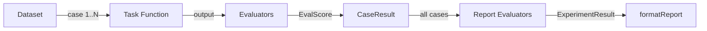
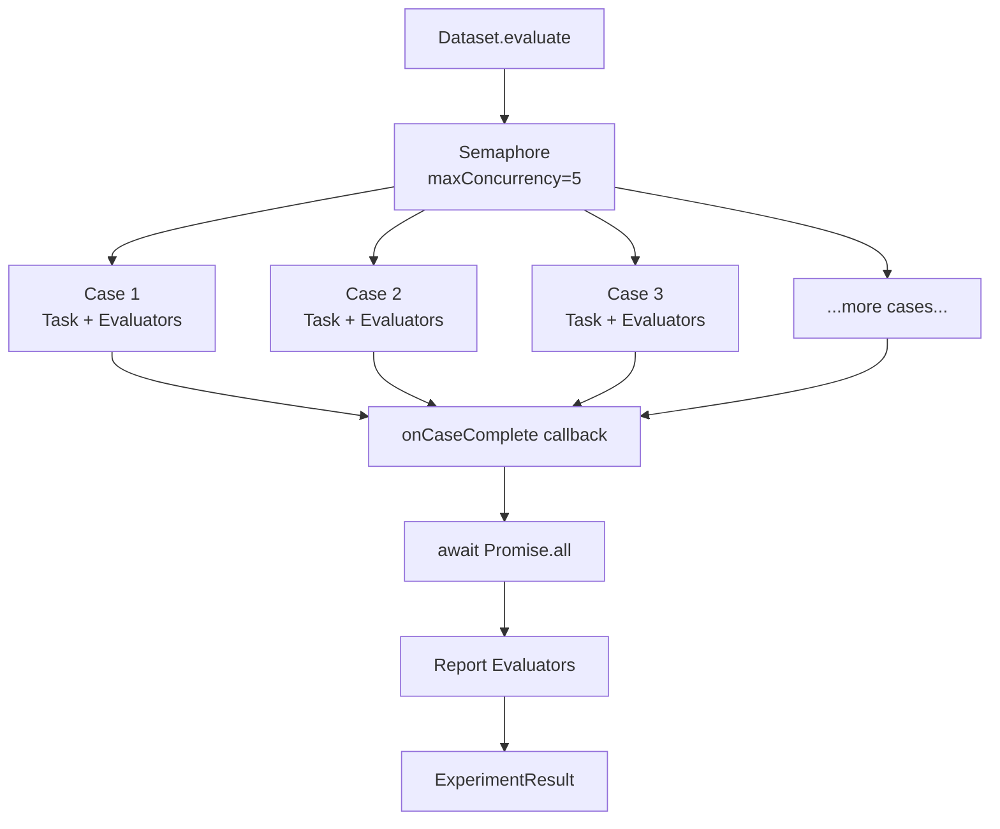

## Introduction

Evals (evaluations) let you measure how well your agent or task function performs across a set of test cases. Rather than checking a single output manually, you define a **Dataset** of inputs (with optional expected outputs), run your function over all of them, and score each result with **Evaluators**.

This is a 1-1 TypeScript port of [Pydantic AI's evals module](https://ai.pydantic.dev/evals/).

Key benefits:

- **Systematic testing** — catch regressions across many input scenarios
- **Quantitative scoring** — go beyond pass/fail with numeric scores and summary statistics
- **LLM-as-judge** — use a language model to evaluate subjective qualities like helpfulness or accuracy
- **Concurrency** — run cases in parallel with configurable limits
- **Immutable data** — all dataset transformations return new objects

---

## Quick Start

```typescript
import {
  Dataset,
  equalsExpected,
  formatReport,
} from "@vibes/framework";

// 1. Define your dataset
const dataset = Dataset.fromArray([
  { name: "uppercase hello", inputs: "hello", expectedOutput: "HELLO" },
  { name: "uppercase world", inputs: "world", expectedOutput: "WORLD" },
], {
  evaluators: [equalsExpected()],
});

// 2. Define your task
async function uppercaseTask(input: string): Promise<string> {
  return input.toUpperCase();
}

// 3. Run the experiment
const result = await dataset.evaluate(uppercaseTask);

// 4. Print a report
console.log(formatReport(result));
```

Output:

```
============================================================
Eval Report
============================================================
Timestamp:      2025-01-01T12:00:00.000Z
Total Duration: 3ms
Cases:          2

------------------------------------------------------------
Summary
------------------------------------------------------------
Evaluator        Mean      Min      Max    PassRate
------------------------------------------------------
equalsExpected  1.000    1.000    1.000      100.0%

------------------------------------------------------------
Cases
------------------------------------------------------------
[OK] uppercase hello (1ms)
  equalsExpected: pass - output matches expectedOutput
[OK] uppercase world (0ms)
  equalsExpected: pass - output matches expectedOutput
============================================================
```

---

## Dataset and Case

A **Dataset** is an immutable collection of **Cases**. Each Case has:

| Field            | Type                       | Required | Description                                     |
| ---------------- | -------------------------- | -------- | ----------------------------------------------- |
| `inputs`         | `TInput`                   | Yes      | The input passed to your task function           |
| `name`           | `string`                   | No       | Human-readable label for this case               |
| `expectedOutput` | `TExpected`                | No       | Reference output for evaluators                  |
| `metadata`       | `Record<string, unknown>`  | No       | Arbitrary metadata attached to this case         |
| `evaluators`     | `Evaluator[]`              | No       | Per-case evaluators (added to dataset evaluators)|

### Creating Datasets

```typescript
// From an array
const ds = Dataset.fromArray(cases, { name: "my-dataset", evaluators: [...] });

// From a JSON string or object
const ds = Dataset.fromJSON<string, string>(jsonString);
const ds = Dataset.fromJSON<string, string>({ cases: [...] });

// From a file
const ds = await Dataset.fromFile<string, string>("./cases.json");

// From raw text
const ds = Dataset.fromText<string, string>(text, "json");
```

### Immutable Transformations

```typescript
// Filter cases (returns a new Dataset)
const subset = ds.filter((c) => c.metadata?.env === "production");

// Map cases to a new type (returns a new Dataset)
const transformed = ds.map((c) => ({
  ...c,
  inputs: c.inputs.trim(),
}));

// Iterate
for (const c of ds) {
  console.log(c.name, c.inputs);
}
```

### Serialization

```typescript
// To JSON object (evaluators excluded — they are functions)
const json = ds.toJSON();

// Write to file
await ds.toFile("./cases.json");
```

---

## Built-in Evaluators

All built-in evaluators implement the `Evaluator` interface and return an `EvalScore`.

### Case-Level Evaluators

| Evaluator        | Description                                              | Score type |
| ---------------- | -------------------------------------------------------- | ---------- |
| `equalsExpected()` | Strict equality between output and `expectedOutput`    | boolean    |
| `equals(value)`  | Strict equality between output and a fixed value         | boolean    |
| `contains(str)`  | String output contains substring                         | boolean    |
| `isInstance(type)` | `typeof output === typeName`                           | boolean    |
| `maxDuration(sec)` | Task completed within the time limit                   | boolean    |
| `hasMatchingSpan(pred)` | Span tree contains a node matching predicate      | boolean    |
| `isValidSchema(schema)` | Output validates against a Zod schema             | boolean    |
| `custom(name, fn)` | User-defined evaluator function                        | any        |

```typescript
import {
  contains,
  equals,
  equalsExpected,
  isInstance,
  isValidSchema,
  maxDuration,
  custom,
} from "@vibes/framework";
import { z } from "zod";

const evaluators = [
  equalsExpected(),
  equals("expected value"),
  contains("keyword", { caseSensitive: false }),
  isInstance("string"),
  maxDuration(5), // 5 seconds
  isValidSchema(z.object({ name: z.string() })),
  custom("my-check", (ctx) => ({
    score: ctx.output !== null,
    reason: "output must not be null",
  })),
];
```

### EvalScore

Every evaluator returns an `EvalScore`:

```typescript
interface EvalScore {
  score: number | boolean | string;
  label?: string;
  reason?: string;
}
```

---

## LLM-as-Judge

For subjective qualities (helpfulness, accuracy, tone), use an LLM as the evaluator.

```typescript
import { llmJudge, setDefaultJudgeModel } from "@vibes/framework";
import { openai } from "@ai-sdk/openai";

// Optional: set a default model once
setDefaultJudgeModel(openai("gpt-4o-mini"));

const ev = llmJudge({
  rubric: "Is the response helpful, accurate, and concise?",
  // model: openai("gpt-4o"), // override per-evaluator
  includeInput: true,         // include task input in judge context
  includeExpectedOutput: true, // include expected output in judge context
  score: false,                // false = boolean, true = numeric 0-1
});
```

### Helper Functions

For one-off judge calls (outside of a dataset):

```typescript
import {
  judgeOutput,
  judgeInputOutput,
  judgeOutputExpected,
  judgeInputOutputExpected,
} from "@vibes/framework";

const score = await judgeOutput(output, "Is it helpful?", model);
const score = await judgeInputOutput(input, output, "Does it answer the question?", model);
const score = await judgeOutputExpected(output, expected, "Does it match?", model);
const score = await judgeInputOutputExpected(input, output, expected, "Correct?", model);
```

---

## Custom Evaluators

Implement the `Evaluator` interface for full control:

```typescript
import type { Evaluator, EvaluatorContext, EvalScore } from "@vibes/framework";

const sentimentEvaluator: Evaluator<string, undefined> = {
  name: "positive-sentiment",
  evaluate(ctx: EvaluatorContext<unknown, undefined, string>): EvalScore {
    const output = ctx.output ?? "";
    const positive = output.includes("good") || output.includes("great");
    return {
      score: positive,
      reason: positive ? "output has positive sentiment" : "output lacks positive words",
    };
  },
};
```

Or use the `custom()` factory:

```typescript
import { custom } from "@vibes/framework";

const ev = custom("word-count", (ctx) => ({
  score: typeof ctx.output === "string" && ctx.output.split(" ").length >= 10,
  reason: "response should be at least 10 words",
}));
```

### Accessing Context

The `EvaluatorContext` gives evaluators access to:

```typescript
ctx.inputs          // task input
ctx.output          // task output (undefined if task threw)
ctx.expectedOutput  // expected output (from Case)
ctx.metadata        // case metadata
ctx.spanTree        // OTel span tree (if captured)
ctx.usage           // token usage (if captured)
ctx.durationMs      // task wall-clock duration in ms

// Accumulate data from within an evaluator
ctx.setEvalAttribute("raw-score", 0.85);
ctx.incrementEvalMetric("tokens-checked", 42);
```

---

## Report-Level Evaluators

Report evaluators run once after all cases complete and receive the full `CaseResult[]` array. Use them for aggregate metrics.

```typescript
import {
  confusionMatrix,
  precisionRecall,
  rocAuc,
  kolmogorovSmirnov,
} from "@vibes/framework";

const ds = Dataset.fromArray(cases, {
  reportEvaluators: [
    confusionMatrix({
      getLabel: (r) => r.output as string,
      getExpected: (r) => r.case.expectedOutput as string,
    }),
    precisionRecall({
      getPositive: (r) => r.output as boolean,
      getExpected: (r) => r.case.expectedOutput as boolean,
    }),
    rocAuc({
      getScore: (r) => r.output as number,
      getLabel: (r) => r.case.expectedOutput as boolean,
    }),
    kolmogorovSmirnov({
      getScoreA: (r, i) => scoresA[i],
      getScoreB: (r, i) => scoresB[i],
    }),
  ],
});
```

---

## Experiment Runner

Use `Dataset.evaluate()` as your primary API. The `runExperiment()` function is a thin wrapper for cases where you want to merge extra evaluators at call time:

```typescript
import { runExperiment, equalsExpected } from "@vibes/framework";

const result = await runExperiment({
  dataset: myDataset,
  task: async (input) => agent.run(input).then(r => r.output),
  evaluators: [equalsExpected()], // merged with dataset.evaluators
  maxConcurrency: 5,
  maxRetries: 2,
  onCaseComplete: (r) => console.log(`Done: ${r.case.name}`),
});
```

### Evaluate Options

| Option           | Type     | Default | Description                                 |
| ---------------- | -------- | ------- | ------------------------------------------- |
| `maxConcurrency` | `number` | `5`     | Maximum concurrent case evaluations         |
| `maxRetries`     | `number` | `1`     | Maximum task retry attempts per case        |
| `onCaseComplete` | function | -       | Callback invoked after each case completes  |

---

## Span-Based Evaluation

When your task function captures OTel spans, you can evaluate them with `hasMatchingSpan`:

```typescript
import { SpanTree, hasMatchingSpan } from "@vibes/framework";

// Build a SpanTree from captured span data
const tree = SpanTree.fromSpanData(capturedSpans);

// Use in an evaluator
const ev = hasMatchingSpan(
  (node) => node.name === "llm-call" && node.status === "ok",
  "llm-call-succeeded",
);

// Or traverse programmatically
const llmSpans = tree.find((n) => n.name.startsWith("llm"));
const anyErrors = tree.any((n) => n.status === "error");
const callCount = tree.count((n) => n.name === "tool-call");
```

---

## Dataset Generation

Use an LLM to generate test cases automatically:

```typescript
import { generateDataset } from "@vibes/framework";
import { z } from "zod";
import { openai } from "@ai-sdk/openai";

const ds = await generateDataset({
  model: openai("gpt-4o"),
  nExamples: 10,
  inputSchema: z.object({
    question: z.string().describe("A geography trivia question"),
  }),
  expectedOutputSchema: z.string().describe("The correct answer"),
  extraInstructions: "Focus on capital cities of European countries.",
});
```

---

## Eval Pipeline



## Concurrency Flow


