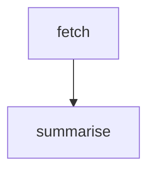

A `Graph` is a finite state machine pipeline. You define nodes (processing steps) and transitions between them; the graph executes them in sequence, carrying a typed state object from node to node until a node produces a final output.

Use graphs for multi-step sequential workflows, resumable pipelines, and pipelines that benefit from step-by-step inspection or replay.

<Info>
If you are looking at older Vibes docs that show `new Graph({ nodes: [...] })` or `this.next()` inside a node — those are incorrect. The correct API is shown on this page.
</Info>

## Graph State Machine



## Defining Nodes

Each node extends `BaseNode<State, Output>`. The `run()` method returns either `next(nodeId, newState)` to transition to another node, or `output(value)` to end the graph. Import `next` and `output` as free functions from `@vibes/framework` — they are NOT methods on `BaseNode`.

```typescript
import { Agent, BaseNode, next, output } from "@vibes/framework";
import { anthropic } from "@ai-sdk/anthropic";

type State = { url: string; content?: string };

class FetchNode extends BaseNode<State, string> {
  readonly id = "fetch";
  readonly nextNodes = ["summarise"]; // optional — used by toMermaid() for edges

  async run(state: State) {
    const content = await fetch(state.url).then(r => r.text());
    return next<State, string>("summarise", { ...state, content });
    //    ^^^^ free function imported from @vibes/framework — NOT this.next()
  }
}

const summariseAgent = new Agent({
  model: anthropic("claude-sonnet-4-6"),
  systemPrompt: "Summarise the provided content in a few sentences.",
});

class SummariseNode extends BaseNode<State, string> {
  readonly id = "summarise";

  async run(state: State) {
    const summary = await summariseAgent.run(`Summarise: ${state.content}`);
    return output<State, string>(summary.output);
    //     ^^^^ free function imported from @vibes/framework — NOT this.output()
  }
}
```

### BaseNode fields

| Field | Type | Description |
|-------|------|-------------|
| `id` | `string` (abstract) | Unique node identifier — used by `Graph` to look up and route to this node |
| `nextNodes?` | `string[]` | Optional list of node IDs this node can transition to — used by `toMermaid()` to draw edges |
| `run(state)` | `Promise<NodeResult>` (abstract) | Runs the node logic; return `next(...)` or `output(...)` |

## Building and Running a Graph

Pass nodes as a positional array to the `Graph` constructor. An optional second argument accepts `{ maxIterations? }`.

```typescript
import { Graph } from "@vibes/framework";

const graph = new Graph<State, string>([new FetchNode(), new SummariseNode()], {
  maxIterations: 50, // optional — default is unlimited
});

const result = await graph.run(
  { url: "https://example.com" }, // initial state
  "fetch"                          // start node ID
);

console.log(result); // "Example Domain is a placeholder website..."
```

## Step-by-Step Iteration with runIter()

`graph.runIter()` returns a `GraphRun` object. Call `run.next()` repeatedly to advance one step at a time. Each step is either a `"node"` step (with `nodeId` and `state`) or an `"output"` step (with `output`).

```typescript
import { Graph, GraphRun } from "@vibes/framework";

const run = graph.runIter({ url: "https://example.com" }, "fetch");

let step = await run.next();
while (step !== null && step.kind === "node") {
  console.log("At node:", step.nodeId, "state:", step.state);
  step = await run.next();
}

if (step?.kind === "output") {
  console.log("Done:", step.output);
}
```

### GraphStep kinds

| `step.kind` | Extra fields | When |
|------------|-------------|------|
| `"node"` | `nodeId: string`, `state: State` | After each node completes a transition |
| `"output"` | `output: Output` | When a node calls `output(value)` — graph is complete |

## Visualizing with toMermaid()

`graph.toMermaid()` returns a `flowchart TD` Mermaid string. The edges are derived from the `nextNodes` declarations on each `BaseNode`.

```typescript
const diagram = graph.toMermaid();
console.log(diagram);
// flowchart TD
//   fetch[fetch]
//   summarise[summarise]
//   fetch --> summarise
```

Paste the output into any Mermaid renderer or embed it in your docs as a fenced `mermaid` code block.

## Persistence

Pass a `FileStatePersistence` instance to `graph.run()` to checkpoint state after each node. If the run is interrupted, restarting with the same `graphId` resumes from the last saved state.

```typescript
import { FileStatePersistence, Graph } from "@vibes/framework";

const persistence = new FileStatePersistence<State>("./graph-state");

const result = await graph.run(
  { url: "https://example.com" },
  "fetch",
  { persistence, graphId: "run-123" } // resumes if state file for run-123 exists
);
```

For in-memory persistence (useful in tests), use `MemoryStatePersistence`:

```typescript
import { MemoryStatePersistence } from "@vibes/framework";

const persistence = new MemoryStatePersistence<State>();
const result = await graph.run(initialState, "fetch", { persistence, graphId: "test-run" });
```

## API Reference

| Symbol | Description |
|--------|-------------|
| `BaseNode<State, Output>` | Abstract base class for graph nodes |
| `BaseNode.id` | `string` — unique node ID (abstract, set as `readonly id = "..."`) |
| `BaseNode.nextNodes?` | `string[]` — optional outgoing node IDs for Mermaid edge generation |
| `BaseNode.run(state)` | `Promise<NodeResult>` — abstract node logic; return `next(...)` or `output(...)` |
| `next(nodeId, newState)` | Free function — transitions to another node with updated state |
| `output(value)` | Free function — ends the graph with a final output value |
| `new Graph<State, Output>(nodes, options?)` | Create a graph from a node array; `options.maxIterations?` caps turns |
| `graph.run(state, startNodeId, options?)` | Run to completion; returns `Output` |
| `graph.runIter(state, startNodeId)` | Returns `GraphRun` for step-by-step iteration |
| `GraphRun.next()` | Returns `GraphStep \| null` |
| `GraphStep` | `{ kind: "node", nodeId, state }` or `{ kind: "output", output }` |
| `graph.toMermaid()` | Returns a `flowchart TD` Mermaid string |
| `FileStatePersistence<State>(dir)` | Persists graph state to files under `dir/`; resumes on restart |
| `MemoryStatePersistence<State>()` | In-memory persistence — useful for testing |

---

<CardGroup cols={2}>
  <Card title="Agents" icon="robot" href="/concepts/agents">
    Use agents as nodes in your graph workflow
  </Card>
  <Card title="Graph Workflow Example" icon="diagram-project" href="/examples/graph-workflow">
    End-to-end graph pipeline example
  </Card>
</CardGroup>
