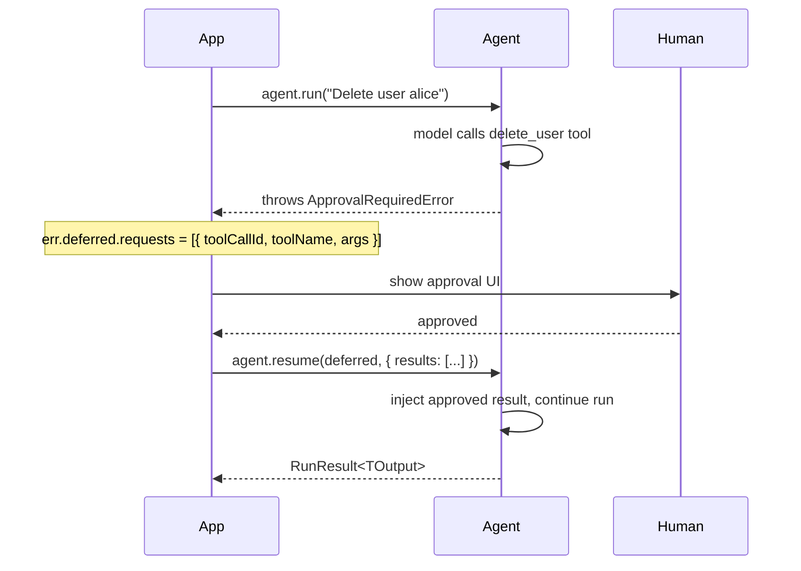

Human-in-the-loop (HITL) lets you pause an agent run before a sensitive tool executes, ask a human for approval, then resume the run with the decision. Use it whenever an action is irreversible, high-risk, or requires accountability - deleting records, sending emails, making purchases, or executing code on behalf of a user.

## Approval Flow



## requiresApproval on tool()

Add `requiresApproval: true` to any tool definition. The framework will throw `ApprovalRequiredError` before calling `execute`, giving your application a chance to intercept the call and ask for human approval.

```typescript
import { Agent, ApprovalRequiredError, tool } from "@vibes/framework";
import { anthropic } from "@ai-sdk/anthropic";
import { z } from "zod";

const deleteTool = tool({
  name: "delete_user",
  description: "Permanently delete a user account",
  parameters: z.object({ userId: z.string() }),
  execute: async (_ctx, { userId }) => `User ${userId} deleted.`,
  requiresApproval: true,   // throws ApprovalRequiredError before execute
});

const agent = new Agent({
  model: anthropic("claude-sonnet-4-6"),
  tools: [deleteTool],
});

try {
  await agent.run("Delete user alice123");
} catch (err) {
  if (err instanceof ApprovalRequiredError) {
    const { deferred } = err;
    // deferred.requests: DeferredToolRequest[]
    // Each: { toolCallId, toolName, args }

    const approved = await askHumanApproval(deferred.requests);

    const results = {
      results: approved.map(req => ({
        toolCallId: req.toolCallId,
        result: "approved",          // inject result directly
        // OR: argsOverride: { ... } // re-execute with different args
      })),
    };

    const finalResult = await agent.resume(deferred, results);
    console.log(finalResult.output);
  }
}
```

## DeferredToolRequests

When `ApprovalRequiredError` is thrown, `err.deferred` is a `DeferredToolRequests` object. Its `requests` array contains one entry for each tool the model called simultaneously. Each entry is a `DeferredToolRequest`:

```typescript
// err.deferred.requests shape:
interface DeferredToolRequest {
  toolCallId: string;   // unique ID for this call
  toolName: string;     // matches tool.name in your definition
  args: unknown;        // the arguments the model passed
}
```

Iterate over `deferred.requests` to build your approval UI and construct the `results` array:

```typescript
import { ApprovalRequiredError } from "@vibes/framework";

try {
  await agent.run("...");
} catch (err) {
  if (err instanceof ApprovalRequiredError) {
    const { deferred } = err;

    // Build results for each pending tool call
    const results = {
      results: deferred.requests.map(req => ({
        toolCallId: req.toolCallId,
        result: `Approved: ${req.toolName} with args ${JSON.stringify(req.args)}`,
      })),
    };

    const finalResult = await agent.resume(deferred, results);
  }
}
```

## ExternalToolset

Use `ExternalToolset` when tool execution happens client-side and you have a raw JSON Schema instead of a Zod schema. `ExternalToolset` automatically sets `requiresApproval: true` on every tool - the intent is always to throw `ApprovalRequiredError`, let the client execute the tool, then resume with the result.

```typescript
import { Agent, ApprovalRequiredError, ExternalToolset } from "@vibes/framework";
import { anthropic } from "@ai-sdk/anthropic";

const clientTools = new ExternalToolset([
  {
    name: "read_file",
    description: "Read a file from the user's local filesystem",
    jsonSchema: {
      type: "object",
      properties: { path: { type: "string" } },
      required: ["path"],
    },
  },
]);

const agent = new Agent({
  model: anthropic("claude-sonnet-4-6"),
  toolsets: [clientTools],
});

try {
  await agent.run("Read my config file at ~/.config/app.json");
} catch (err) {
  if (err instanceof ApprovalRequiredError) {
    const { deferred } = err;
    // Execute client-side and collect results
    const results = {
      results: await Promise.all(
        deferred.requests.map(async req => ({
          toolCallId: req.toolCallId,
          result: await executeClientSide(req.toolName, req.args),
        }))
      ),
    };
    const finalResult = await agent.resume(deferred, results);
  }
}
```

<Info>
**ExternalToolset vs requiresApproval: true on tool()**

Use `requiresApproval: true` on `tool()` when you have a Zod schema and a server-side `execute` function, but want human approval before it runs.

Use `ExternalToolset` when tool execution happens client-side/externally and you have a raw JSON Schema instead of Zod. `ExternalToolset` sets `requiresApproval: true` automatically.
</Info>

## Approving with Modified Args

To re-run a tool with different arguments (for example, letting a human correct a filename before proceeding), provide `argsOverride` instead of `result` in the resume results:

```typescript
const results = {
  results: deferred.requests.map(req => ({
    toolCallId: req.toolCallId,
    argsOverride: {
      // Corrected args - the tool's execute function will be called with these
      userId: "alice456",  // human corrected the ID
    },
  })),
};

const finalResult = await agent.resume(deferred, results);
```

When `argsOverride` is present, the framework re-invokes the tool's `execute` function with the new arguments. When `result` is present, the framework injects it directly as the tool result without calling `execute`.

## API Reference

| Symbol | Type | Description |
|--------|------|-------------|
| `requiresApproval` | `boolean` | Option on `tool()` - causes `ApprovalRequiredError` before `execute` runs |
| `ApprovalRequiredError` | `class` | Thrown when a tool with `requiresApproval: true` is called; has `.deferred` property |
| `DeferredToolRequest` | `interface` | `{ toolCallId: string, toolName: string, args: unknown }` - one entry per pending tool call |
| `DeferredToolRequests` | `class` | `err.deferred`; has `.requests: DeferredToolRequest[]` |
| `DeferredToolResults` | `interface` | Argument to `agent.resume()` - `{ results: DeferredToolResult[] }` |
| `DeferredToolResult` | `interface` | `{ toolCallId: string, result?: unknown, argsOverride?: unknown }` - provide one or the other |
| `agent.resume(deferred, results)` | `method` | Resumes a paused run; returns `Promise<RunResult<TOutput>>` |
| `ExternalToolset` | `class` | Toolset for client-side tools defined with JSON Schema; auto-sets `requiresApproval: true` |
| `ExternalToolDefinition` | `interface` | `{ name: string, description: string, jsonSchema: object }` |

---

<CardGroup cols={2}>
  <Card title="Tools" icon="wrench" href="/concepts/tools">
    Define tools with Zod schemas and execute functions
  </Card>
  <Card title="Toolsets" icon="toolbox" href="/concepts/toolsets">
    Group tools into reusable toolsets including ExternalToolset
  </Card>
</CardGroup>
