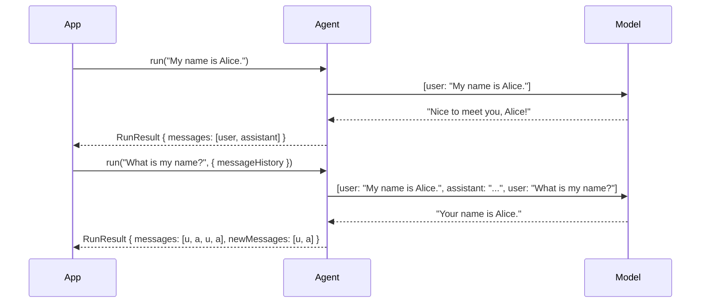

Every agent run produces a list of `ModelMessage` objects. Passing these back into the next run continues the conversation, giving the model full context. History processors let you transform, trim, summarize, or filter messages before each turn — keeping context windows manageable without losing important history.

## Multi-Turn Conversations



Use `result.messages` as the `messageHistory` for the next run:

```typescript
import { Agent } from "@vibes/framework";
import { anthropic } from "@ai-sdk/anthropic";

const agent = new Agent({
  model: anthropic("claude-sonnet-4-6"),
  systemPrompt: "You are a helpful assistant.",
});

const first = await agent.run("My name is Alice.");
const second = await agent.run("What is my name?", {
  messageHistory: first.messages,  // continue the conversation
});

console.log(second.output);       // "Your name is Alice."
console.log(second.newMessages);  // only messages added in this run
```

`result.messages` contains the **full** conversation history (including prior turns). `result.newMessages` contains only the messages added during this specific run — useful for storing incremental updates.

## Message Serialization

To persist conversation history across sessions, serialize messages to JSON and restore them later.

```typescript
import { serializeMessages, deserializeMessages } from "@vibes/framework";

// After a run — store to DB or file
const json = serializeMessages(result.messages);
await db.save("session-123", json);

// On next session — restore for continuation
const stored = await db.load("session-123");
const messages = deserializeMessages(stored);

const next = await agent.run("What did we discuss?", {
  messageHistory: messages,
});
```

`serializeMessages` encodes `ModelMessage[]` to a JSON string. `deserializeMessages` is the inverse: it parses and validates the JSON, returning a typed `ModelMessage[]`.

## History Processors

`historyProcessors` run before each turn and receive the accumulated message history. They return a (possibly modified) message list that is sent to the model. Use them to keep context windows affordable without losing important history.

```typescript
const agent = new Agent({
  model,
  historyProcessors: [trimHistoryProcessor(20)],
});
```

Multiple processors are applied in order, each receiving the output of the previous.

### trimHistoryProcessor

Keep the last N messages. Simple and fast — good for short-context workflows.

```typescript
import { trimHistoryProcessor } from "@vibes/framework";

const agent = new Agent({
  model,
  historyProcessors: [trimHistoryProcessor(20)],  // keep last 20 messages
});
```

### tokenTrimHistoryProcessor

Trim messages to fit within a token budget. Removes older messages first until the history fits.

```typescript
import { tokenTrimHistoryProcessor } from "@vibes/framework";

const agent = new Agent({
  model,
  historyProcessors: [tokenTrimHistoryProcessor(4000)],  // max 4000 tokens
});
```

### summarizeHistoryProcessor

Summarize messages that exceed a threshold, replacing them with a condensed summary message. Preserves semantic content while reducing token count.

```typescript
import { summarizeHistoryProcessor } from "@vibes/framework";

const agent = new Agent({
  model,
  historyProcessors: [
    summarizeHistoryProcessor(model, { maxMessages: 10 }),
  ],
});
```

### privacyFilterProcessor

Redact sensitive content before messages are sent to the model. Supports regex-based redaction and field-path-based removal.

```typescript
import { privacyFilterProcessor } from "@vibes/framework";

const agent = new Agent({
  model,
  historyProcessors: [
    privacyFilterProcessor([
      // RegexPrivacyRule — replace pattern matches with a placeholder
      { pattern: /\d{4}-\d{4}-\d{4}-\d{4}/g, replacement: "[CARD]" },
      // FieldPrivacyRule — remove a specific field from tool messages
      { messageType: "tool", fieldPath: "content.0.result.ssn" },
    ]),
  ],
});
```

The two rule types:

| Rule type | Shape | When to use |
|-----------|-------|-------------|
| `RegexPrivacyRule` | `{ pattern: RegExp, replacement?: string }` | Redact patterns anywhere in text (credit cards, emails, etc.) |
| `FieldPrivacyRule` | `{ messageType: string, fieldPath: string }` | Remove a specific structured field from tool call results |

<Warning>
Do not use `{ type: "regex", redactValue: ... }` — that shape is incorrect. The actual `PrivacyRule` union uses `pattern` for regex rules with no `type` key.
</Warning>

## Custom History Processors

A history processor is any function that takes `(messages: ModelMessage[], ctx: RunContext<TDeps>)` and returns a `ModelMessage[]`.

```typescript
import type { HistoryProcessor } from "@vibes/framework";

// Keep only user and assistant messages — drop tool calls
const noTools: HistoryProcessor = (messages, _ctx) =>
  messages.filter((m) => m.role === "user" || m.role === "assistant");

const agent = new Agent({
  model,
  historyProcessors: [noTools],
});
```

Custom processors compose with built-in ones — pass them in the same array.

---

<CardGroup cols={2}>
  <Card title="Streaming" icon="bolt" href="/concepts/streaming">
    Real-time token and event streaming
  </Card>
  <Card title="Agents" icon="robot" href="/concepts/agents">
    Agent class, run methods, and options
  </Card>
</CardGroup>
