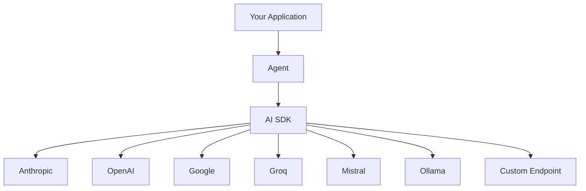

Vibes accepts any [Vercel AI SDK](https://sdk.vercel.ai) `LanguageModel` instance as its `model` option. This means every provider that ships a Vercel AI SDK adapter - Anthropic, OpenAI, Google, Groq, Mistral, Ollama, and custom OpenAI-compatible endpoints - works with Vibes out of the box. The model is passed at agent construction and can be overridden per run.

For installation and initial setup, see [Getting Started](/getting-started/install).

## Architecture



## Provider Quickstarts

Install the provider package for your chosen model, set the API key environment variable, and pass the model instance to `Agent`.

<Info>
All provider packages follow the Vercel AI SDK spec. Install the provider package for your chosen model, set the API key env var, and pass the model instance to `Agent`.
</Info>

### Anthropic

```bash
npm install @ai-sdk/anthropic
```

```typescript
import { Agent } from "@vibes/framework";
import { anthropic } from "@ai-sdk/anthropic";
// Requires: ANTHROPIC_API_KEY environment variable

const agent = new Agent({
  model: anthropic("claude-sonnet-4-6"),
  systemPrompt: "You are helpful.",
});
```

### OpenAI

```bash
npm install @ai-sdk/openai
```

```typescript
import { Agent } from "@vibes/framework";
import { openai } from "@ai-sdk/openai";
// Requires: OPENAI_API_KEY environment variable

const agent = new Agent({
  model: openai("gpt-4o"),
  systemPrompt: "You are helpful.",
});
```

### Google Gemini

```bash
npm install @ai-sdk/google
```

```typescript
import { Agent } from "@vibes/framework";
import { google } from "@ai-sdk/google";
// Requires: GOOGLE_GENERATIVE_AI_API_KEY environment variable

const agent = new Agent({
  model: google("gemini-2.0-flash"),
  systemPrompt: "You are helpful.",
});
```

### Groq

```bash
npm install @ai-sdk/groq
```

```typescript
import { Agent } from "@vibes/framework";
import { groq } from "@ai-sdk/groq";
// Requires: GROQ_API_KEY environment variable

const agent = new Agent({
  model: groq("llama-3.3-70b-versatile"),
  systemPrompt: "You are helpful.",
});
```

### Mistral

```bash
npm install @ai-sdk/mistral
```

```typescript
import { Agent } from "@vibes/framework";
import { mistral } from "@ai-sdk/mistral";
// Requires: MISTRAL_API_KEY environment variable

const agent = new Agent({
  model: mistral("mistral-large-latest"),
  systemPrompt: "You are helpful.",
});
```

### Ollama (local)

```bash
npm install ollama-ai-provider
```

```typescript
import { Agent } from "@vibes/framework";
import { ollama } from "ollama-ai-provider";
// No API key required - connects to your local Ollama server

const agent = new Agent({
  model: ollama("llama3.2"),
  systemPrompt: "You are helpful.",
});
```

### OpenAI-Compatible (custom endpoint)

Any service that exposes an OpenAI-compatible REST API can be used via `createOpenAI` with a custom `baseURL`:

```typescript
import { Agent } from "@vibes/framework";
import { createOpenAI } from "@ai-sdk/openai";

const custom = createOpenAI({
  baseURL: "https://my-provider.example.com/v1",
  apiKey: process.env.MY_API_KEY,
});

const agent = new Agent({
  model: custom("my-model"),
  systemPrompt: "You are helpful.",
});
```

## ModelSettings

`ModelSettings` lets you tune the model's sampling behavior. Pass it at agent construction to apply to every run, or override it per run via `RunOptions`.

| Field | Type | Description |
|-------|------|-------------|
| `temperature` | `number?` | Sampling temperature (0–2). Lower = more deterministic |
| `maxTokens` | `number?` | Maximum tokens to generate |
| `topP` | `number?` | Nucleus sampling: only sample from top-P probability mass |
| `topK` | `number?` | Only sample from the top-K tokens |
| `presencePenalty` | `number?` | Penalises tokens regardless of frequency (presence) |
| `frequencyPenalty` | `number?` | Penalises tokens that have already appeared (frequency) |
| `stopSequences` | `string[]?` | Stop generation when any of these sequences appear |
| `seed` | `number?` | Seed for deterministic generation (model-dependent) |

```typescript
const agent = new Agent({
  model: anthropic("claude-sonnet-4-6"),
  modelSettings: {
    temperature: 0.7,
    maxTokens: 2000,
  },
});
```

## Overriding the Model Per Run

Use `agent.override({ model })` to swap the model for a single run without modifying the agent. This is useful for routing different prompts to different models - for example, a cheaper model for classification and an expensive model for generation:

```typescript
const cheapModel = groq("llama-3.3-70b-versatile");
const richModel = anthropic("claude-sonnet-4-6");

// Use cheap model for simple classification
const label = await agent
  .override({ model: cheapModel })
  .run("Classify: is this spam? " + email);

// Use powerful model for generation
const reply = await agent
  .override({ model: richModel })
  .run("Draft a professional reply to: " + email);
```

---

<CardGroup cols={2}>
  <Card title="Install" icon="download" href="/getting-started/install">
    Set up providers and environment variables
  </Card>
  <Card title="Agents" icon="robot" href="/concepts/agents">
    Full Agent constructor options reference
  </Card>
</CardGroup>
