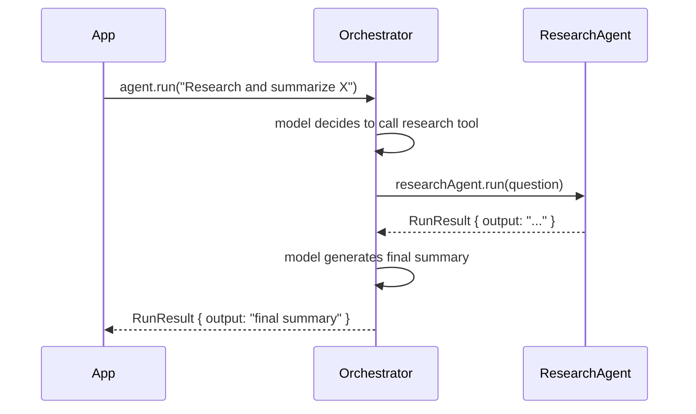

Multi-agent systems let you divide complex tasks across specialist agents, each with its own system prompt, tools, and model. Vibes has no dedicated multi-agent API: you delegate to a child agent by wrapping it in `tool()`. The orchestrating agent calls that tool like any other, and the framework handles usage aggregation automatically.

Use sub-agents when a sub-task needs a different persona or toolset, or when the output of one stage becomes structured input for the next.

## Agent Delegation Flow



## Agent-as-Tool Pattern

Wrap a child agent in `tool()`. The `execute` function calls the child agent and returns its output.

```typescript
import { Agent, tool } from "@vibes/framework";
import { anthropic } from "@ai-sdk/anthropic";
import { z } from "zod";

const researchAgent = new Agent({
  model: anthropic("claude-sonnet-4-6"),
  systemPrompt: "You are a research specialist. Answer questions with detailed, factual information.",
});

const researchTool = tool({
  name: "research",
  description: "Delegate a research question to the research specialist",
  parameters: z.object({ question: z.string() }),
  execute: async (_ctx, { question }) => {
    const result = await researchAgent.run(question);
    return result.output;
  },
});

const orchestratorAgent = new Agent({
  model: anthropic("claude-sonnet-4-6"),
  systemPrompt: "You are an orchestrator. Use the research tool for in-depth questions, then summarize the findings.",
  tools: [researchTool],
});

const result = await orchestratorAgent.run("Research and summarize the history of TypeScript");
console.log(result.output);
```

## Usage Aggregation

`RunResult.usage` automatically sums token usage across all nested agent calls. You do not need to track usage manually — the orchestrator's `result.usage` reflects the total cost of the entire delegation chain.

```typescript
const result = await orchestratorAgent.run("Research and summarize the history of TypeScript");

console.log(result.usage.inputTokens.total);   // total input tokens (all agents)
console.log(result.usage.outputTokens.total);  // total output tokens (all agents)
```

## Programmatic Handoff

You can route to different specialist agents based on runtime conditions. Use a plain TypeScript `if`/`else` inside `tool.execute()` — there is no special routing API.

```typescript
const routerTool = tool({
  name: "delegate",
  description: "Route the task to the appropriate specialist",
  parameters: z.object({
    taskType: z.enum(["research", "code", "math"]),
    prompt: z.string(),
  }),
  execute: async (_ctx, { taskType, prompt }) => {
    if (taskType === "research") {
      return (await researchAgent.run(prompt)).output;
    } else if (taskType === "code") {
      return (await codeAgent.run(prompt)).output;
    } else {
      return (await mathAgent.run(prompt)).output;
    }
  },
});
```

## When to Use Sub-Agents

Use sub-agents when:

- A sub-task requires a **different system prompt** (different persona, different instructions)
- A sub-task needs **different tools** that should not be exposed to the orchestrator
- The output of one stage becomes **structured input** for the next stage
- You want to **reuse an agent** across multiple orchestrators

Avoid sub-agents for:

- Simple single-tool operations that do not need a separate model call
- Cases where the orchestrator can solve the problem directly without specialist knowledge

## API Reference

There is no special multi-agent API in Vibes. Sub-agents are just agents wrapped in tools.

| Symbol | Description |
|--------|-------------|
| `agent.run(prompt, options?)` | Run an agent and return `RunResult<TOutput>` |
| `RunResult.output` | The agent's final output |
| `RunResult.usage` | Token usage — summed across all nested agent calls automatically |
| `tool({ execute })` | Wrap any async function as a tool, including `agent.run()` calls |

---

<CardGroup cols={2}>
  <Card title="Tools" icon="wrench" href="/concepts/tools">
    Define tools and wrap any function for agent use
  </Card>
  <Card title="Agents" icon="robot" href="/concepts/agents">
    Configure agents with models, tools, and system prompts
  </Card>
</CardGroup>
