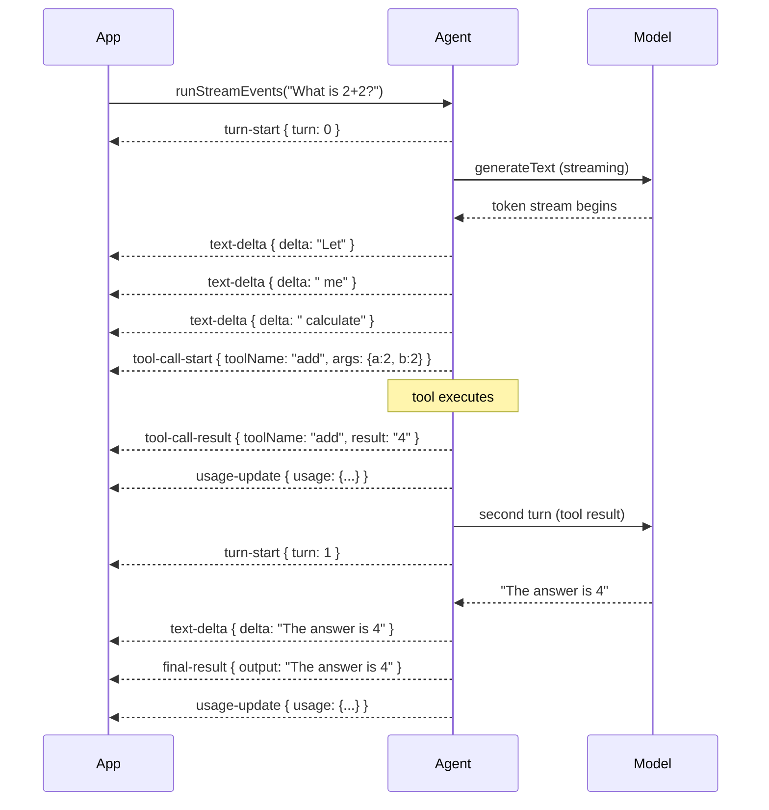

Vibes provides two streaming APIs. `agent.stream()` is the simpler option: it returns a `StreamResult` that you can iterate over for text tokens and await for the final output. `agent.runStreamEvents()` gives you granular event-level control: every turn start, text delta, tool call, and tool result is emitted as a typed event.

Use `agent.stream()` for most cases. Reach for `agent.runStreamEvents()` when you need full observability, custom progress indicators, or real-time tool call logging.

## Streaming Event Timeline



## agent.stream() — Simple Streaming

`agent.stream()` returns a `StreamResult<TOutput>` immediately. The async iterables deliver data in real time; the promises resolve when the run completes.

```typescript
import { Agent } from "@vibes/framework";
import { anthropic } from "@ai-sdk/anthropic";

const agent = new Agent({
  model: anthropic("claude-sonnet-4-6"),
  systemPrompt: "You are a helpful assistant.",
});

const stream = agent.stream("Tell me a story.");

// Stream tokens as they arrive
for await (const chunk of stream.textStream) {
  process.stdout.write(chunk);
}

// Await final values after consuming textStream
const output = await stream.output;           // Promise<TOutput>
const messages = await stream.messages;       // Promise<ModelMessage[]>
const newMessages = await stream.newMessages; // Promise<ModelMessage[]>
const usage = await stream.usage;             // Promise<Usage>
```

For progressive structured output (only when `outputMode: "tool"`):

```typescript
for await (const partial of stream.partialOutput) {
  console.log("Partial output:", partial);
}
```

## agent.runStreamEvents() — Event Stream

`agent.runStreamEvents()` returns an `AsyncIterable<AgentStreamEvent<TOutput>>`. Switch on `event.kind` to handle each event type.

```typescript
import type { AgentStreamEvent } from "@vibes/framework";

for await (const event of agent.runStreamEvents("What is 2 + 2?")) {
  switch (event.kind) {  // NOTE: .kind not .type
    case "turn-start":
      console.log(`Turn ${event.turn} started`);
      break;
    case "text-delta":
      process.stdout.write(event.delta);
      break;
    case "tool-call-start":
      console.log(`Calling ${event.toolName}`, event.args);
      break;
    case "tool-call-result":
      console.log(`Result from ${event.toolName}:`, event.result);
      break;
    case "partial-output":
      console.log("Partial output:", event.partial);
      break;
    case "usage-update":
      console.log("Usage:", event.usage);
      break;
    case "final-result":
      console.log("Done:", event.output);
      break;
    case "error":
      console.error("Error:", event.error);
      break;
  }
}
```

<Warning>
The event discriminant is `event.kind`, not `event.type`. The existing `reference/core/streaming.mdx` page has this bug — always use `event.kind`.
</Warning>

## AgentStreamEvent Reference

| `event.kind` | Extra Fields | When Emitted |
|-------------|-------------|--------------|
| `"turn-start"` | `turn: number` | Beginning of each model turn |
| `"text-delta"` | `delta: string` | Each text token from the model |
| `"tool-call-start"` | `toolName, toolCallId, args` | Model requests a tool call |
| `"tool-call-result"` | `toolCallId, toolName, result` | Tool finished executing |
| `"partial-output"` | `partial: unknown` | Progressive structured output (tool mode only) |
| `"usage-update"` | `usage: Usage` | After each turn completes |
| `"final-result"` | `output: TOutput` | Run completed successfully |
| `"error"` | `error: unknown` | Unrecoverable error — stream ends |

## When to Use Which

| Use Case | API |
|----------|-----|
| Stream text to user UI | `agent.stream()` + `textStream` |
| Await final structured output | `agent.stream()` + `output` |
| Observe tool calls in real time | `agent.runStreamEvents()` |
| Build custom progress indicators | `agent.runStreamEvents()` |
| Log every turn and tool for debugging | `agent.runStreamEvents()` |
| Persist new messages from this run | Either + `newMessages` |

## StreamResult Interface

For reference, the complete `StreamResult<TOutput>` interface:

| Field | Type | Description |
|-------|------|-------------|
| `textStream` | `AsyncIterable<string>` | Token-by-token text stream |
| `partialOutput` | `AsyncIterable<TOutput>` | Progressive structured output (tool mode only) |
| `output` | `Promise<TOutput>` | Final structured output |
| `messages` | `Promise<ModelMessage[]>` | Full conversation history |
| `newMessages` | `Promise<ModelMessage[]>` | Messages added during this run |
| `usage` | `Promise<Usage>` | Accumulated token usage |

---

<CardGroup cols={2}>
  <Card title="Messages" icon="message" href="/concepts/messages">
    Multi-turn conversations and message history
  </Card>
  <Card title="Results" icon="check" href="/concepts/results">
    RunResult and StreamResult interfaces
  </Card>
</CardGroup>
