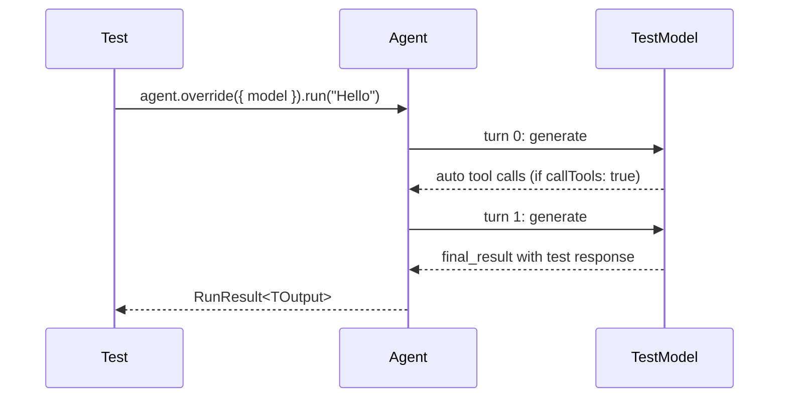

Testing agents correctly means running them without real model API calls, in a way that's fast and deterministic. Vibes provides two main options: `TestModel` auto-generates plausible tool calls and a final response on every run; `FunctionModel` gives you full per-turn control so you can simulate exact model behavior. Both integrate with `agent.override({ model })` to drop in a test model without changing your agent definition.

## Preventing Accidental API Calls

Call `setAllowModelRequests(false)` once at the top of your test file to raise an error if any agent accidentally reaches the real model API. This guards against tests that forget to use a test model.

```typescript
import { setAllowModelRequests } from "@vibes/framework/testing";

// At the top of your test file - prevents any real model call
setAllowModelRequests(false);
```

<Warning>
`setAllowModelRequests(false)` is module-level global state. Only call it once at the top of a test file setup block. `agent.override({ model })` bypasses this guard automatically - test models always work even when real calls are blocked.
</Warning>

## TestModel



`TestModel` is the simplest option. It auto-generates schema-valid tool calls for any tools the agent has, then returns a final result.

```typescript
import { setAllowModelRequests, TestModel, createTestModel } from "@vibes/framework/testing";
import { z } from "zod";

setAllowModelRequests(false);

// Basic usage: auto-generates tool calls, then returns "test response"
const model = new TestModel();
const result = await agent.override({ model }).run("Hello");
// result.output === "test response"

// With typed output schema: auto-generates schema-valid output
const OutputSchema = z.object({ answer: z.string() });
const typedModel = createTestModel({ outputSchema: OutputSchema });
const typedResult = await agent.override({ model: typedModel }).run("Hello");
// typedResult.output.answer === "test response" (schema-valid string)
```

`TestModel` accepts an optional options object:

| Option | Type | Default | Description |
|--------|------|---------|-------------|
| `callTools` | `boolean` | `true` | Auto-generate tool calls on the first turn before returning final result |
| `text` | `string` | `"test response"` | Text returned when there is no output schema |
| `outputSchema` | Zod schema | - | When provided, generates schema-valid structured output |

`createTestModel({ outputSchema })` is a convenience factory equivalent to `new TestModel({ outputSchema })`.

## FunctionModel - Per-Turn Control

When you need precise control over what the model returns on each turn, use `FunctionModel`. Its constructor takes a function that receives `{ messages, tools, turn }` and returns a `ModelResponse`.

```typescript
import { FunctionModel } from "@vibes/framework/testing";

const model = new FunctionModel(({ messages, tools, turn }) => {
  if (turn === 0) {
    // First turn: return a tool call
    return {
      content: [
        {
          type: "tool-call",
          toolCallId: "tc-1",
          toolName: "search",
          input: JSON.stringify({ q: "hello" }),
        },
      ],
      finishReason: { unified: "tool-calls", raw: undefined },
      usage: {
        inputTokens: { total: 1, noCache: 1, cacheRead: 0 },
        outputTokens: { total: 1 },
      },
      warnings: [],
    };
  }
  // Second turn: return text
  return {
    content: [{ type: "text", text: "The answer is 42" }],
    finishReason: { unified: "stop", raw: undefined },
    usage: {
      inputTokens: { total: 1, noCache: 1, cacheRead: 0 },
      outputTokens: { total: 1 },
    },
    warnings: [],
  };
});

const result = await agent.override({ model }).run("What is the answer?");
```

The function receives the current `messages` array and `tools` definition on every turn, so you can assert on what the agent sent before deciding what to return.

## captureRunMessages

`captureRunMessages` wraps an agent run and captures the `ModelMessage[]` arrays that were passed to the model on each turn, letting you assert on exact message content:

```typescript
import { captureRunMessages, TestModel } from "@vibes/framework/testing";

const model = new TestModel();

const { result, messages } = await captureRunMessages(() =>
  agent.override({ model }).run("Hello")
);

// messages[0] = ModelMessage[] sent to model on turn 0
// messages[1] = ModelMessage[] sent to model on turn 1 (if multi-turn)
console.log(messages[0]); // inspect system prompt, user message
console.log(result.output);
```

<Warning>
`captureRunMessages` is not safe for concurrent agent runs - it uses module-level state that is reset after each call. Use it for sequential assertions only. Do not run multiple agents in parallel inside the same `captureRunMessages` callback.
</Warning>

## agent.override()

`agent.override({ model })` returns a runner object - it is **not** an `Agent` instance. The runner exposes the same three execution methods:

```typescript
const runner = agent.override({ model });

// All three run methods are available:
const result = await runner.run("Hello");
const stream = runner.stream("Hello");
for await (const event of runner.runStreamEvents("Hello")) { ... }
```

<Note>
`agent.override()` returns `{ run, stream, runStreamEvents }` - not an `Agent`. You cannot pass the override result where an `Agent` is expected, and it cannot be stored in a variable typed as `Agent`.
</Note>

The `override` call bypasses the `setAllowModelRequests(false)` guard automatically, so your test models always work even when real API calls are blocked.

## API Reference

| Symbol | Signature | Description |
|--------|-----------|-------------|
| `setAllowModelRequests` | `(allow: boolean) => void` | Module-level guard - throws if a real model call is attempted when `false` |
| `TestModel` | `new TestModel(options?)` | Auto-generates tool calls and final result; use for most agent tests |
| `createTestModel` | `({ outputSchema }) => TestModel` | Convenience factory for typed output tests |
| `FunctionModel` | `new FunctionModel(fn)` | Per-turn model control; `fn` receives `{ messages, tools, turn }` |
| `captureRunMessages` | `(fn) => Promise<{ result, messages }>` | Captures `ModelMessage[][]` for all turns; sequential only |
| `agent.override` | `(options) => { run, stream, runStreamEvents }` | Swap model for a test; bypasses `setAllowModelRequests` guard |

---

<CardGroup cols={2}>
  <Card title="Hello World" icon="rocket" href="/getting-started/hello-world">
    Build your first agent and run it end-to-end
  </Card>
  <Card title="Agents" icon="robot" href="/concepts/agents">
    Agent configuration, output schemas, and run options
  </Card>
</CardGroup>
