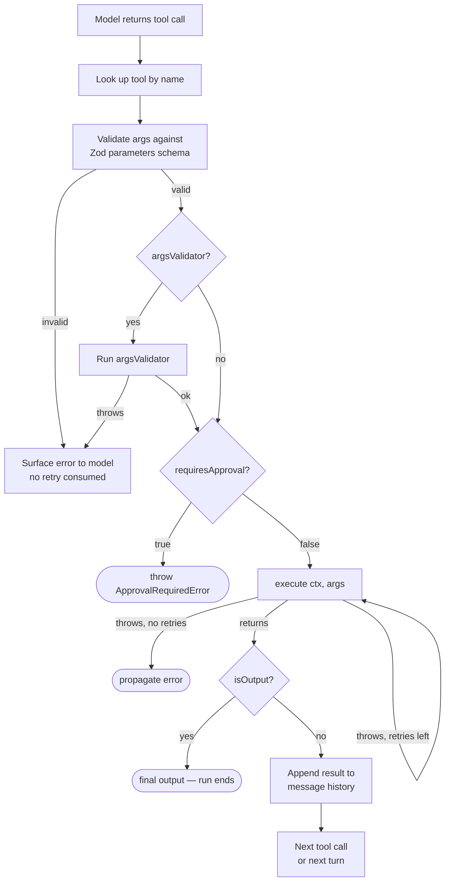

Tools are the primary way agents take actions — searching databases, calling APIs, reading files, or computing values. The model decides when to call a tool and with what arguments; Vibes validates the arguments against a Zod schema, executes the function, and appends the result to the message history for the next turn.

Vibes provides four tool factories for different use cases: `tool()` (with dependency injection), `plainTool()` (no context), `outputTool()` (terminal — ends the run), and `fromSchema()` (raw JSON Schema instead of Zod).

## Tool Execution Pipeline



## tool() — Tools with Dependencies

`tool<TDeps>()` is the full-featured factory. The `execute` function receives a `RunContext<TDeps>` as its first argument, giving it access to injected deps, token usage, the current run ID, and more.

```typescript
import { tool } from "@vibes/framework";
import { z } from "zod";

type Deps = { db: Database };

const search = tool<Deps>({
  name: "search",
  description: "Search the database",
  parameters: z.object({ query: z.string() }),
  execute: async (ctx, { query }) => ctx.deps.db.search(query),
  argsValidator: ({ query }) => {
    if (query.length < 3) throw new Error("Query too short");
  },
  prepare: async (ctx) => ctx.deps.db.isConnected() ? undefined : null,
  requiresApproval: false,
  sequential: false,
  maxRetries: 1,
});
```

## plainTool() — Simple Tools

`plainTool()` is a simpler factory for tools with no side effects and no dependency injection requirements. The `execute` function receives only the validated args — no `RunContext`.

```typescript
import { plainTool } from "@vibes/framework";
import { z } from "zod";

const add = plainTool({
  name: "add",
  description: "Add two numbers",
  parameters: z.object({ a: z.number(), b: z.number() }),
  execute: async ({ a, b }) => String(a + b),
});
```

Use `plainTool` when your tool is a pure function: math, formatting, text transformation, or any computation that doesn't need external resources.

## outputTool() — Terminal Tools

`outputTool()` creates a tool that ends the run. When the model calls it, the tool's return value becomes the agent's final output and no further turns occur. Use this with `outputMode: 'tool'` for structured output that the model fills in via a tool call.

```typescript
import { outputTool } from "@vibes/framework";
import { z } from "zod";

const done = outputTool({
  name: "done",
  description: "Return the final answer",
  parameters: z.object({ answer: z.string(), confidence: z.number() }),
  execute: async (_ctx, args) => args,
});

const agent = new Agent({
  model: anthropic("claude-sonnet-4-6"),
  tools: [done],
  outputMode: "tool",
});
```

## fromSchema() — Raw JSON Schema Tools

`fromSchema()` builds a tool from a plain JSON Schema object instead of Zod. Use this when integrating with external schema registries, OpenAPI specs, or when Zod is overkill for a simple schema. Note: no TypeScript type inference is available for the args.

```typescript
import { fromSchema } from "@vibes/framework";

const legacy = fromSchema({
  name: "legacy_api",
  description: "Call a legacy API",
  jsonSchema: {
    type: "object",
    properties: { endpoint: { type: "string" } },
    required: ["endpoint"],
  },
  execute: async (_ctx, args) => callApi(args.endpoint as string),
});
```

## Tool Options Reference

All options accepted by `tool()`:

| Option | Type | Required | Description |
|--------|------|----------|-------------|
| `name` | `string` | yes | Tool name — must be unique within an agent |
| `description` | `string` | yes | Describes the tool to the model |
| `parameters` | `ZodType` | yes | Zod schema for the arguments |
| `execute` | `(ctx, args) => Promise<string \| object>` | yes | Implementation function |
| `argsValidator` | `(args) => void \| Promise<void>` | no | Cross-field validation — throw to reject without consuming a retry |
| `prepare` | `(ctx) => ToolDefinition \| null \| undefined` | no | Per-turn availability check — return `null` to exclude this turn |
| `requiresApproval` | `boolean \| (ctx, args) => boolean` | no | When `true`, throws `ApprovalRequiredError` before execution |
| `sequential` | `boolean?` | no | When `true`, acquires a run-level mutex so this tool never runs concurrently |
| `maxRetries` | `number?` | no | Max retries on execution failure (independent of result validation retries) |

## prepare — Conditional Tool Availability

The `prepare` function is called once per model turn before the tool list is sent to the model. Return `null` or `undefined` to exclude the tool from that turn's available set:

```typescript
const search = tool<Deps>({
  name: "search",
  description: "Search the database",
  parameters: z.object({ query: z.string() }),
  execute: async (ctx, { query }) => ctx.deps.db.search(query),
  // Only include this tool when the database is connected
  prepare: async (ctx) => ctx.deps.db.isConnected() ? undefined : null,
});
```

You can also return a modified tool definition from `prepare` to dynamically change its description or parameters based on the current context.

## Multi-modal Returns

Tool `execute` functions can return strings, plain objects, or multi-modal content (images and uploaded files). Vibes serializes the result into the message history automatically:

```typescript
import { tool } from "@vibes/framework";
import type { BinaryContent } from "@vibes/framework";

const screenshot = tool({
  name: "screenshot",
  description: "Take a screenshot",
  parameters: z.object({ url: z.string() }),
  execute: async (_ctx, { url }): Promise<BinaryContent> => {
    const buffer = await captureScreenshot(url);
    return { type: "image", data: buffer, mimeType: "image/png" };
  },
});
```

The result is passed back to the model as a multi-modal message part, enabling vision-capable models to reason about images.

---

<CardGroup cols={2}>
  <Card title="Toolsets" icon="layers" href="/concepts/toolsets">
    Compose and conditionally expose groups of tools
  </Card>
  <Card title="Dependencies" icon="plug" href="/concepts/dependencies">
    Access injected deps inside tool execute
  </Card>
</CardGroup>
