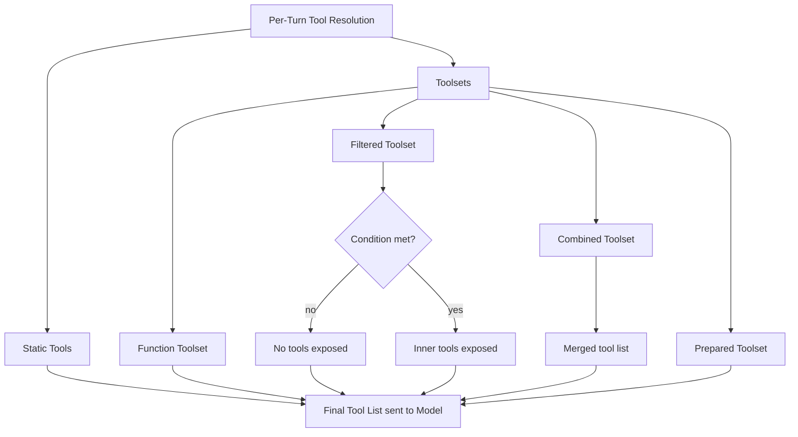

Toolsets are dynamic, per-turn tool groups. Unlike the static `tools` array - which sends every tool to the model on every turn - toolsets are resolved at the start of each turn and can depend on context: the user's role, feature flags, which phase the agent is in, and so on.

An agent can mix static `tools` and any number of `toolsets`. All are merged into a single flat tool list before each model call.

## Toolset Composition



## FunctionToolset - Basic Toolset

`FunctionToolset` is the simplest toolset: a named group of static tools. Use it to logically bundle related tools together.

```typescript
import { FunctionToolset } from "@vibes/framework";

const myToolset = new FunctionToolset([searchTool, fetchTool]);
myToolset.addTool(anotherTool);

const agent = new Agent({
  model,
  toolsets: [myToolset],
});
```

## FilteredToolset - Conditional Tools

`FilteredToolset` wraps another toolset with a boolean predicate. When the predicate returns `false`, the entire inner toolset is hidden from the model for that turn.

```typescript
import { FilteredToolset } from "@vibes/framework";

const adminToolset = new FilteredToolset(
  innerToolset,
  (ctx) => ctx.deps.isAdmin,
);
```

The predicate is **all-or-nothing**: the inner toolset is either shown in full or hidden entirely. For per-tool filtering within a toolset, see `PreparedToolset`.

## PreparedToolset - Per-Turn Filtering

`PreparedToolset` lets you return a *subset* of tools based on context. The `prepare` function receives the full `RunContext` and the complete tool list, and returns whichever tools to expose.

```typescript
import { PreparedToolset } from "@vibes/framework";

const safe = new PreparedToolset(
  adminTools,
  (ctx, tools) => ctx.deps.confirmed
    ? tools
    : tools.filter((t) => t.name !== "delete"),
);
```

**`PreparedToolset` vs `FilteredToolset`:**

| | `FilteredToolset` | `PreparedToolset` |
|---|---|---|
| Granularity | All-or-nothing | Per-tool |
| Predicate receives | `(ctx)` | `(ctx, tools)` |
| Use when | Hiding entire toolset by role | Filtering individual tools by state |

## CombinedToolset - Merging Toolsets

`CombinedToolset` merges multiple toolsets into one. Tools from later toolsets override earlier ones on name conflict (last name wins).

```typescript
import { CombinedToolset } from "@vibes/framework";

const combined = new CombinedToolset([toolsetA, toolsetB]);
```

## PrefixedToolset - Namespacing

`PrefixedToolset` adds a string prefix to every tool name. Use it to avoid collisions when combining toolsets from different domains.

```typescript
import { PrefixedToolset } from "@vibes/framework";

const namespaced = new PrefixedToolset(innerToolset, "admin_");
// "search" → "admin_search", "delete" → "admin_delete"
```

## RenamedToolset - Custom Names

`RenamedToolset` renames specific tools using a mapping object.

```typescript
import { RenamedToolset } from "@vibes/framework";

const renamed = new RenamedToolset(innerToolset, {
  old_name: "new_name",
});
```

## WrapperToolset - Middleware

`WrapperToolset` wraps another toolset and intercepts `execute` calls. Use it for cross-cutting concerns like logging, tracing, input transformation, or output transformation - without modifying the underlying tools.

```typescript
import { WrapperToolset } from "@vibes/framework";

const logged = new WrapperToolset(innerToolset, {
  wrapExecute: async (ctx, tool, args, next) => {
    console.log(`Calling ${tool.name}`, args);
    const result = await next(ctx, args);
    console.log(`Result from ${tool.name}:`, result);
    return result;
  },
});
```

## ApprovalRequiredToolset - Mark All for Approval

`ApprovalRequiredToolset` wraps a toolset and marks every tool inside it as `requiresApproval: true`. Use it when you want to require human approval for an entire group of tools without modifying them individually.

```typescript
import { ApprovalRequiredToolset } from "@vibes/framework";

const gated = new ApprovalRequiredToolset(dangerousToolset);
```

When any tool from this toolset is requested by the model, Vibes throws `ApprovalRequiredError` with the deferred tool requests. See [Human-in-the-Loop](/concepts/human-in-the-loop) for the full approval flow.

## ExternalToolset - Tools Without Zod Schemas

`ExternalToolset` is for tools that have pre-existing JSON schemas - for example, tools loaded from an MCP server. Parameters are passed as raw JSON instead of going through Zod parsing.

```typescript
import { ExternalToolset } from "@vibes/framework";

const external = new ExternalToolset(mcpTools);
```

Use `ExternalToolset` when integrating with external tool registries that provide their own JSON Schema definitions.

---

<CardGroup cols={2}>
  <Card title="Tools" icon="wrench" href="/concepts/tools">
    Build individual tools with the tool() factory
  </Card>
  <Card title="Dependencies" icon="plug" href="/concepts/dependencies">
    Inject runtime context via RunContext
  </Card>
</CardGroup>
