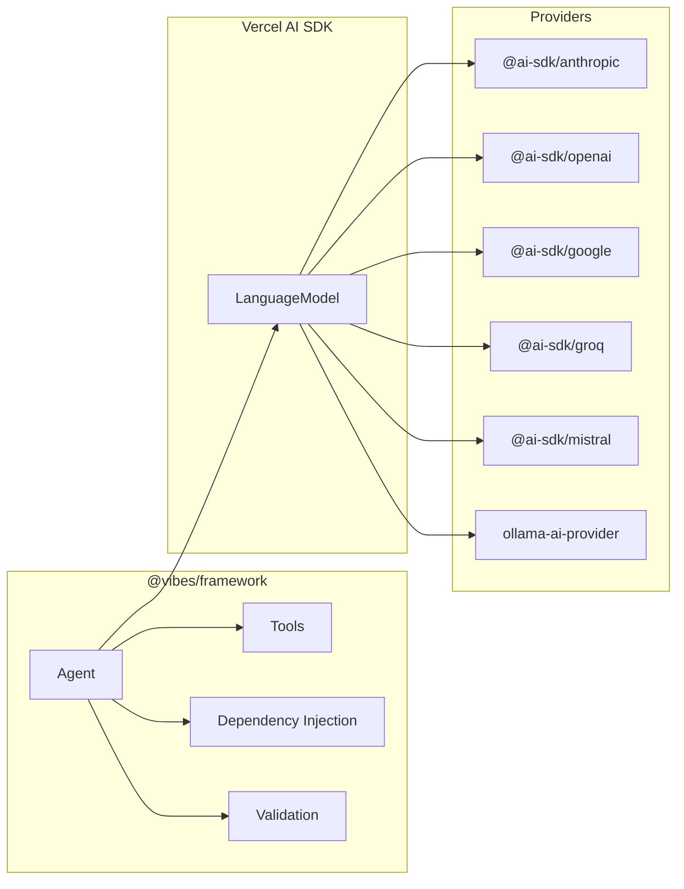

Vibes runs on Deno and Node.js. Install the framework, pick a provider, set your API key, and you're ready to build agents.

## Install the Framework

<Tabs>
  <Tab title="Deno">
    Add the framework to your project:

    ```bash
    deno add jsr:@vibes/framework
    ```

    Then add it to your `deno.json` import map along with your provider:

    ```jsonc
    {
      "imports": {
        "@vibes/framework": "jsr:@vibes/framework@^0.1",
        "ai": "npm:ai@^6",
        "zod": "npm:zod@^4",
        "@ai-sdk/anthropic": "npm:@ai-sdk/anthropic@^1"
      }
    }
    ```
  </Tab>
  <Tab title="Node.js">
    Install via npm:

    ```bash
    npx jsr add @vibes/framework
    npm install ai zod
    ```

    Then add your provider to `package.json`:

    ```bash
    npm install @ai-sdk/anthropic
    ```

    **Requirements:** Node.js 18 or later, TypeScript 5+.

    Add to `tsconfig.json`:

    ```jsonc
    {
      "compilerOptions": {
        "module": "NodeNext",
        "moduleResolution": "NodeNext",
        "target": "ES2022",
        "lib": ["ES2022"]
      }
    }
    ```
  </Tab>
</Tabs>

## How It Fits Together

Vibes is a thin orchestration layer over the Vercel AI SDK. You install Vibes once and choose any supported AI provider separately.



## Choose a Provider

Install the provider package that matches your preferred AI service:

| Provider | Package | Install (Deno) | Env Variable |
|----------|---------|----------------|--------------|
| Anthropic (Claude) | `@ai-sdk/anthropic` | `deno add npm:@ai-sdk/anthropic` | `ANTHROPIC_API_KEY` |
| OpenAI (GPT) | `@ai-sdk/openai` | `deno add npm:@ai-sdk/openai` | `OPENAI_API_KEY` |
| Google (Gemini) | `@ai-sdk/google` | `deno add npm:@ai-sdk/google` | `GOOGLE_GENERATIVE_AI_API_KEY` |
| Groq | `@ai-sdk/groq` | `deno add npm:@ai-sdk/groq` | `GROQ_API_KEY` |
| Mistral | `@ai-sdk/mistral` | `deno add npm:@ai-sdk/mistral` | `MISTRAL_API_KEY` |
| Ollama (local) | `ollama-ai-provider` | `deno add npm:ollama-ai-provider` | (none) |
| OpenAI-compatible | `@ai-sdk/openai` | `deno add npm:@ai-sdk/openai` | varies |

<Tip>
  These 7 are the most popular choices. Vibes supports 50+ providers via the Vercel AI SDK - see the [full provider list](https://sdk.vercel.ai/providers/ai-sdk-providers).
</Tip>

## Set Your API Key

Export your provider's API key as an environment variable before running your agent:

```bash
export ANTHROPIC_API_KEY="sk-ant-..."
```

<Note>
  Never commit API keys to source control. Use a `.env` file locally and your deployment platform's secret management in production.
</Note>

## Verify the Install

Create `hello.ts` and run it to confirm everything is working:

```ts
import { Agent } from "@vibes/framework";
import { anthropic } from "@ai-sdk/anthropic";

const agent = new Agent({
  model: anthropic("claude-haiku-4-5-20251001"),
  systemPrompt: "You are a helpful assistant.",
});

const result = await agent.run("Say exactly: hello from vibes");
console.log(result.output);
// hello from vibes
```

<Tabs>
  <Tab title="Deno">
    ```bash
    deno run --allow-env --allow-net hello.ts
    ```
  </Tab>
  <Tab title="Node.js">
    ```bash
    npx tsx hello.ts
    ```
  </Tab>
</Tabs>

## Next Steps

<CardGroup cols={2}>
  <Card title="Hello World Tutorial" icon="rocket" href="/getting-started/hello-world">
    Build a complete weather agent with tools, structured output, and tests in one progressive tutorial.
  </Card>
  <Card title="Introduction" icon="book-open" href="/introduction">
    Learn the design philosophy and why Vibes was built.
  </Card>
</CardGroup>
