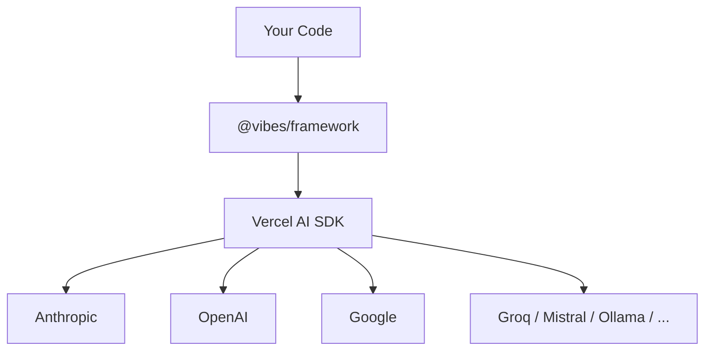

<div style={{ display: 'flex', justifyContent: 'center', marginBottom: '2rem' }}>
  
  
</div>

## TypeScript Agent Framework, the Pydantic AI way

**Powered by Vercel AI SDK.** Build production-grade AI agents with type-safe tools, dependency injection, structured output, and first-class testing.

```ts
import { Agent } from "@vibes/framework";
import { anthropic } from "@ai-sdk/anthropic";

const agent = new Agent({
  model: anthropic("claude-haiku-4-5-20251001"),
  systemPrompt: "You are a helpful assistant.",
});

const result = await agent.run("What is the capital of France?");
console.log(result.output); // "Paris"
```

## Why Vibes?

1. **Type-safe tools with Zod + Dependency injection** - Every tool parameter is validated at runtime with Zod. Carry databases, HTTP clients, and config via `RunContext` through the entire call chain. No `any` types, no global state.
2. **Model-agnostic** - Switch between Anthropic, OpenAI, Google, Groq, Mistral, Ollama, and 50+ providers by changing one line.
3. **Structured output + Streaming** - Define a Zod schema, get back a typed object or stream typed partial objects to the client as they arrive.
4. **Automatic retries + Cost control** - Vibes retries on validation failure and enforces token budgets and request limits to keep costs in check.
5. **First-class testing - no API calls required** - `TestModel`, `FunctionModel`, `agent.override()`, and `setAllowModelRequests(false)` make every agent fully testable in CI without hitting a real LLM.
6. **MCP, AG-UI, A2A + Durable agents via Temporal** - Connect to MCP servers, build AG-UI and A2A agents out of the box. Run long-lived agents that survive crashes and restarts with Temporal.
7. **OpenTelemetry observability** - Every run emits OTel spans, events, and token usage metrics. Works with Jaeger, Honeycomb, Datadog, and any OTel-compatible backend.

## Architecture



## Acknowledgments

Vibes is inspired by [Pydantic AI](https://ai.pydantic.dev/) - the agent framework by Samuel Colvin and the Pydantic team. Pydantic AI showed that agent frameworks can be type-safe, testable, and dependency-injection-friendly without sacrificing simplicity. Vibes borrows its API design, agent loop architecture, and teaching philosophy, adapted for TypeScript.

The model layer is powered by [Vercel AI SDK](https://sdk.vercel.ai/), which provides a unified interface to 50+ LLM providers. Without the AI SDK, Vibes would require maintaining its own provider integrations.

See the [Introduction](/introduction) for the full story.

<CardGroup cols={3}>
  <Card title="Introduction" href="/introduction" icon="book-open">
    Learn about Vibes' design philosophy and what inspired it
  </Card>
  <Card title="Install" href="/getting-started/install" icon="download">
    Set up Vibes in under 2 minutes
  </Card>
  <Card title="Hello World" href="/getting-started/hello-world" icon="rocket">
    Build your first agent
  </Card>
</CardGroup>
