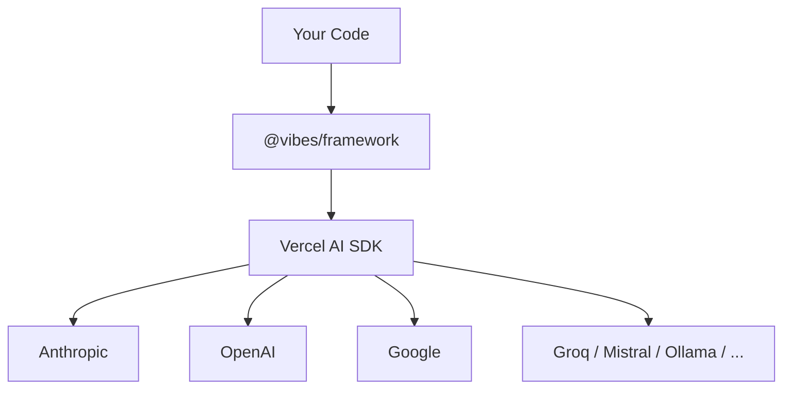

## TypeScript Agent Framework, the pydantic-ai way

**Powered by Vercel AI SDK.** Build production-grade AI agents with type-safe tools, dependency injection, structured output, and first-class testing.

## Why Vibes?

1. **Type-safe tools with Zod schemas** — Every tool parameter is validated at runtime. No `any` types leaking into your agent logic.
2. **Dependency injection via RunContext** — Carry databases, HTTP clients, and config through the entire call chain. Test by swapping deps, not mocking modules.
3. **Model-agnostic via Vercel AI SDK** — Switch between Anthropic, OpenAI, Google, Groq, Mistral, Ollama, and 50+ other providers by changing one line.
4. **Structured output with schema validation and retries** — Define a Zod schema, get back a typed object. Vibes retries automatically on validation failure.
5. **First-class testing utilities** — `TestModel`, `FunctionModel`, `agent.override()`, `setAllowModelRequests(false)`. Every agent is testable without real API calls.
6. **Protocol-ready: MCP, AG-UI, A2A built-in** — Connect to MCP servers, build AG-UI streaming agents, and compose agents with A2A out of the box.

## Architecture



## Hello World

```ts
import { Agent } from "@vibes/framework";
import { anthropic } from "@ai-sdk/anthropic";

const agent = new Agent({
  model: anthropic("claude-haiku-4-5-20251001"),
  systemPrompt: "You are a helpful assistant.",
});

const result = await agent.run("What is the capital of France?");
console.log(result.output); // "Paris"
```

## Acknowledgments

Vibes is inspired by [pydantic-ai](https://ai.pydantic.dev/) — the agent framework by Samuel Colvin and the Pydantic team. pydantic-ai showed that agent frameworks can be type-safe, testable, and dependency-injection-friendly without sacrificing simplicity. Vibes borrows its API design, agent loop architecture, and teaching philosophy, adapted for TypeScript.

The model layer is powered by [Vercel AI SDK](https://sdk.vercel.ai/), which provides a unified interface to 50+ LLM providers. Without the AI SDK, Vibes would require maintaining its own provider integrations.

See the [Introduction](/introduction) for the full story.

<CardGroup cols={3}>
  <Card title="Introduction" href="/introduction" icon="book-open">
    Learn about Vibes' design philosophy and what inspired it
  </Card>
  <Card title="Install" href="/getting-started/install" icon="download">
    Set up Vibes in under 2 minutes
  </Card>
  <Card title="Hello World" href="/getting-started/hello-world" icon="rocket">
    Build your first agent
  </Card>
</CardGroup>
