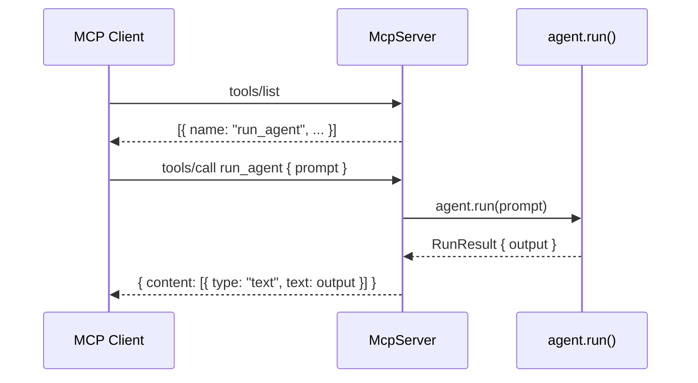

When you expose a Vibes agent as an MCP server, any MCP-compatible client can discover and invoke your agent as a tool. This enables Claude Desktop, Cursor, Zed, or any other AI application that speaks MCP to call your agent directly.

<Info>
Vibes does not yet include a built-in MCP server class. This page shows how to use [`@modelcontextprotocol/sdk`](https://github.com/modelcontextprotocol/typescript-sdk) directly to wrap a Vibes agent and serve it over stdio or HTTP.
</Info>

## How It Works



The MCP SDK handles all protocol details: capability negotiation, JSON-RPC framing, tool schema advertisement. You register your agent as one or more tools, and the SDK routes incoming `tools/call` requests to your handler.

## Installation

```bash
npm install @modelcontextprotocol/sdk
```

The package is already a dependency in the default `deno.json` when using Vibes in a Deno project.

## Stdio Transport

Stdio transport is the standard choice for Claude Desktop and other desktop AI apps. The client launches your server as a subprocess and communicates over stdin/stdout.

```typescript
import { Agent } from "npm:@vibes/framework";
import { McpServer } from "@modelcontextprotocol/sdk/server/mcp.js";
import { StdioServerTransport } from "@modelcontextprotocol/sdk/server/stdio.js";
import { z } from "npm:zod";
import { anthropic } from "npm:@ai-sdk/anthropic";

const model = anthropic("claude-opus-4-5");
const agent = new Agent({
  model,
  systemPrompt: "You are a helpful research assistant.",
});

// Create the MCP server
const server = new McpServer({
  name: "research-agent",
  version: "1.0.0",
});

// Register the agent as a tool
server.tool(
  "run_agent",
  "Ask the research agent a question and get a detailed answer.",
  {
    prompt: z.string().describe("The question or task for the agent"),
  },
  async ({ prompt }) => {
    const result = await agent.run(prompt);
    return {
      content: [{ type: "text", text: result.output }],
    };
  },
);

// Connect and run
const transport = new StdioServerTransport();
await server.connect(transport);
```

### Claude Desktop Configuration

Add the server to `~/Library/Application Support/Claude/claude_desktop_config.json`:

```json
{
  "mcpServers": {
    "research-agent": {
      "command": "deno",
      "args": ["run", "--allow-all", "/path/to/your/server.ts"]
    }
  }
}
```

After restarting Claude Desktop, your agent appears as an available tool.

## HTTP/SSE Transport

Use `StreamableHTTPServerTransport` for remote access over HTTP. This lets any HTTP client - including other Vibes agents using `MCPHttpClient` - call your server.

```typescript
import { Agent } from "npm:@vibes/framework";
import { McpServer } from "@modelcontextprotocol/sdk/server/mcp.js";
import { StreamableHTTPServerTransport } from "@modelcontextprotocol/sdk/server/streamableHttp.js";
import { z } from "npm:zod";
import { anthropic } from "npm:@ai-sdk/anthropic";

const model = anthropic("claude-opus-4-5");
const agent = new Agent({
  model,
  systemPrompt: "You are a helpful research assistant.",
});

const server = new McpServer({
  name: "research-agent",
  version: "1.0.0",
});

server.tool(
  "run_agent",
  "Ask the research agent a question and get a detailed answer.",
  {
    prompt: z.string().describe("The question or task for the agent"),
  },
  async ({ prompt }) => {
    const result = await agent.run(prompt);
    return {
      content: [{ type: "text", text: result.output }],
    };
  },
);

// Serve over HTTP on port 8080
Deno.serve({ port: 8080 }, async (req) => {
  const transport = new StreamableHTTPServerTransport({ sessionIdHeader: "mcp-session-id" });
  await server.connect(transport);
  return transport.handleRequest(req);
});
```

A Vibes agent can connect to this server using `MCPHttpClient`:

```typescript
import { MCPHttpClient, MCPToolset } from "npm:@vibes/framework";

const client = new MCPHttpClient({ url: "http://localhost:8080" });
await client.connect();
const toolset = new MCPToolset(client);
// Use toolset in another agent...
```

## Registering Agent Capabilities as Tools

You can expose multiple tools, each mapping to a different agent behavior:

```typescript
// Tool 1: quick answer
server.tool(
  "quick_answer",
  "Get a concise one-paragraph answer to a question.",
  { question: z.string() },
  async ({ question }) => {
    const result = await agent.run(`Answer briefly: ${question}`);
    return { content: [{ type: "text", text: result.output }] };
  },
);

// Tool 2: detailed analysis
server.tool(
  "analyze",
  "Get an in-depth analysis with supporting evidence.",
  {
    topic: z.string(),
    depth: z.enum(["surface", "deep"]).default("deep"),
  },
  async ({ topic, depth }) => {
    const prompt = depth === "deep"
      ? `Provide a detailed analysis of: ${topic}. Include examples and counterarguments.`
      : `Briefly analyze: ${topic}`;
    const result = await agent.run(prompt);
    return { content: [{ type: "text", text: result.output }] };
  },
);
```

## With Dependencies

If your agent requires dependencies (database access, authenticated clients, etc.), create them at server startup and close them on shutdown:

```typescript
const db = await openDatabase();

server.tool(
  "search_knowledge_base",
  "Search the internal knowledge base",
  { query: z.string() },
  async ({ query }) => {
    const result = await agent.run(query, { deps: { db } });
    return { content: [{ type: "text", text: result.output }] };
  },
);

// Clean up on process exit
globalThis.addEventListener("unload", async () => {
  await db.close();
});
```

## Further Reading

- [MCP SDK documentation](https://modelcontextprotocol.io/docs/sdk) - full reference for `McpServer`, tool schemas, transports, and capabilities
- [MCP Client](/integrations/mcp-client) - how to consume MCP servers from a Vibes agent
- [Model Context Protocol specification](https://spec.modelcontextprotocol.io) - protocol details and capability negotiation
