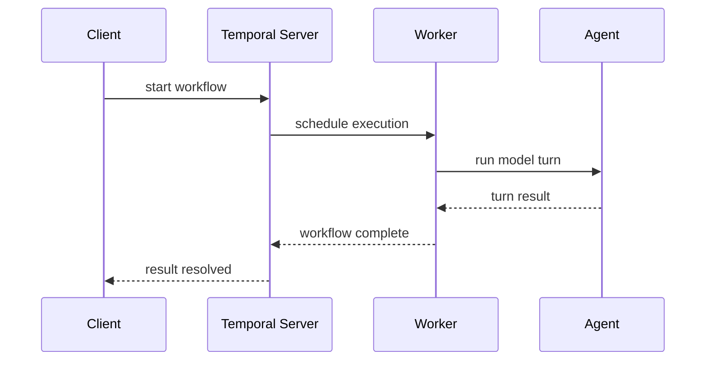

<Info>
**Node.js runtime required for Temporal workers.** Temporal's workflow runtime uses V8 isolates and cannot run in Deno. Use `MockTemporalAgent` in Deno for unit tests - it works without a Temporal server.
</Info>

[Temporal](https://temporal.io) is a durable execution platform that makes long-running workflows resilient to failures. When you run a Vibes agent through Temporal, every model call and tool invocation is automatically retried on failure, replayed correctly after crashes, and auditable through Temporal's history service. This makes Temporal the right choice for workflows that take minutes or hours, need guaranteed completion, or must survive process restarts.

## How It Works



The key insight: `workflowFn` is a deterministic orchestrator. It schedules `activities` (model turns, tool calls) as separate execution units. If the worker crashes mid-run, Temporal replays `workflowFn` from its event history and skips already-completed activities, resuming exactly where it left off.

## Installation

Temporal requires three npm packages. These must run in a **Node.js** process:

```bash
npm install @temporalio/worker @temporalio/workflow @temporalio/client
```

The Vibes framework package (`@vibes/framework`) provides `TemporalAgent` and `MockTemporalAgent`. No separate Temporal-specific Vibes package is needed.

## TemporalAgent Setup

```typescript
import { Agent, TemporalAgent } from "npm:@vibes/framework";
import { anthropic } from "npm:@ai-sdk/anthropic";

const model = anthropic("claude-opus-4-5");
const agent = new Agent({ model, systemPrompt: "You are a research assistant." });

const temporalAgent = new TemporalAgent(agent, {
  taskQueue: "research-queue",
  depsFactory: () => ({ db: getDb() }),          // called once per activity execution
  modelCallActivity: { startToCloseTimeout: "2m" },
  toolCallActivity: {
    startToCloseTimeout: "30s",
    retryPolicy: { maximumAttempts: 3, initialInterval: "5s" },
  },
});
```

`TemporalAgentOptions` fields:

| Option | Type | Required | Description |
|--------|------|----------|-------------|
| `taskQueue` | `string` | Yes | Temporal task queue name - must match the worker's task queue |
| `depsFactory` | `() => TDeps \| Promise<TDeps>` | No | Factory called each activity execution to create fresh dependencies |
| `modelCallActivity` | `TemporalActivityOptions` | No | Timeout and retry config for model turn activities |
| `toolCallActivity` | `TemporalActivityOptions` | No | Timeout and retry config for tool call activities |

`TemporalActivityOptions` fields:

| Option | Type | Description |
|--------|------|-------------|
| `startToCloseTimeout` | `string` | Max duration per attempt (e.g. `"2m"`, `"30s"`) |
| `retryPolicy.maximumAttempts` | `number` | Max retry count |
| `retryPolicy.initialInterval` | `string` | Initial retry delay |
| `retryPolicy.backoffCoefficient` | `number` | Exponential backoff multiplier |

## Worker Setup (Node.js Process)

The worker runs in a **Node.js** process. It registers `temporalAgent.activities` (a property) and a `workflowsPath` pointing to your workflow file.

```typescript
// worker.js - Node.js only, NOT Deno
import { Worker } from "@temporalio/worker";
import { TemporalAgent } from "@vibes/framework";

// ... create agent and temporalAgent as above ...

const worker = await Worker.create({
  taskQueue: temporalAgent.taskQueue,
  activities: temporalAgent.activities,   // property, NOT a method call
  workflowsPath: require.resolve("./workflows"),  // your workflows file
});

await worker.run();
```

Your `workflows.ts` file re-exports `temporalAgent.workflowFn` (also a property):

```typescript
// workflows.ts - re-export workflowFn as a named workflow
import { temporalAgent } from "./my-agent";

export const researchWorkflow = temporalAgent.workflowFn;  // property, NOT a method call
```

<Warning>
**`temporalAgent.activities` and `temporalAgent.workflowFn` are properties, not methods.**

Do NOT call them with parentheses - they are not functions:
- `temporalAgent.activities` - correct (property access)
- `temporalAgent.workflowFn` - correct (property access)

Adding `()` after either property causes a TypeError at runtime.
</Warning>

## Starting Workflows

Workflows are started via the Temporal client - there is no framework method for this. The client connects to the Temporal server and schedules execution on the worker's task queue.

```typescript
import { Client, Connection } from "@temporalio/client";
import { researchWorkflow } from "./workflows";

const connection = await Connection.connect({
  // address: "my-temporal-server:7233",  // default: localhost:7233
});
const client = new Client({ connection });

// Start the workflow
const handle = await client.workflow.start(temporalAgent.workflowFn, {
  taskQueue: temporalAgent.taskQueue,   // must match the worker's task queue
  workflowId: "research-001",
  args: ["Summarize the latest developments in quantum computing."],
});

// Wait for the result
const result = await handle.result();
console.log(result.output);  // final agent output
```

You can also start a workflow and check it later without blocking:

```typescript
const handle = await client.workflow.start(temporalAgent.workflowFn, {
  taskQueue: temporalAgent.taskQueue,
  workflowId: `research-${Date.now()}`,
  args: ["What is the population of Tokyo?"],
});

console.log(`Started workflow: ${handle.workflowId}`);

// Later - check status or get result
const result = await client.workflow.result(handle.workflowId);
```

## Migration Warning: Five API Bugs in Old Documentation

<Warning>
If you're migrating from older Vibes documentation, the following APIs were documented incorrectly. **None of these exist in the actual framework:**

1. `temporalAgent.start(client, opts)` - This method does not exist. Use `client.workflow.start(temporalAgent.workflowFn, opts)` instead.

2. `temporalAgent.workflowsPath()` - This method does not exist. Provide your own workflow file that re-exports `temporalAgent.workflowFn`.

3. `activities` used as a method call - `activities` is a **property**, not a method. Use `temporalAgent.activities` (no parentheses).

4. `new MockTemporalAgent(agent)` without a second argument - The constructor requires `TemporalAgentOptions` including `taskQueue`. Use `new MockTemporalAgent(agent, { taskQueue: "test" })`.

5. `serializeAgentState` / `deserializeAgentState` - These exports do not exist. The correct names are `serializeRunState` and `deserializeRunState`.
</Warning>

## MockTemporalAgent (Testing)

`MockTemporalAgent` runs the same agent logic as `TemporalAgent` but without a real Temporal server. It records activity history for assertions, supports deterministic replay, and works in Deno.

```typescript
import { MockTemporalAgent } from "npm:@vibes/framework";

// Second argument is required - must include taskQueue
const mock = new MockTemporalAgent(agent, { taskQueue: "test" });

// Run the agent
const result = await mock.run("What is 2 + 2?");
console.log(result.output); // "4"

// Inspect activity history
const history = mock.getActivityHistory();
console.log(history[0].activity); // "runModelTurn"

// Simulate replay - uses cached results (no model API calls)
const replayResult = await mock.simulateReplay("What is 2 + 2?");
console.log(replayResult.output); // "4" (from cache)

// Reset between tests
mock.reset();
```

`MockTemporalAgent` methods:

| Method | Description |
|--------|-------------|
| `run(prompt, opts?)` | Execute the agent, recording all activity invocations |
| `simulateReplay(prompt, opts?)` | Re-run using cached activity results - no model API calls |
| `getActivityHistory()` | Returns `ReadonlyArray<ActivityHistoryEntry>` of all recorded activities |
| `reset()` | Clears activity history and replay cache |

### Testing Pattern

```typescript
import { assertEquals } from "@std/assert";
import { MockTemporalAgent } from "npm:@vibes/framework";

Deno.test("research agent completes successfully", async () => {
  const mock = new MockTemporalAgent(agent, { taskQueue: "test" });

  const result = await mock.run("What is the capital of France?");

  assertEquals(result.output.toLowerCase().includes("paris"), true);

  const history = mock.getActivityHistory();
  assertEquals(history.length > 0, true);
  assertEquals(history[0].activity, "runModelTurn");

  mock.reset();
});
```

## Serialization Helpers

When passing agent state through Temporal (which serializes all workflow arguments and results), you may need to convert between Vibes `ModelMessage` types and JSON-serializable formats.

```typescript
import {
  deserializeRunState,
  roundTripMessages,
  serializeRunState,
} from "npm:@vibes/framework";

// Serialize messages for storage or transmission
const serialized = serializeRunState(messages);  // ModelMessage[] → SerializableMessage[]

// Deserialize back to Vibes message types
const restored = deserializeRunState(serialized);  // SerializableMessage[] → ModelMessage[]

// Round-trip test helper (serialize then deserialize)
const roundTripped = roundTripMessages(messages);  // ModelMessage[] → ModelMessage[]
```

<Warning>
The old docs used `serializeAgentState` and `deserializeAgentState` - these names do not exist. The correct exports are `serializeRunState` and `deserializeRunState`.
</Warning>

## API Reference

### TemporalAgent

| Member | Signature | Description |
|--------|-----------|-------------|
| Constructor | `new TemporalAgent(agent, options)` | Create the agent with Temporal config |
| `activities` | property: `{ runModelTurn, runToolCall }` | Temporal activity implementations - pass to `Worker.create` |
| `workflowFn` | property: async function | Valid Temporal workflow function - export from your workflows file |
| `run(prompt, opts?)` | `(string, opts?) => Promise<RunResult>` | Non-Temporal fallback using `agent.run()` directly |
| `taskQueue` | getter: `string` | The configured task queue name |

### TemporalAgentOptions

```typescript
interface TemporalAgentOptions<TDeps> {
  taskQueue: string;
  depsFactory?: () => TDeps | Promise<TDeps>;
  modelCallActivity?: TemporalActivityOptions;
  toolCallActivity?: TemporalActivityOptions;
}
```

### TemporalActivityOptions

```typescript
interface TemporalActivityOptions {
  startToCloseTimeout?: string;
  retryPolicy?: {
    maximumAttempts?: number;
    initialInterval?: string;
    backoffCoefficient?: number;
  };
}
```

### MockTemporalAgent

| Member | Signature | Description |
|--------|-----------|-------------|
| Constructor | `new MockTemporalAgent(agent, options)` | Requires `options` including `taskQueue` |
| `run(prompt, opts?)` | `(string, opts?) => Promise<RunResult>` | Execute agent, record activity history |
| `simulateReplay(prompt, opts?)` | `(string, opts?) => Promise<RunResult>` | Replay using cached results |
| `getActivityHistory()` | `() => ReadonlyArray<ActivityHistoryEntry>` | All recorded activities |
| `reset()` | `() => void` | Clear history and cache |

### Serialization

| Function | Signature | Description |
|----------|-----------|-------------|
| `serializeRunState` | `(ModelMessage[]) => SerializableMessage[]` | Convert to JSON-safe format |
| `deserializeRunState` | `(SerializableMessage[]) => ModelMessage[]` | Restore from serialized format |
| `roundTripMessages` | `(ModelMessage[]) => ModelMessage[]` | Serialize then deserialize (test utility) |
