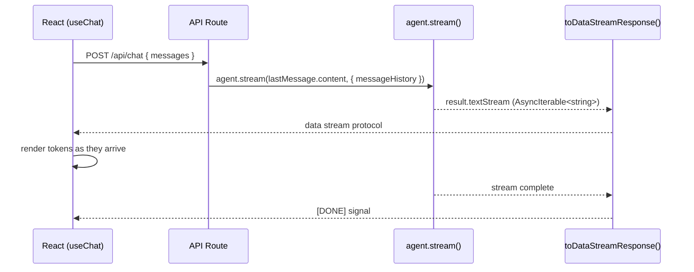

[Vercel AI UI](https://sdk.vercel.ai/docs/ai-sdk-ui) provides React hooks - `useChat` and `useCompletion` - that handle streaming text responses, message history, and loading states out of the box. There is no dedicated Vibes framework class for this integration. The pattern is straightforward: run your Vibes agent with `agent.stream()`, pipe the output through `toDataStreamResponse()` from the `ai` package, and the Vercel AI hooks connect to it automatically.

## How Streaming Works



`toDataStreamResponse()` converts a `textStream` into the Vercel AI data stream protocol. The `useChat` and `useCompletion` hooks on the frontend understand this protocol natively.

## API Route

### Next.js App Router

```typescript
// app/api/chat/route.ts
import { agent } from "@/lib/agent";
import { toDataStreamResponse } from "ai";

export async function POST(req: Request) {
  const { messages } = await req.json();
  const lastMessage = messages[messages.length - 1];

  const result = await agent.stream(lastMessage.content, {
    messageHistory: messages.slice(0, -1),
  });

  return toDataStreamResponse(result.textStream);
}
```

The `messages` array follows Vercel AI SDK's message format (each message has `role` and `content` fields). `agent.stream()` accepts a prompt string and optional `messageHistory` to continue multi-turn conversations.

### Deno Server

For non-Next.js setups or Deno-native deployments:

```typescript
import { agent } from "./agent.ts";
import { toDataStreamResponse } from "npm:ai";

Deno.serve(async (req: Request) => {
  if (req.method !== "POST") {
    return new Response("Method Not Allowed", { status: 405 });
  }

  const { messages } = await req.json();
  const lastMessage = messages[messages.length - 1];

  const result = await agent.stream(lastMessage.content, {
    messageHistory: messages.slice(0, -1),
  });

  return toDataStreamResponse(result.textStream);
});
```

<Info>
The `ai` package (v6) is already a dependency in `deno.json` - no separate install is needed for Deno projects. For Next.js, install with `npm install ai`.
</Info>

## React Frontend

### useChat

`useChat` manages multi-turn conversations. It maintains the full message history and sends it with each request so your API route can pass it as `messageHistory`.

```typescript
"use client";
import { useChat } from "ai/react";

export function Chat() {
  const { messages, input, handleInputChange, handleSubmit, isLoading } = useChat({
    api: "/api/chat",
  });

  return (
    <div>
      <div className="messages">
        {messages.map((message) => (
          <div key={message.id} className={`message ${message.role}`}>
            {message.content}
          </div>
        ))}
        {isLoading && <div className="message assistant">...</div>}
      </div>

      <form onSubmit={handleSubmit}>
        <input
          value={input}
          onChange={handleInputChange}
          placeholder="Ask anything..."
          disabled={isLoading}
        />
        <button type="submit" disabled={isLoading}>Send</button>
      </form>
    </div>
  );
}
```

### useCompletion

`useCompletion` is simpler - designed for single-turn completions without conversation history. Use this for standalone prompts like document summarization or code generation forms.

```typescript
"use client";
import { useCompletion } from "ai/react";

export function Summarizer() {
  const { completion, input, handleInputChange, handleSubmit, isLoading } = useCompletion({
    api: "/api/complete",
  });

  return (
    <div>
      <form onSubmit={handleSubmit}>
        <textarea
          value={input}
          onChange={handleInputChange}
          placeholder="Paste text to summarize..."
          rows={8}
        />
        <button type="submit" disabled={isLoading}>
          {isLoading ? "Summarizing..." : "Summarize"}
        </button>
      </form>

      {completion && (
        <div className="result">
          <h3>Summary</h3>
          <p>{completion}</p>
        </div>
      )}
    </div>
  );
}
```

The API route for `useCompletion` is similar - just use a `prompt` field instead of `messages`:

```typescript
// app/api/complete/route.ts
import { agent } from "@/lib/agent";
import { toDataStreamResponse } from "ai";

export async function POST(req: Request) {
  const { prompt } = await req.json();

  const result = await agent.stream(prompt);

  return toDataStreamResponse(result.textStream);
}
```

## Structured Output

If your agent uses `outputSchema` (structured JSON output), use `result.partialOutput` instead of `result.textStream`. The `partialOutput` stream emits incremental JSON chunks as the schema is filled in.

```typescript
// app/api/analyze/route.ts - structured output with useCompletion
import { agent } from "@/lib/agent";  // agent has outputSchema: z.object({ ... })
import { toDataStreamResponse } from "ai";

export async function POST(req: Request) {
  const { prompt } = await req.json();

  const result = await agent.stream(prompt);

  // Use partialOutput for streaming structured output
  // The frontend receives incremental JSON delta chunks
  return toDataStreamResponse(result.partialOutput);
}
```

## Complete Example

A minimal full-stack chat application:

```typescript
// lib/agent.ts - shared agent definition
import { Agent } from "npm:@vibes/framework";
import { anthropic } from "npm:@ai-sdk/anthropic";

export const agent = new Agent({
  model: anthropic("claude-opus-4-5"),
  systemPrompt: "You are a helpful assistant.",
});
```

```typescript
// app/api/chat/route.ts - Next.js API route
import { agent } from "@/lib/agent";
import { toDataStreamResponse } from "ai";

export async function POST(req: Request) {
  const { messages } = await req.json();
  const lastMessage = messages[messages.length - 1];

  const result = await agent.stream(lastMessage.content, {
    messageHistory: messages.slice(0, -1),
  });

  return toDataStreamResponse(result.textStream);
}
```

```typescript
// app/page.tsx - React component
"use client";
import { useChat } from "ai/react";

export default function Page() {
  const { messages, input, handleInputChange, handleSubmit } = useChat({
    api: "/api/chat",
  });

  return (
    <main>
      {messages.map((m) => (
        <p key={m.id}>
          <strong>{m.role}:</strong> {m.content}
        </p>
      ))}
      <form onSubmit={handleSubmit}>
        <input value={input} onChange={handleInputChange} />
        <button type="submit">Send</button>
      </form>
    </main>
  );
}
```

## API Reference

### Key Functions

| Function | Package | Description |
|----------|---------|-------------|
| `toDataStreamResponse(stream)` | `ai` | Converts an `AsyncIterable<string>` to a Vercel AI data stream `Response` |
| `agent.stream(prompt, opts?)` | `@vibes/framework` | Runs the agent, returns `{ textStream, partialOutput, ... }` |

### useChat Options

| Option | Type | Description |
|--------|------|-------------|
| `api` | `string` | URL of your API route (e.g. `"/api/chat"`) |
| `initialMessages` | `Message[]` | Pre-populate the conversation |
| `onFinish` | `(message) => void` | Called when the stream completes |
| `onError` | `(error) => void` | Called on stream error |
| `headers` | `Record<string, string>` | Additional HTTP headers |
| `body` | `object` | Additional body fields sent with every request |

### useCompletion Options

| Option | Type | Description |
|--------|------|-------------|
| `api` | `string` | URL of your API route (e.g. `"/api/complete"`) |
| `onFinish` | `(prompt, completion) => void` | Called when the stream completes |
| `onError` | `(error) => void` | Called on stream error |
| `headers` | `Record<string, string>` | Additional HTTP headers |
