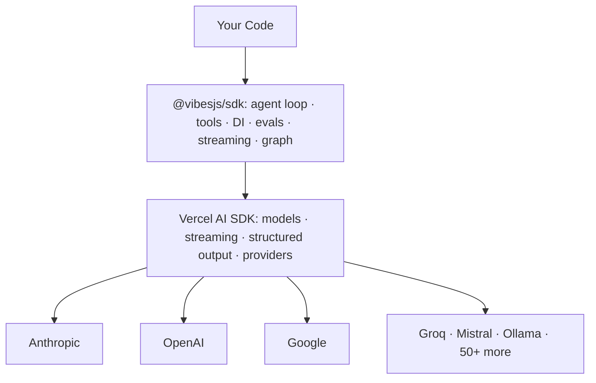
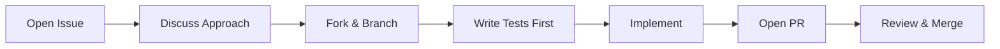

<p align="center">
  <picture>
    <source media="(prefers-color-scheme: dark)" srcset="./docs/logo/dark.svg">
    
  </picture>
</p>

<p align="center">
  <strong>TypeScript agent framework for building production-grade, type-safe AI applications — the Pydantic AI way, using Vercel AI SDK.</strong>
</p>

<p align="center">
  <a href="https://jsr.io/@vibesjs/sdk"></a>
  <a href="https://www.npmjs.com/package/@vibesjs/sdk"></a>
  <a href="./LICENSE"></a>
</p>

<p align="center">
  <a href="#-quick-start">Quick Start</a> ·
  <a href="#-installation">Installation</a> ·
  <a href="#-why-vibes">Why Vibes</a> ·
  <a href="https://vibes-sdk.a7ul.com">Documentation</a> ·
  <a href="#-examples">Examples</a>
</p>

---

## Architecture



## Quick Start

```ts
import { Agent } from "@vibesjs/sdk";
import { anthropic } from "@ai-sdk/anthropic";

const agent = new Agent({
  model: anthropic("claude-haiku-4-5-20251001"),
  systemPrompt: "You are a helpful assistant.",
});

const result = await agent.run("What is the capital of France?");
console.log(result.output); // "Paris"
```

## Installation

**Deno:**
```bash
deno add jsr:@vibesjs/sdk
```

**Node.js:**
```bash
npx jsr add @vibesjs/sdk
npm install ai zod
```

Then install a provider:
```bash
# Anthropic
npm install @ai-sdk/anthropic   # ANTHROPIC_API_KEY

# OpenAI
npm install @ai-sdk/openai      # OPENAI_API_KEY

# Google
npm install @ai-sdk/google      # GOOGLE_GENERATIVE_AI_API_KEY
```

> Vibes supports 50+ providers via the [Vercel AI SDK](https://sdk.vercel.ai/providers/ai-sdk-providers). Switching providers is a one-line change.

## AI coding assistant support

**Claude Code (agent skill)** — install the `@vibesjs/sdk` skill so your coding assistant writes idiomatic Vibes code without looking up docs:

```bash
mkdir -p .claude/agents && curl -fsSL https://raw.githubusercontent.com/a7ul/vibes/main/packages/sdk/skills/vibes-sdk.md -o .claude/agents/vibes-sdk.md
```

**MCP server** — add the Vibes docs MCP server to any MCP-compatible client (Cursor, Windsurf, Claude Desktop, etc.) for in-editor documentation access:

```json
{
  "mcpServers": {
    "vibes-sdk": {
      "url": "https://vibes-sdk.a7ul.com/mcp"
    }
  }
}
```

## Why Vibes?

Most AI frameworks try to hide the model behind magic. Vibes does the opposite — it gives you a thin, typed layer that stays out of the way.

The core idea is borrowed from Pydantic AI: **agents are just functions**. They take input, call tools, and return typed output. There's no hidden state, no opaque orchestration engine, no DSL to learn. If you know TypeScript and async/await, you already know how to use Vibes.

| Feature | What it means |
|---------|---------------|
| **Type-safe tools + Dependency injection** | Every tool parameter is validated at runtime with Zod. Carry databases, HTTP clients, and config via `RunContext` through the entire call chain. No `any` types, no global state. |
| **Automatic retries + Cost control** | Retries on validation failure and enforces token budgets and request limits to keep costs in check. |
| **Structured output + Streaming** | Define a Zod schema, get back a typed object — or stream typed partial objects to the client as they arrive. |
| **Testing + Evals** | Unit-test every agent in CI with `TestModel` and `setAllowModelRequests(false)` — no real API calls. Then go further with typed eval datasets, built-in and LLM-as-judge evaluators, and experiment runners with configurable concurrency. Evals are code — they live in your repo, run in CI, and catch regressions before they reach users. |
| **Model-agnostic** | Switch between Anthropic, OpenAI, Google, Groq, Mistral, Ollama, and 50+ providers by changing one line. |
| **OpenTelemetry observability** | Every run emits OTel spans, events, and token usage metrics. Works with Jaeger, Honeycomb, Datadog, and any OTel-compatible backend. |
| **Durable agents + MCP, AG-UI, A2A** | Run long-lived agents that survive crashes and restarts with Temporal. Connect to MCP servers and build AG-UI and A2A agents out of the box. |

## Examples

### Type-safe tools + structured output

```ts
import { Agent, tool } from "@vibesjs/sdk";
import { anthropic } from "@ai-sdk/anthropic";
import { z } from "zod";

// Dependencies
type Deps = {
  db: { getUser: (id: string) => Promise<{ name: string; plan: string }> };
};

// Tools
const getUserInfo = tool({
  name: "get_user_info",
  description: "Fetch user details from the database",
  parameters: z.object({ userId: z.string() }),
  execute: async (ctx, { userId }) => ctx.deps.db.getUser(userId),
});

// Structured output schema
const SupportResponse = z.object({
  greeting: z.string(),
  recommendation: z.string(),
  escalate: z.boolean().describe("Whether to escalate to a human agent"),
});

// Agent
const supportAgent = new Agent<Deps>({
  model: anthropic("claude-haiku-4-5-20251001"),
  systemPrompt: "You are a customer support agent. Be concise and helpful.",
  tools: [getUserInfo],
  outputSchema: SupportResponse,
});

// Run with injected deps
const result = await supportAgent.run("Help user-42 with their billing question", {
  deps: {
    db: { getUser: async (id) => ({ name: "Ada", plan: "pro" }) },
  },
});

console.log(result.output.greeting); // "Hi Ada!"
console.log(result.output.escalate); // false
```

### Testing (no API calls)

```ts
import { Agent, TestModel, setAllowModelRequests } from "@vibesjs/sdk";

setAllowModelRequests(false); // block any real LLM calls in CI

const agent = new Agent({
  model: new TestModel({ output: "Paris" }),
  systemPrompt: "You are a helpful assistant.",
});

const result = await agent.run("What is the capital of France?");
assert(result.output === "Paris");
```

### Streaming

```ts
const stream = agent.stream("Explain async/await in TypeScript");

for await (const chunk of stream.textStream) {
  process.stdout.write(chunk);
}
```

## Pydantic AI comparison

Vibes is, in a real sense, Pydantic AI for TypeScript. Most concepts transfer directly.

| Concept | Pydantic AI | @vibesjs/sdk |
|---------|------------|--------------|
| Core class | `Agent` | `Agent` |
| Run | `agent.run_sync()` | `agent.run()` |
| Streaming | `agent.run_stream()` | `agent.stream()` |
| Tools | `@agent.tool` decorator | `tool()` factory |
| Dependencies | `deps: TDeps` | `deps: TDeps` |
| Typed output | `result_type: MyModel` | `outputSchema: z.object(...)` |
| Type validation | Pydantic | Zod |
| Result validators | `@agent.result_validator` | `resultValidators: [...]` |
| Testing | `TestModel` / `FunctionModel` | `TestModel` / `FunctionModel` |
| Language | Python | TypeScript |
| Model layer | Pydantic AI providers | Vercel AI SDK |

## Packages

| Package | Description |
|---------|-------------|
| [`@vibesjs/sdk`](./packages/sdk) | The core agent framework |

## Maintained by AI agents

Vibes was created and is maintained by AI agents under the supervision of [Atul (@a7ul)](https://github.com/a7ul). Every commit is reviewed by a human; every line was written by an agent.

When Pydantic AI ships a new release, a GitHub Actions workflow automatically detects it, opens an issue with a full porting checklist, and assigns the GitHub Copilot coding agent to implement it. The resulting PR is reviewed and merged by a human.

## Contributing

Contributions are welcome. Please open an issue before submitting a large PR so we can discuss the approach.



## Acknowledgements

- **[Pydantic AI](https://ai.pydantic.dev/)** — the design philosophy, API shape, and abstractions that Vibes is modeled after. If you like Vibes, go star Pydantic AI.
- **[Vercel AI SDK](https://sdk.vercel.ai/)** — the model layer powering all providers, streaming, and structured output.
- **[Zod](https://zod.dev/)** — runtime schema validation used throughout for tools, output, and dependencies.

## License

MIT — see [LICENSE](./LICENSE)
