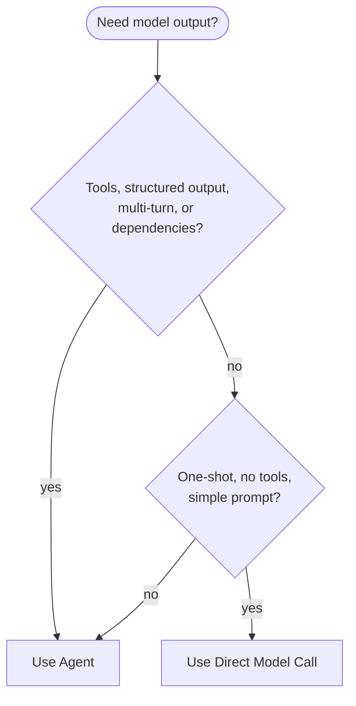
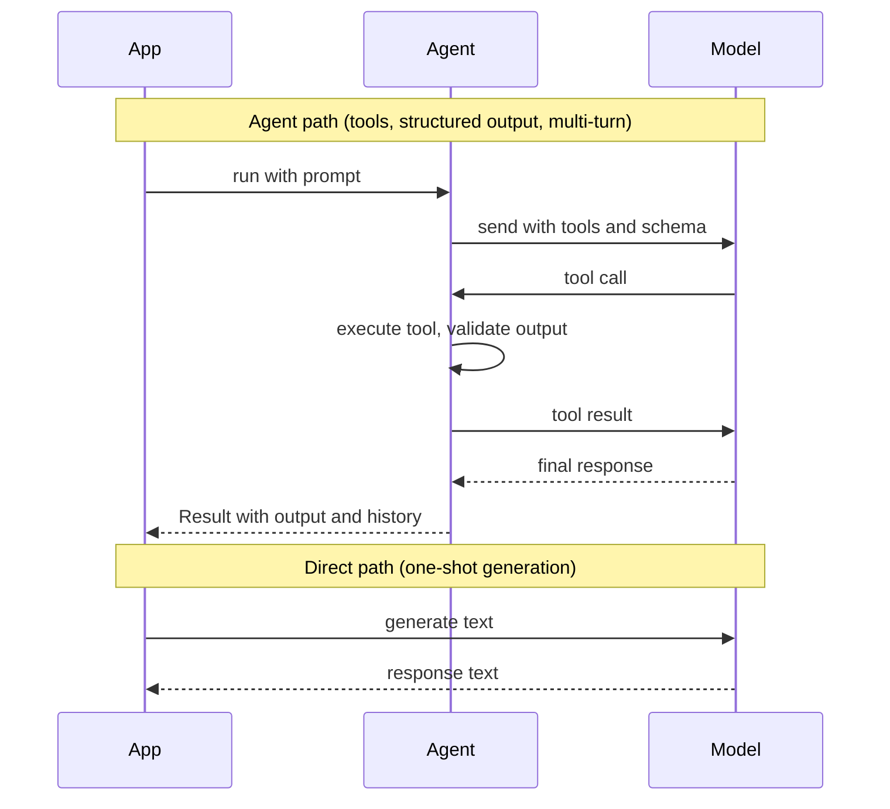

The Vibes `agent()` wrapper adds significant value: tools, structured output, result validators, multi-turn conversation management, RunContext dependency injection, and human-in-the-loop flows. But sometimes you want none of that — just a single model call with a prompt and a response.

For those cases, reach for the Vercel AI SDK's `generateText` and `streamText` directly.

<Info>
Vibes does **not** re-export `generateText` or `streamText`. Import them from `"ai"` and your provider package (e.g., `"@ai-sdk/anthropic"`) directly.
</Info>

---

## When to use agent vs. direct



### Use the Agent when you need

- **Tools** — the model should call functions with side effects
- **outputSchema** — structured JSON output with Zod validation and retries
- **Multi-turn conversation** — message history carried across turns
- **Result validators** — custom post-processing that can trigger retries
- **RunContext dependencies** — database clients, loggers, auth context injected via DI
- **Human-in-the-loop** — approval gates before sensitive tool calls

### Use direct model calls when you need

- **One-shot text generation** — summarize, translate, classify with no side effects
- **Classification tasks** — `"Is this text positive, negative, or neutral?"` with a simple string response
- **Template filling** — populate a template from structured data, no tools needed
- **Simple summarization** — compress a document into a paragraph
- **Scripts and background tasks** — cron jobs, batch processing where agent overhead isn't warranted

---

## generateText

Use `generateText` for synchronous, one-shot prompts where you need the full response before proceeding.

```typescript
import { generateText } from "ai";
import { anthropic } from "@ai-sdk/anthropic";

const { text } = await generateText({
  model: anthropic("claude-opus-4-5"),
  prompt: "Summarize this in one sentence: ...",
});

console.log(text);
```

`generateText` returns a `GenerateTextResult` with the `text` field containing the model's response, plus usage statistics and finish reason.

### Classification example

```typescript
import { generateText } from "ai";
import { anthropic } from "@ai-sdk/anthropic";

async function classifySentiment(review: string): Promise<string> {
  const { text } = await generateText({
    model: anthropic("claude-opus-4-5"),
    system: 'Reply with exactly one word: "positive", "negative", or "neutral".',
    prompt: review,
  });
  return text.trim();
}
```

---

## streamText

Use `streamText` when you want to display tokens as they arrive — ideal for chat UIs, long-form generation, or any scenario where perceived latency matters.

```typescript
import { streamText } from "ai";
import { anthropic } from "@ai-sdk/anthropic";

const result = streamText({
  model: anthropic("claude-opus-4-5"),
  prompt: "Write a haiku about TypeScript",
});

for await (const chunk of result.textStream) {
  process.stdout.write(chunk);
}
```

`streamText` returns a result object immediately. The `textStream` async iterable yields string chunks. Access `result.text` (a Promise) to await the full response after streaming completes.

### Streaming with system prompt

```typescript
import { streamText } from "ai";
import { anthropic } from "@ai-sdk/anthropic";

const result = streamText({
  model: anthropic("claude-opus-4-5"),
  system: "You are a concise technical writer.",
  messages: [
    { role: "user", content: "Explain async/await in three sentences." },
  ],
});

let fullText = "";
for await (const chunk of result.textStream) {
  process.stdout.write(chunk);
  fullText += chunk;
}

// Access usage after stream completes
const usage = await result.usage;
console.log(`\nTokens used: ${usage.totalTokens}`);
```

---

## Agent vs. direct: side-by-side



The direct path skips the agent loop entirely — no tool routing, no output validation retries, no multi-turn state. That simplicity is both its strength (less overhead, less complexity) and its limitation (no recovery if the output isn't what you expected).

---

## Using both in the same project

It is completely valid — and often the right call — to mix agents and direct model calls in the same codebase.

```typescript
import { agent } from "@vibesjs/sdk";
import { generateText } from "ai";
import { anthropic } from "@ai-sdk/anthropic";

// Complex user-facing flow: use the agent
const researchAgent = agent({
  model: "claude-opus-4-5",
  tools: { webSearch, saveNote },
  outputSchema: ResearchReport,
});

export async function runResearch(topic: string) {
  return researchAgent.run(`Research the topic: ${topic}`);
}

// Background utility: use generateText directly
export async function generateSlug(title: string): Promise<string> {
  const { text } = await generateText({
    model: anthropic("claude-opus-4-5"),
    system: "Convert a blog post title into a URL slug. Reply with only the slug, no explanation.",
    prompt: title,
  });
  return text.trim();
}
```

Use the agent for features that need tools, history, or structured output. Use `generateText`/`streamText` for internal utilities, preprocessing steps, or simple transformations where the full agent machinery is overkill.

<Info>
For the full `generateText` and `streamText` API including temperature, max tokens, stop sequences, and provider-specific options, see the [Vercel AI SDK documentation](https://sdk.vercel.ai/docs/reference/ai-sdk-core/generate-text).
</Info>
