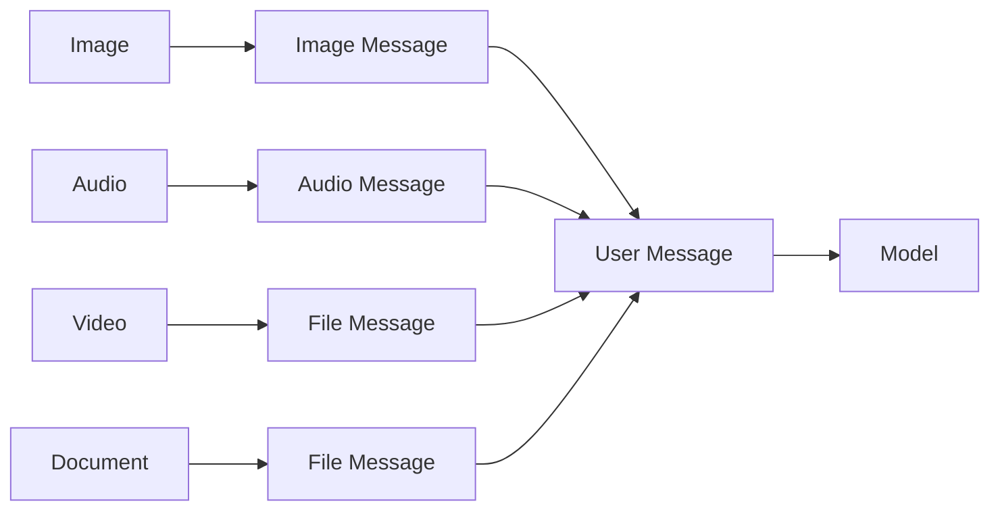
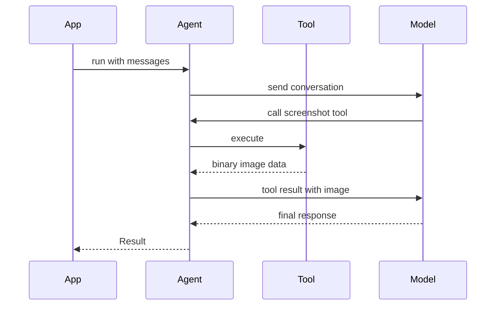

Vibes supports four input modalities — images, audio, video, and documents — through a set of message helper functions. Each helper wraps the raw binary or URL data into a `UserModelMessage` that the agent loop passes directly to the model. On the output side, tools can return `BinaryContent` (raw bytes with a MIME type) that flows back to the model as part of the conversation.

```typescript
import { imageMessage, audioMessage, fileMessage } from "@vibesjs/sdk";
```

## Content type routing



---

## Images

```typescript
imageMessage(image: string | Uint8Array | URL, text?: string, mediaType?: string): UserModelMessage
```

The `image` parameter accepts a URL string, a base64-encoded string, or raw bytes. The optional `text` parameter adds a text prompt alongside the image. `mediaType` defaults to `"image/jpeg"` when omitted and the runtime cannot infer it.

<CodeGroup>

```typescript URL string
import { imageMessage } from "@vibesjs/sdk";

const msg = imageMessage(
  "https://example.com/photo.jpg",
  "Describe what you see in this image."
);
```

```typescript Base64 string
import { imageMessage } from "@vibesjs/sdk";

const base64 = fs.readFileSync("./screenshot.png").toString("base64");

const msg = imageMessage(base64, "What is on this screen?", "image/png");
```

```typescript Uint8Array (raw bytes)
import { imageMessage } from "@vibesjs/sdk";

const bytes = await fetch("https://example.com/chart.png").then((r) =>
  r.arrayBuffer().then((b) => new Uint8Array(b))
);

const msg = imageMessage(bytes, "Summarize this chart.", "image/png");
```

</CodeGroup>

<Info>
When passing a base64 string, include only the encoded payload — not the `data:image/jpeg;base64,` prefix. Vibes sends the data part directly to the model provider.
</Info>

---

## Audio

```typescript
audioMessage(audio: string | Uint8Array, mediaType: string, text?: string): UserModelMessage
```

Unlike `imageMessage`, the `mediaType` argument is **required** for audio — the runtime has no way to infer the codec from raw bytes.

```typescript
import { audioMessage } from "@vibesjs/sdk";

const audioBytes = fs.readFileSync("./recording.mp3");
const base64Audio = audioBytes.toString("base64");

const msg = audioMessage(base64Audio, "audio/mpeg", "Transcribe this recording.");
```

<Warning>
Audio modality support depends on the model provider. Check your provider's documentation to confirm which audio formats and codecs are accepted before sending audio messages.
</Warning>

---

## Video

Video follows the same shape as audio: use `fileMessage` with a `video/*` MIME type. Provider support varies.

```typescript
import { fileMessage } from "@vibesjs/sdk";

const videoBytes = fs.readFileSync("./clip.mp4");
const base64Video = videoBytes.toString("base64");

const msg = fileMessage(base64Video, "video/mp4", "Describe the action in this clip.");
```

<Warning>
Video support is experimental for most providers. Verify that your chosen model accepts `video/mp4` (or the specific video/* MIME type) before sending video in production.
</Warning>

---

## Documents

Use `fileMessage` to send PDFs, plain text, or other document formats alongside a prompt.

```typescript
fileMessage(data: string | Uint8Array, mediaType: string, text?: string): UserModelMessage
```

```typescript
import { fileMessage } from "@vibesjs/sdk";

const pdfBytes = fs.readFileSync("./contract.pdf");
const base64Pdf = Buffer.from(pdfBytes).toString("base64");

const msg = fileMessage(
  base64Pdf,
  "application/pdf",
  "Summarize the key obligations in this contract."
);
```

Common document MIME types:

| Format | `mediaType` |
| ------ | ----------- |
| PDF | `"application/pdf"` |
| Plain text | `"text/plain"` |
| HTML | `"text/html"` |
| CSV | `"text/csv"` |

---

## UploadedFile

When a provider has already stored a file server-side (for example, via the Anthropic Files API), you reference it with an `UploadedFile` object rather than re-uploading the bytes.

```typescript
import type { UploadedFile } from "@vibesjs/sdk";

const file: UploadedFile = {
  type: "uploaded_file",  // underscore — not a hyphen
  fileId: "file_abc123",
  mimeType: "application/pdf",
  filename: "contract.pdf",
};
```

<Warning>
The `type` discriminant is `"uploaded_file"` with an **underscore**. Using `"uploaded-file"` (hyphen) will fail the type check and the provider will reject the request.
</Warning>

Use `uploadedFileSchema` when an agent tool needs to accept an `UploadedFile` as a parameter:

```typescript
import { uploadedFileSchema } from "@vibesjs/sdk";
import { tool } from "@vibesjs/sdk";
import { z } from "zod";

const analyzeTool = tool({
  description: "Analyze an already-uploaded file",
  parameters: z.object({
    file: uploadedFileSchema,
    question: z.string(),
  }),
  execute: async ({ file, question }) => {
    // file.fileId, file.mimeType, file.filename available here
    return `Analyzing ${file.filename ?? file.fileId} for: ${question}`;
  },
});
```

---

## Binary content from tools

Tools can return `BinaryContent` — raw bytes with a MIME type — which the agent loop forwards to the model as part of the next turn. This lets a tool produce an image, audio clip, or document that the model can reason about.

```typescript
import { tool } from "@vibesjs/sdk";
import type { BinaryContent } from "@vibesjs/sdk";
import { z } from "zod";

const screenshotTool = tool({
  description: "Capture a screenshot of a URL and return it as an image",
  parameters: z.object({
    url: z.string().url(),
  }),
  execute: async ({ url }): Promise<BinaryContent> => {
    const imageBytes = await captureScreenshot(url); // your implementation
    return {
      type: "binary",
      data: imageBytes,
      mimeType: "image/png",
    };
  },
});
```

### Tool multi-modal return flow



<Info>
To learn how tools integrate with the broader agent loop and how to compose toolsets, see [Tools](/concepts/tools).
</Info>
