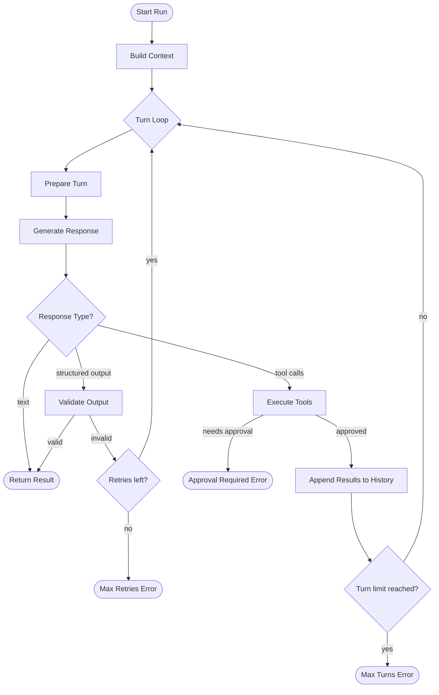

The `Agent` class is the primary way you build an AI agent in Vibes. It wraps the Vercel AI SDK's `generateText` / `streamText` loop, manages multi-turn tool execution, injects dependencies, and validates structured output - all in a single cohesive interface.

An agent is typed over its dependencies (`TDeps`) and output (`TOutput`), making it fully type-safe end to end.

## Agent Loop

Every call to `agent.run()`, `agent.stream()`, or `agent.runStreamEvents()` goes through the same loop:



## Basic Usage

```typescript
import { Agent } from "@vibesjs/sdk";
import { anthropic } from "@ai-sdk/anthropic";

const agent = new Agent({
  model: anthropic("claude-sonnet-4-6"),
  systemPrompt: "You are a helpful assistant.",
});

const result = await agent.run("Hello!");
console.log(result.output);
```

## Type Parameters

`Agent<TDeps, TOutput>` accepts two type parameters:

- **`TDeps`** - the shape of the dependencies object injected at run time. Defaults to `undefined` (no deps).
- **`TOutput`** - the output type. Defaults to `string`. Specify this when using `outputSchema` for structured output.

```typescript
type Deps = { db: Database };

const agent = new Agent<Deps, string>({
  model: anthropic("claude-haiku-4-5-20251001"),
  systemPrompt: (ctx) => `Helping user from ${ctx.deps.db.region}`,
});

// Pass deps at run time
const result = await agent.run("Hello!", { deps: { db: myDb } });
```

When `systemPrompt` is a function, it receives the full `RunContext<TDeps>` on every turn, giving it access to the injected deps, current usage, run ID, and more.

## Constructor Options

All options are passed to `new Agent(opts: AgentOptions<TDeps, TOutput>)`.

| Field | Type | Default | Description |
|-------|------|---------|-------------|
| `model` | `LanguageModel` | required | Vercel AI SDK model instance (e.g. `anthropic("claude-sonnet-4-6")`) |
| `name` | `string?` | - | Human-readable agent name |
| `systemPrompt` | `string \| (ctx) => string` | - | Base system prompt, static or dynamic |
| `instructions` | `string \| (ctx) => string` | - | Per-run additions appended after `systemPrompt`. Not recorded in `result.messages` |
| `tools` | `ToolDefinition<TDeps>[]` | `[]` | Static tools always available to the model |
| `toolsets` | `Toolset<TDeps>[]` | `[]` | Dynamic per-turn tool groups |
| `outputSchema` | `ZodType \| ZodType[]` | - | Zod schema for structured output |
| `outputMode` | `'tool' \| 'native' \| 'prompted'` | `'tool'` | How structured output is requested |
| `outputTemplate` | `boolean` | `true` | Whether to inject the schema into the system prompt |
| `resultValidators` | `ResultValidator<TDeps, TOutput>[]` | `[]` | Post-parse validators - throw to reject and retry |
| `maxRetries` | `number` | `3` | Max validation retries before `MaxRetriesError` |
| `maxTurns` | `number` | `10` | Max tool-call round trips before `MaxTurnsError` |
| `usageLimits` | `UsageLimits?` | - | Cap cumulative token or request usage |
| `historyProcessors` | `HistoryProcessor<TDeps>[]` | `[]` | Per-turn message transforms (trim, summarize, filter) |
| `modelSettings` | `ModelSettings?` | - | Temperature, maxTokens, topP, and other model parameters |
| `endStrategy` | `'early' \| 'exhaustive'` | `'early'` | When to stop after receiving `final_result` |
| `maxConcurrency` | `number?` | unlimited | Max concurrent tool executions per turn |
| `telemetry` | `TelemetrySettings?` | - | OpenTelemetry settings passed to the AI SDK |

## Running an Agent

Vibes provides three run methods depending on how you want to consume the output:

```typescript
// Awaitable - returns RunResult<TOutput> when the run completes
const result = await agent.run("What is 2 + 2?");

// Streaming - returns StreamResult<TOutput> immediately
// Consume textStream, then await output / messages / usage
const stream = agent.stream("Tell me a story.");
for await (const chunk of stream.textStream) {
  process.stdout.write(chunk);
}
const output = await stream.output;

// Event stream - returns AsyncIterable<AgentStreamEvent<TOutput>>
// Full visibility into each turn, tool call, and text delta
for await (const event of agent.runStreamEvents("What is 2 + 2?")) {
  // switch on event.kind
}
```

See [Streaming](/concepts/streaming) for the full `StreamResult` interface and event kinds, and [Results](/concepts/results) for the `RunResult` API.

## agent.override()

`agent.override(overrides)` returns a scoped runner that substitutes specific options for a single `run()`, `stream()`, or `runStreamEvents()` call. The original agent is never mutated.

```typescript
const result = await agent
  .override({ model: testModel, maxTurns: 3 })
  .run("Test prompt", { deps: fakeDeps });
```

Override options mirror `AgentOptions`: `model`, `systemPrompt`, `instructions`, `tools`, `toolsets`, `resultValidators`, `maxRetries`, `maxTurns`, `usageLimits`, `historyProcessors`, `modelSettings`, `endStrategy`, `telemetry`.

<Info>
**Tip:** Use `agent.override()` in tests to swap in a `TestModel` without modifying your production agent. Override runs also bypass the `setAllowModelRequests(false)` guard, so they work in any test environment.
</Info>

---

<CardGroup cols={3}>
  <Card title="Models" icon="cpu" href="/concepts/models">
    Choose and configure language models
  </Card>
  <Card title="Dependencies" icon="plug" href="/concepts/dependencies">
    Inject runtime dependencies via RunContext
  </Card>
  <Card title="Tools" icon="wrench" href="/concepts/tools">
    Give agents the ability to take actions
  </Card>
</CardGroup>
