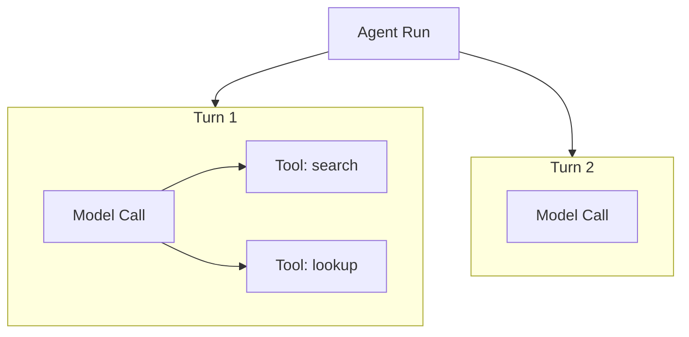

Vibes provides two ways to add OpenTelemetry tracing to your agents. `instrumentAgent()` is a non-mutating wrapper that adds telemetry to any existing agent without changing its definition. Inline telemetry via `AgentOptions.telemetry` configures tracing directly on the agent at construction time. Both approaches delegate entirely to the Vercel AI SDK's `experimental_telemetry` - Vibes does not create custom spans.

Use `instrumentAgent()` when you want to add tracing to an agent you didn't define (a shared utility, a library agent). Use inline telemetry when you own the agent and prefer to configure tracing at construction time.

## OTel Span Hierarchy



Each model call (one per agent turn) gets its own `generateText` span. Each tool invocation gets a child span under that turn's span. The exact span names and attributes follow the Vercel AI SDK telemetry convention and may vary by SDK version.

## instrumentAgent()

`instrumentAgent()` wraps an existing agent and returns an object with the same three run methods (`run`, `stream`, `runStreamEvents`). The original agent is never mutated.

```typescript
import { instrumentAgent } from "@vibesjs/sdk/otel";
import { Agent, tool } from "@vibesjs/sdk";
import { anthropic } from "@ai-sdk/anthropic";
import { z } from "zod";

const myAgent = new Agent({
  model: anthropic("claude-sonnet-4-6"),
  systemPrompt: "You are a helpful assistant.",
});

const instrumented = instrumentAgent(myAgent, {
  functionId: "my-agent",           // stable span name for this agent
  metadata: { version: "1.0" },     // additional span attributes
  excludeContent: true,             // don't record prompts/outputs (GDPR)
  isEnabled: true,                  // default true; set false to disable tracing
});

// Use exactly like the original agent:
const result = await instrumented.run("Hello");
const stream = instrumented.stream("Hello");
for await (const event of instrumented.runStreamEvents("Hello")) { ... }
```

`instrumentAgent()` uses `agent.override()` internally - it never mutates the original agent and is safe to reuse across requests.

## Inline Telemetry on AgentOptions

Configure telemetry directly on the agent constructor using the `telemetry` option. `TelemetrySettings` is the Vercel AI SDK type:

```typescript
import { Agent } from "@vibesjs/sdk";
import { anthropic } from "@ai-sdk/anthropic";
import type { TelemetrySettings } from "ai";

const agent = new Agent({
  model: anthropic("claude-sonnet-4-6"),
  telemetry: {
    isEnabled: true,
    functionId: "my-agent",
    recordInputs: true,
    recordOutputs: true,
  },
});
```

The `telemetry` field accepts the same `TelemetrySettings` shape that the Vercel AI SDK accepts on `generateText`. All span creation is handled by the AI SDK.

## Content Exclusion for GDPR

When you need to trace agent execution without recording the content of prompts or model outputs (for GDPR, PII, or compliance reasons), set `excludeContent: true` on `instrumentAgent`:

```typescript
const instrumented = instrumentAgent(myAgent, {
  functionId: "my-agent",
  excludeContent: true,   // span attributes will not contain prompt/output text
  isEnabled: true,
});
```

With `excludeContent: true`, spans are still created for every turn and tool call - you retain execution structure, latency, and token counts - but the actual text content is omitted from span attributes.

## What Spans Are Created

Vibes delegates span creation entirely to the Vercel AI SDK's `experimental_telemetry`. The framework passes your `TelemetrySettings` or `InstrumentationOptions` through to each `generateText` call.

What the AI SDK creates per agent run:
- One span per model call (one per agent turn)
- One child span per tool invocation within a turn

<Note>
Vibes does not create custom spans. All span naming follows the Vercel AI SDK telemetry convention. Consult the [Vercel AI SDK telemetry docs](https://sdk.vercel.ai/docs/ai-sdk-core/telemetry) for current span names and attribute schemas.
</Note>

## API Reference

| Symbol | Type | Description |
|--------|------|-------------|
| `instrumentAgent` | `(agent, options) => { run, stream, runStreamEvents }` | Wraps an agent with telemetry; returns the same interface as the original agent |
| `InstrumentationOptions` | `interface` | `{ functionId: string, metadata?: Record<string, unknown>, excludeContent?: boolean, isEnabled?: boolean }` |
| `TelemetrySettings` | `interface` (from `"ai"`) | `{ isEnabled: boolean, functionId: string, recordInputs: boolean, recordOutputs: boolean }` - passed directly to Vercel AI SDK |

---

<CardGroup cols={2}>
  <Card title="Agents" icon="robot" href="/concepts/agents">
    Agent configuration options including telemetry
  </Card>
  <Card title="Vercel AI SDK Telemetry" icon="chart-line" href="https://sdk.vercel.ai/docs/ai-sdk-core/telemetry">
    Full span names, attributes, and OTel setup for the AI SDK
  </Card>
</CardGroup>
