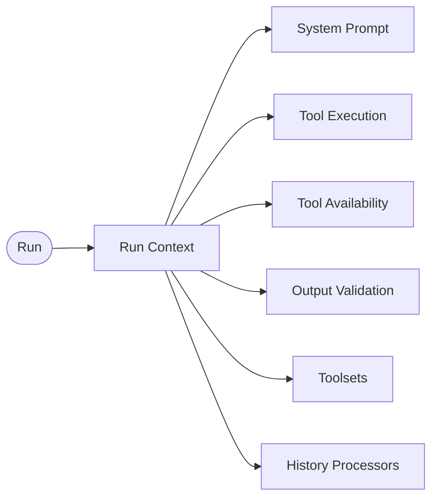

`RunContext<TDeps>` is the primary dependency injection mechanism in Vibes. When you construct an `Agent<TDeps>`, you declare what external resources it needs. At `agent.run()` time you supply those resources as `deps`, and every callback in the agent - system prompts, instructions, tools, validators, toolsets, and history processors - receives the same `RunContext` carrying those deps.

This is a signature feature of Vibes: you never need to close over global variables or pass deps out-of-band. Your agent is fully self-contained and trivially testable.

## RunContext fan-out

Every entry point to the agent resolves a single `RunContext<TDeps>` and fans it out to all callbacks:



## Defining dependencies

Define a `Deps` type, pass it as the first type parameter to `Agent`, and supply the concrete instance at run time:

```typescript
import { Agent } from "@vibesjs/sdk";
import { anthropic } from "@ai-sdk/anthropic";

type Deps = { db: Database };

const agent = new Agent<Deps>({
  model: anthropic("claude-sonnet-4-6"),
  systemPrompt: "You are a research assistant.",
});

// Inject deps at run time
const result = await agent.run("Find recent papers on LLMs", {
  deps: { db: myDatabase },
});
```

## The RunContext interface

The full interface available in every callback:

```typescript
// Source: lib/types/context.ts
interface RunContext<TDeps = undefined> {
  deps: TDeps;                                              // injected dependencies
  usage: Usage;                                             // token usage accumulated so far
  retryCount: number;                                       // result validation retries
  toolName: string | null;                                  // current tool name (null outside tool.execute)
  runId: string;                                            // unique run identifier
  metadata: Record<string, unknown>;                        // per-run metadata from caller
  toolResultMetadata: Map<string, Record<string, unknown>>; // metadata attached by tools
  attachMetadata(toolCallId: string, meta: Record<string, unknown>): void;
}
```

Reference table:

| Field / Method | Type | Description |
|----------------|------|-------------|
| `deps` | `TDeps` | User-supplied dependencies injected at run time |
| `usage` | `Usage` | Accumulated token usage (`inputTokens`, `outputTokens`, `totalTokens`, `requests`) |
| `retryCount` | `number` | How many result validation retries have occurred so far |
| `toolName` | `string \| null` | Name of the currently executing tool, or `null` outside a tool call |
| `runId` | `string` | Unique identifier for this run (UUID) |
| `metadata` | `Record<string, unknown>` | Per-run caller metadata passed via `RunOptions.metadata` |
| `toolResultMetadata` | `Map<string, Record<string, unknown>>` | Metadata attached by tools via `attachMetadata()` |
| `attachMetadata(id, meta)` | `void` | Attach arbitrary metadata for a specific tool call ID |

## Using deps in tools

Tools receive `RunContext<TDeps>` as their first argument, giving them direct access to your injected dependencies:

```typescript
import { tool } from "@vibesjs/sdk";
import { z } from "zod";

type Deps = { db: Database };

const search = tool<Deps>({
  name: "search",
  description: "Search the database",
  parameters: z.object({ query: z.string() }),
  execute: async (ctx, { query }) => ctx.deps.db.search(query),
});

const agent = new Agent<Deps>({
  model: anthropic("claude-sonnet-4-6"),
  tools: [search],
});
```

## Using deps in system prompts

System prompts and instructions can be functions that receive `RunContext`. This lets you build dynamic prompts from runtime state:

```typescript
const agent = new Agent<Deps>({
  model: anthropic("claude-sonnet-4-6"),
  systemPrompt: (ctx) => `Helping from region: ${ctx.deps.db.region}`,
  instructions: (ctx) =>
    ctx.deps.db.isReadOnly ? "Do not perform write operations." : "",
});
```

## Testing with dependencies

The canonical testing pattern is to create fake deps and pass them via `agent.override()`:

```typescript
const fakeDeps: Deps = {
  db: {
    region: "us-east-1",
    isReadOnly: false,
    search: async (q) => `Fake results for: ${q}`,
  },
};

const result = await agent
  .override({ model: testModel, maxTurns: 3 })
  .run("Find papers on attention mechanisms", { deps: fakeDeps });
```

<Info>
This is the recommended testing pattern - inject test doubles via `deps`, never mock the framework internals. Your agent code stays unchanged; only the dep implementations swap.
</Info>

## History processors and privacy

History processors run before each model call and can transform or filter the message history. The `privacyFilterProcessor` is a built-in processor that redacts sensitive content before messages are sent to the model.

The `PrivacyRule` union type supports two shapes:

```typescript
import { privacyFilterProcessor } from "@vibesjs/sdk";

const agent = new Agent({
  model: anthropic("claude-sonnet-4-6"),
  historyProcessors: [
    privacyFilterProcessor([
      // RegexPrivacyRule - redact credit card numbers
      { pattern: /\d{4}-\d{4}-\d{4}-\d{4}/g, replacement: "[CARD]" },
      // FieldPrivacyRule - remove a specific field from tool results
      { messageType: "tool", fieldPath: "content.0.result.ssn" },
    ]),
  ],
});
```

- **`RegexPrivacyRule`**: `{ pattern: RegExp, replacement?: string }` - replace matches of the pattern with the replacement string (defaults to `"[REDACTED]"` if omitted).
- **`FieldPrivacyRule`**: `{ messageType: string, fieldPath: string }` - remove the value at `fieldPath` from messages of the given type.

---

<CardGroup cols={2}>
  <Card title="Tools" icon="wrench" href="/concepts/tools">
    Use deps inside tool execute functions
  </Card>
  <Card title="Agents" icon="robot" href="/concepts/agents">
    Full Agent constructor options reference
  </Card>
</CardGroup>
