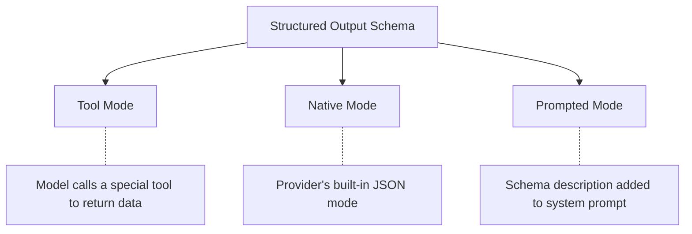

`agent.run()` returns a `RunResult<TOutput>` once the run completes. `agent.stream()` and `agent.runStreamEvents()` return a `StreamResult<TOutput>` immediately and resolve the final values lazily. Both carry the structured output, complete message history, new messages added in this run, and token usage.

## Output modes

When you set `outputSchema`, Vibes has three strategies for requesting structured output from the model:



| Mode | How it works | Best for |
|------|-------------|----------|
| `'tool'` (default) | Framework exposes a special `final_result` tool; model calls it to return structured data | Most providers; supports `partialOutput` streaming |
| `'native'` | Uses the provider's native JSON mode (e.g. OpenAI `response_format`) | Providers with built-in JSON mode support |
| `'prompted'` | Schema description is injected into the system prompt as text; model formats the response | Providers without tool or JSON mode support |

## Structured output with outputSchema

Define a Zod schema and the agent will parse the model's response and return it as a typed value.

```typescript
import { Agent } from "@vibesjs/sdk";
import { anthropic } from "@ai-sdk/anthropic";
import { z } from "zod";

const Schema = z.object({
  answer: z.string(),
  confidence: z.number(),
});

const agent = new Agent<undefined, z.infer<typeof Schema>>({
  model: anthropic("claude-sonnet-4-6"),
  outputSchema: Schema,
});

const result = await agent.run("What is the capital of France?");
console.log(result.output.answer);      // "Paris"
console.log(result.output.confidence);  // 0.99
```

`result.output` is fully typed as `{ answer: string; confidence: number }`.

## Output modes

```typescript
const agent = new Agent({
  model,
  outputSchema: Schema,
  outputMode: "tool",    // default - uses final_result tool
  // outputMode: "native",   // provider JSON mode
  // outputMode: "prompted", // schema in system prompt
  outputTemplate: true,  // default - injects schema description into system prompt
});
```

<Warning>
`outputTemplate` is a boolean, not a string. Setting `outputTemplate: true` (the default) tells Vibes to inject the JSON schema description into the system prompt. You cannot customize the injected text.
</Warning>

## Union types as outputSchema

Pass an array of Zod schemas to let the model choose which one applies. This is useful for agents that can return different structured shapes depending on the task.

```typescript
const AgentOutput = z.discriminatedUnion("kind", [
  z.object({ kind: z.literal("answer"), text: z.string() }),
  z.object({ kind: z.literal("clarify"), question: z.string() }),
]);

const agent = new Agent<undefined, z.infer<typeof AgentOutput>>({
  model,
  outputSchema: [
    z.object({ kind: z.literal("answer"), text: z.string() }),
    z.object({ kind: z.literal("clarify"), question: z.string() }),
  ],
});
```

## Result validators

`resultValidators` are post-parse validation functions that run after Vibes parses the output. Throw an error to reject the output and trigger a retry.

```typescript
const agent = new Agent<undefined, z.infer<typeof Schema>>({
  model,
  outputSchema: Schema,
  maxRetries: 3,
  resultValidators: [
    (ctx, output) => {
      if (output.confidence < 0.5) {
        throw new Error("Confidence too low - please try again.");
      }
    },
  ],
});
```

`maxRetries` controls how many times the agent retries on validation failure before throwing `MaxRetriesError`.

## RunResult interface

`agent.run()` resolves to a `RunResult<TOutput>`:

| Field | Type | Description |
|-------|------|-------------|
| `output` | `TOutput` | The structured (or string) output |
| `messages` | `ModelMessage[]` | Full conversation history including this run |
| `newMessages` | `ModelMessage[]` | Only messages added during this run |
| `usage` | `Usage` | Accumulated token usage for this run |

```typescript
const result = await agent.run("Summarize this document.");

console.log(result.output);       // TOutput
console.log(result.messages);     // full history
console.log(result.newMessages);  // messages from this run only
console.log(result.usage);        // { promptTokens, completionTokens, totalTokens }
```

## StreamResult interface

`agent.stream()` returns a `StreamResult<TOutput>` immediately. Consume the async iterables first, then await the promises.

| Field | Type | Description |
|-------|------|-------------|
| `textStream` | `AsyncIterable<string>` | Token-by-token text stream |
| `partialOutput` | `AsyncIterable<TOutput>` | Progressive structured output (tool outputMode only) |
| `output` | `Promise<TOutput>` | Final structured output |
| `messages` | `Promise<ModelMessage[]>` | Full conversation history |
| `newMessages` | `Promise<ModelMessage[]>` | Messages added during this run |
| `usage` | `Promise<Usage>` | Accumulated token usage |

```typescript
const stream = agent.stream("Tell me a story.");

// Stream tokens as they arrive
for await (const chunk of stream.textStream) {
  process.stdout.write(chunk);
}

// Await final values after consuming textStream
const output = await stream.output;
const messages = await stream.messages;
const newMessages = await stream.newMessages;
const usage = await stream.usage;
```

For progressive structured output during streaming (tool outputMode only):

```typescript
for await (const partial of stream.partialOutput) {
  console.log("Partial:", partial);
}
```

---

<CardGroup cols={2}>
  <Card title="Streaming" icon="bolt" href="/concepts/streaming">
    Real-time token and event streaming
  </Card>
  <Card title="Messages" icon="message" href="/concepts/messages">
    Multi-turn conversations and message history
  </Card>
</CardGroup>
