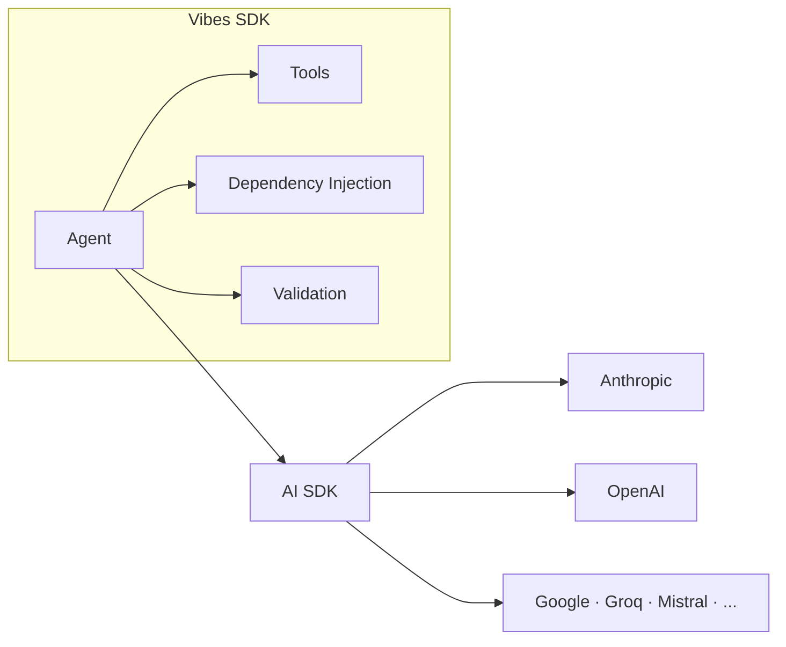

Vibes runs on Deno and Node.js. Install the framework, pick a provider, set your API key, and you're ready to build agents.

## Install the framework

<Tabs>
  <Tab title="Deno">
    Add the framework to your project:

    ```bash
    deno add jsr:@vibesjs/sdk
    ```

    Then add it to your `deno.json` import map along with your provider:

    ```jsonc
    {
      "imports": {
        "@vibesjs/sdk": "jsr:@vibesjs/sdk@^1.0",
        "ai": "npm:ai@^6",
        "zod": "npm:zod@^4",
        "@ai-sdk/anthropic": "npm:@ai-sdk/anthropic@^1"
      }
    }
    ```
  </Tab>
  <Tab title="Node.js">
    Install via npm:

    ```bash
    npx jsr add @vibesjs/sdk
    npm install ai zod@^4
    ```

    Then add your provider to `package.json`:

    ```bash
    npm install @ai-sdk/anthropic
    ```

    **Requirements:** Node.js 18 or later, TypeScript 5+.

    Add to `tsconfig.json`:

    ```jsonc
    {
      "compilerOptions": {
        "module": "NodeNext",
        "moduleResolution": "NodeNext",
        "target": "ES2022",
        "lib": ["ES2022"]
      }
    }
    ```
  </Tab>
</Tabs>

## How it fits together

Vibes is a thin orchestration layer over the Vercel AI SDK. You install Vibes once and choose any supported AI provider separately.



## Choose a provider

Install the provider package that matches your preferred AI service:

| Provider | Package | Install (Deno) | Env Variable |
|----------|---------|----------------|--------------|
| Anthropic (Claude) | `@ai-sdk/anthropic` | `deno add npm:@ai-sdk/anthropic` | `ANTHROPIC_API_KEY` |
| OpenAI (GPT) | `@ai-sdk/openai` | `deno add npm:@ai-sdk/openai` | `OPENAI_API_KEY` |
| Google (Gemini) | `@ai-sdk/google` | `deno add npm:@ai-sdk/google` | `GOOGLE_GENERATIVE_AI_API_KEY` |
| Groq | `@ai-sdk/groq` | `deno add npm:@ai-sdk/groq` | `GROQ_API_KEY` |
| Mistral | `@ai-sdk/mistral` | `deno add npm:@ai-sdk/mistral` | `MISTRAL_API_KEY` |
| Ollama (local) | `ollama-ai-provider` | `deno add npm:ollama-ai-provider` | (none) |
| OpenAI-compatible | `@ai-sdk/openai` | `deno add npm:@ai-sdk/openai` | varies |

<Tip>
  These 7 are the most popular choices. Vibes supports 50+ providers via the Vercel AI SDK - see the [full provider list](https://sdk.vercel.ai/providers/ai-sdk-providers).
</Tip>

## Set your API key

Export your provider's API key as an environment variable before running your agent:

```bash
export ANTHROPIC_API_KEY="sk-ant-..."
```

<Note>
  Never commit API keys to source control. Use a `.env` file locally and your deployment platform's secret management in production.
</Note>

## Verify the install

Create `hello.ts` and run it to confirm everything is working:

```ts
import { Agent } from "@vibesjs/sdk";
import { anthropic } from "@ai-sdk/anthropic";

const agent = new Agent({
  model: anthropic("claude-haiku-4-5-20251001"),
  systemPrompt: "You are a helpful assistant.",
});

const result = await agent.run("Say exactly: hello from vibes");
console.log(result.output);
// hello from vibes
```

<Tabs>
  <Tab title="Deno">
    ```bash
    deno run --allow-env --allow-net hello.ts
    ```
  </Tab>
  <Tab title="Node.js">
    ```bash
    npx tsx hello.ts
    ```
  </Tab>
</Tabs>

## Agent skill (Claude Code)

If you use Claude Code, install the `@vibesjs/sdk` agent skill so your coding assistant can write idiomatic framework code without looking up docs:

```bash
mkdir -p .claude/agents && curl -fsSL https://raw.githubusercontent.com/a7ul/vibes/main/packages/sdk/skills/vibes-sdk.md -o .claude/agents/vibes-sdk.md
```

See the [Agent Skill](/meta/agent-skill) page for global install, manual setup, and details on how it works.

## Troubleshooting

### Wrong registry: `npm:@vibesjs/sdk` does nothing

If you import from `npm:@vibesjs/sdk` instead of `jsr:@vibesjs/sdk`, the import will resolve silently but produce no useful exports — the npm name is a placeholder stub.

**Fix:** Always use the JSR registry:

```jsonc
// deno.json
{
  "imports": {
    "@vibesjs/sdk": "jsr:@vibesjs/sdk@^1.0"   // ✓ correct
  //  "@vibesjs/sdk": "npm:@vibesjs/sdk"        // ✗ wrong — stub package
  }
}
```

### Zod version mismatch (Zod v3 vs v4)

Vibes requires Zod v4. If you install `zod` without a version constraint you may get Zod v3, which uses a different API. Symptoms include TypeScript errors on `z.object`, `z.string`, etc.

**Fix:**

```bash
# Node.js
npm install zod@^4

# Deno — ensure your import map pins the version
"zod": "npm:zod@^4"
```

### Deno cache corruption

If Deno reports an empty module or missing export for a package that exists, its local cache entry may be corrupted. This can happen after a failed download.

**Detect:** The import resolves but the module exports nothing (e.g. `import { z } from "zod"` gives `z is undefined`).

**Fix:** Clear the corrupted cache entry and re-run:

```bash
# Remove the specific package version from Deno's npm cache
rm -rf ~/Library/Caches/deno/npm/registry.npmjs.org/<package>/<version>

# Then re-run your script — Deno will re-fetch
deno run --allow-env --allow-net hello.ts
```

Replace `<package>` and `<version>` with the affected package (e.g. `zod/4.0.0`).

## Next steps

<CardGroup cols={2}>
  <Card title="Hello World Tutorial" icon="rocket" href="/getting-started/hello-world">
    Build a complete weather agent with tools, structured output, and tests in one progressive tutorial.
  </Card>
  <Card title="Introduction" icon="book-open" href="/introduction">
    Learn the design philosophy and why Vibes was built.
  </Card>
</CardGroup>
