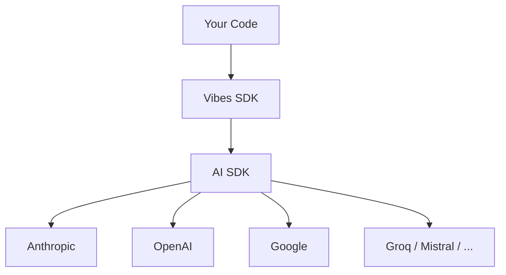

<div style={{ display: 'flex', flexDirection: 'column', alignItems: 'center', gap: '1.5rem', marginBottom: '2rem' }}>
  <div>
    
    
  </div>
  <a href="https://github.com/a7ul/vibes" target="_blank" rel="noopener noreferrer" style={{ display: 'inline-flex', alignItems: 'center', gap: '0.5rem', padding: '0.5rem 1.25rem', borderRadius: '0.5rem', border: '1px solid #e2e8f0', fontWeight: '600', fontSize: '0.95rem', textDecoration: 'none', color: 'inherit' }}>
    ⭐ Star on GitHub
  </a>
</div>

## TypeScript Agent Framework, the Pydantic AI way

Build production-grade AI agents with type-safe tools, dependency injection, structured output, and first-class testing.

```ts
import { Agent } from "@vibesjs/sdk";
import { anthropic } from "@ai-sdk/anthropic";

const agent = new Agent({
  model: anthropic("claude-haiku-4-5-20251001"),
  systemPrompt: "You are a helpful assistant.",
});

const result = await agent.run("What is the capital of France?");
console.log(result.output); // "Paris"
```

## Why Vibes?

1. **Type-safe tools + Dependency injection** - Every tool parameter is validated at runtime with Zod. Carry databases, HTTP clients, and config via `RunContext` through the entire call chain. No `any` types, no global state.
2. **Automatic retries + Cost control** - Vibes retries on validation failure and enforces token budgets and request limits to keep costs in check.
3. **Structured output + Streaming** - Define a Zod schema, get back a typed object or stream typed partial objects to the client as they arrive.
4. **Testing + Evals - the only way to ship AI to production** - Unit-test every agent in CI with `TestModel` and `setAllowModelRequests(false)` (no real API calls). Then go further with typed eval datasets, built-in and LLM-as-judge evaluators, and experiment runners with configurable concurrency. Evals are code - they live in your repo, run in CI, and catch regressions before they reach users.
5. **Model-agnostic** - Switch between Anthropic, OpenAI, Google, Groq, Mistral, Ollama, and 50+ providers by changing one line.
6. **OpenTelemetry observability** - Every run emits OTel spans, events, and token usage metrics. Works with Jaeger, Honeycomb, Datadog, and any OTel-compatible backend.
7. **Durable agents + MCP, AG-UI, A2A** - Run long-lived agents that survive crashes and restarts with Temporal. Connect to MCP servers and build AG-UI and A2A agents out of the box.

## Architecture



## Acknowledgments

Vibes is inspired by [Pydantic AI](https://ai.pydantic.dev/) - the agent framework by Samuel Colvin and the Pydantic team. Pydantic AI showed that agent frameworks can be type-safe, testable, and dependency-injection-friendly without sacrificing simplicity. Vibes borrows its API design, agent loop architecture, and teaching philosophy, adapted for TypeScript.

Vibes uses [Vercel AI SDK](https://sdk.vercel.ai/) for LLM calls, which provides a unified interface to 50+ LLM providers. Without the AI SDK, Vibes would require maintaining its own provider integrations.

See the [Introduction](/introduction) for the full story.

<CardGroup cols={3}>
  <Card title="Introduction" href="/introduction" icon="book-open">
    Learn about Vibes' design philosophy and what inspired it
  </Card>
  <Card title="Install" href="/getting-started/install" icon="download">
    Set up Vibes in under 2 minutes
  </Card>
  <Card title="Hello World" href="/getting-started/hello-world" icon="rocket">
    Build your first agent
  </Card>
</CardGroup>
