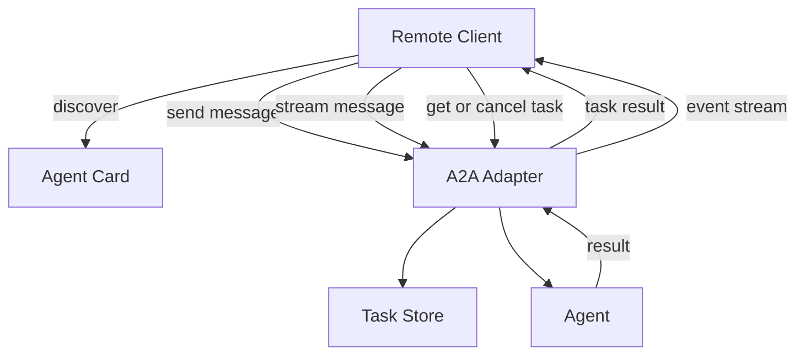

[A2A (Agent-to-Agent)](https://google.github.io/A2A) is Google's open protocol for agent interoperability. It lets agents built on different frameworks - from different vendors - discover and communicate with each other over a standard JSON-RPC HTTP interface. Any A2A-compatible client can find your agent via its `AgentCard` and invoke it without knowing which framework you used.

`A2AAdapter` wraps any Vibes agent and serves it as a fully compliant A2A server.

## Architecture



## Setup

Install `@vibesjs/sdk` and import `A2AAdapter`:

```typescript
import { A2AAdapter, Agent } from "jsr:@vibesjs/sdk";
import { anthropic } from "npm:@ai-sdk/anthropic";

const model = anthropic("claude-opus-4-5");
const agent = new Agent({ model, name: "Research Agent", systemPrompt: "You are a research assistant." });
```

### Constructor

```typescript
const adapter = new A2AAdapter(agent, {
  name: "Research Agent",
  description: "Answers research questions using web search and reasoning.",
  url: "https://my-agent.example.com",
  version: "1.0.0",
  skills: [
    {
      id: "research",
      name: "Research",
      description: "Answer factual questions and summarize information",
    },
  ],
  provider: { organization: "Acme Corp", url: "https://acme.example.com" },
  deps: { db: getDb() },
});
```

`A2AAdapterOptions` fields:

| Option | Type | Default | Description |
|--------|------|---------|-------------|
| `name` | `string` | Agent name | Displayed in AgentCard |
| `description` | `string` | - | Agent description in AgentCard |
| `url` | `string` | `"http://localhost:8000"` | Public URL of this server |
| `version` | `string` | `"1.0.0"` | Agent version string |
| `skills` | `A2AAgentSkill[]` | `[]` | Capabilities list for discovery |
| `provider` | `{ organization, url? }` | - | Organization info |
| `deps` | `TDeps` | - | Static dependencies for every agent run |
| `taskStore` | `TaskStore` | `MemoryTaskStore` | Task persistence backend |

### Deno HTTP server

```typescript
Deno.serve(adapter.handler());
// GET  /.well-known/agent.json  → AgentCard (discovery)
// POST /                        → JSON-RPC (tasks/send, message/stream, etc.)
```

`adapter.handler()` returns a standard Deno HTTP handler. You can also call `adapter.handleRequest(req)` directly if you need to integrate into an existing server.

## AgentCard discovery

Remote agents and clients discover your server by fetching `GET /.well-known/agent.json`. The response is an `AgentCard` object describing your agent's identity and capabilities.

```typescript
// Example AgentCard returned by GET /.well-known/agent.json
{
  "name": "Research Agent",
  "description": "Answers research questions",
  "url": "https://my-agent.example.com",
  "version": "1.0.0",
  "capabilities": {
    "streaming": true,
    "pushNotifications": false,
    "stateTransitionHistory": false
  },
  "skills": [
    {
      "id": "research",
      "name": "Research",
      "description": "Answer factual questions and summarize information"
    }
  ],
  "provider": {
    "organization": "Acme Corp",
    "url": "https://acme.example.com"
  },
  "defaultInputModes": ["text/plain"],
  "defaultOutputModes": ["text/plain"]
}
```

`AgentCard` fields:

| Field | Type | Description |
|-------|------|-------------|
| `name` | `string` | Agent display name |
| `description` | `string \| undefined` | What the agent does |
| `url` | `string` | Base URL of the A2A server |
| `version` | `string` | Agent version |
| `capabilities` | `object` | Supported features (`streaming`, `pushNotifications`, `stateTransitionHistory`) |
| `skills` | `A2AAgentSkill[]` | Array of named capabilities |
| `provider` | `{ organization, url? } \| undefined` | Organization info |
| `defaultInputModes` | `string[]` | MIME types accepted |
| `defaultOutputModes` | `string[]` | MIME types returned |
| `documentationUrl` | `string \| undefined` | Link to docs |
| `iconUrl` | `string \| undefined` | Agent icon URL |

## Task lifecycle

### Synchronous: message/send

Send a message and wait for the full result. The response is an `A2ATask` with all output artifacts.

```typescript
// HTTP request
const response = await fetch("https://my-agent.example.com/", {
  method: "POST",
  headers: { "Content-Type": "application/json" },
  body: JSON.stringify({
    jsonrpc: "2.0",
    method: "message/send",    // also aliased as tasks/send
    id: "req-1",
    params: {
      message: {
        role: "user",
        parts: [{ kind: "text", text: "What are the benefits of Temporal?" }],
      },
    },
  }),
});

const { result } = await response.json();
// result.status.state === "completed"
// result.artifacts[0].parts[0].text === "Temporal provides..."
```

### Streaming: message/stream

Receive incremental updates as the agent processes the request. Returns an SSE stream of events.

```typescript
const response = await fetch("https://my-agent.example.com/", {
  method: "POST",
  headers: { "Content-Type": "application/json" },
  body: JSON.stringify({
    jsonrpc: "2.0",
    method: "message/stream",  // also aliased as tasks/sendSubscribe
    id: "req-2",
    params: {
      message: {
        role: "user",
        parts: [{ kind: "text", text: "Summarize the history of the web." }],
      },
    },
  }),
});

// Read SSE stream
const reader = response.body!.getReader();
const decoder = new TextDecoder();
while (true) {
  const { done, value } = await reader.read();
  if (done) break;
  const line = decoder.decode(value);
  if (line.startsWith("data: ")) {
    const event = JSON.parse(line.slice(6));
    if (event.kind === "artifact-update") {
      process.stdout.write(event.artifact.parts[0].text);
    }
  }
}
```

## Task state machine

Every task progresses through a defined set of states:

```mermaid
stateDiagram-v2
    [*] --> submitted : created
    submitted --> working : started
    working --> completed : success
    working --> failed : error
    working --> canceled : canceled
    working --> input-required : needs clarification
```

`A2ATaskState` values:

| State | Description |
|-------|-------------|
| `submitted` | Task created, not yet processing |
| `working` | Agent is actively processing |
| `completed` | Agent finished, artifacts available |
| `failed` | An error occurred during processing |
| `canceled` | Task was canceled via `tasks/cancel` |
| `input-required` | Agent needs additional user input (not yet fully wired) |

## SSE streaming events

When using `message/stream`, the server emits two event types:

### status-update

Emitted when the task state changes:

```json
{
  "kind": "status-update",
  "taskId": "task-abc123",
  "contextId": "ctx-xyz",
  "status": {
    "state": "working",
    "message": { "role": "agent", "parts": [] }
  },
  "final": false
}
```

The `final: true` flag marks the last event in the stream (state: `completed`, `failed`, or `canceled`).

### artifact-update

Emitted for each chunk of streaming output:

```json
{
  "kind": "artifact-update",
  "taskId": "task-abc123",
  "contextId": "ctx-xyz",
  "artifact": {
    "artifactId": "artifact-1",
    "parts": [{ "kind": "text", "text": "Temporal provides durable..." }],
    "index": 0
  }
}
```

## Other JSON-RPC methods

### tasks/get

Fetch the current state of a task by ID:

```typescript
const response = await fetch("https://my-agent.example.com/", {
  method: "POST",
  headers: { "Content-Type": "application/json" },
  body: JSON.stringify({
    jsonrpc: "2.0",
    method: "tasks/get",
    id: "req-3",
    params: { id: "task-abc123" },
  }),
});
const { result } = await response.json();
console.log(result.status.state); // "completed"
```

### tasks/cancel

Cancel a running task. This signals an abort to the SSE stream - any in-flight `message/stream` response will terminate:

```typescript
await fetch("https://my-agent.example.com/", {
  method: "POST",
  headers: { "Content-Type": "application/json" },
  body: JSON.stringify({
    jsonrpc: "2.0",
    method: "tasks/cancel",
    id: "req-4",
    params: { id: "task-abc123" },
  }),
});
```

## Task store

By default, `A2AAdapter` uses `MemoryTaskStore` - an in-memory implementation that does not persist tasks across process restarts.

```typescript
import { A2AAdapter, MemoryTaskStore } from "jsr:@vibesjs/sdk";

// Default - no need to import MemoryTaskStore for basic usage
const adapter = new A2AAdapter(agent);

// Explicit in-memory store (same as default)
const adapter = new A2AAdapter(agent, {
  taskStore: new MemoryTaskStore(),
});

// Swap for a persistent store in production (implement TaskStore interface):
// const adapter = new A2AAdapter(agent, {
//   taskStore: new RedisTaskStore(redisClient),
// });
```

<Info>
`MemoryTaskStore` is fine for development and stateless serverless deployments. For long-running processes where you need task history across restarts, implement the `TaskStore` interface backed by a database or Redis.
</Info>

## Message parts

A2A messages are composed of parts. Each part has a `kind` discriminant:

### Text part

```typescript
{ kind: "text", text: "What is the capital of France?" }
```

### File part

```typescript
{
  kind: "file",
  file: {
    mimeType: "image/png",
    name: "screenshot.png",
    bytes: "<base64-encoded-bytes>",  // inline bytes
    // OR:
    uri: "https://storage.example.com/screenshot.png",  // remote URL
  }
}
```

### Data part

```typescript
{ kind: "data", data: { key: "value", count: 42 } }
```

## API reference

### A2AAdapterOptions

```typescript
interface A2AAdapterOptions<TDeps> {
  name?: string;
  description?: string;
  url?: string;          // default: "http://localhost:8000"
  version?: string;      // default: "1.0.0"
  skills?: A2AAgentSkill[];
  provider?: { organization: string; url?: string };
  deps?: TDeps;
  taskStore?: TaskStore;  // default: MemoryTaskStore
}
```

### A2AAdapter

| Member | Signature | Description |
|--------|-----------|-------------|
| Constructor | `new A2AAdapter(agent, options?)` | Create the adapter |
| `handler()` | `() => (req: Request) => Promise<Response>` | Returns a Deno HTTP handler |
| `handleRequest(req)` | `(req: Request) => Promise<Response>` | Routes GET `/.well-known/agent.json` and POST `/` |

### A2AAgentSkill

| Field | Type | Description |
|-------|------|-------------|
| `id` | `string` | Unique skill identifier |
| `name` | `string` | Display name |
| `description` | `string \| undefined` | What the skill does |
| `tags` | `string[]` | Optional tags for filtering |
| `examples` | `string[]` | Example inputs |

### JSON-RPC Methods

| Method | Alias | Returns | Description |
|--------|-------|---------|-------------|
| `message/send` | `tasks/send` | `A2ATask` | Synchronous - waits for full result |
| `message/stream` | `tasks/sendSubscribe` | SSE stream | Streaming - emits events as agent processes |
| `tasks/get` | - | `A2ATask` | Fetch task by ID |
| `tasks/cancel` | - | `A2ATask` | Cancel a running task |
