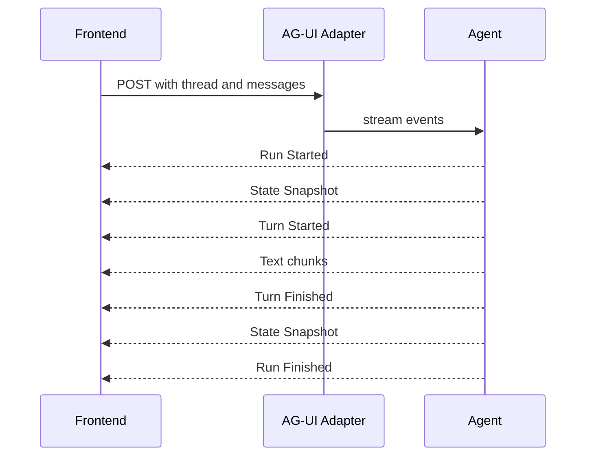
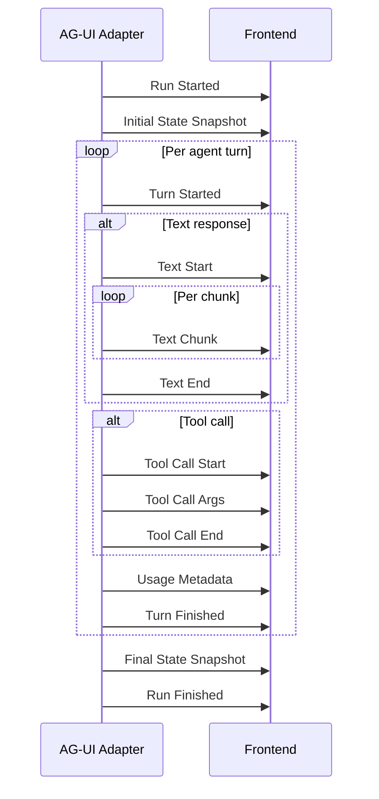

[AG-UI](https://ag-ui.com) is CopilotKit's open protocol for connecting AI agents to user interfaces over Server-Sent Events. `AGUIAdapter` wraps any Vibes agent and serves it as an AG-UI-compatible HTTP endpoint. CopilotKit frontends using `useCoAgent` connect directly to this endpoint.

<Warning>
**Migrating from older docs?** Two API bugs existed in previous versions of this documentation:

1. The `depsFactory` option does **not** exist on `AGUIAdapterOptions`. Use `deps` instead.
2. `handleRequest()` does **not** accept a `Request` object. It accepts an `AGUIRunInput` object. For Deno HTTP servers, use `adapter.handler()` which parses the request body for you.

See the corrected API below.
</Warning>

## Architecture



## Setup

Install `@vibesjs/sdk` and import `AGUIAdapter`:

```typescript
import { Agent, AGUIAdapter } from "npm:@vibesjs/sdk";
import { anthropic } from "npm:@ai-sdk/anthropic";

const model = anthropic("claude-opus-4-5");
const agent = new Agent({ model, systemPrompt: "You are a helpful assistant." });
```

### Constructor

```typescript
const adapter = new AGUIAdapter(agent, {
  deps: myDeps,                         // static deps passed to every agent run
  getState: () => ({ key: "value" }),   // optional state snapshot callback
});
```

`AGUIAdapterOptions` fields:

| Option | Type | Description |
|--------|------|-------------|
| `deps` | `TDeps` | Static dependencies injected into every agent run. Not a factory - computed once at construction. |
| `getState` | `() => Record<string, unknown> \| Promise<Record<string, unknown>>` | Called at run start and end to capture a state snapshot for the frontend |

## Deno HTTP server

One line connects your adapter to a Deno HTTP server:

```typescript
import { Agent, AGUIAdapter } from "npm:@vibesjs/sdk";
import { anthropic } from "npm:@ai-sdk/anthropic";

const model = anthropic("claude-opus-4-5");
const agent = new Agent({ model, systemPrompt: "You are a helpful assistant." });

const adapter = new AGUIAdapter(agent, {
  deps: { db: getDb(), userId: "system" },
  getState: () => ({ sessionActive: true }),
});

// adapter.handler() returns a (req: Request) => Promise<Response> function
Deno.serve(adapter.handler());
```

`adapter.handler()` returns a standard Deno HTTP handler. It parses the JSON body from POST requests into `AGUIRunInput` and calls `handleRequest()`.

## AGUIRunInput

The shape of the input object that `handleRequest()` receives (after `handler()` parses the HTTP body):

```typescript
interface AGUIRunInput {
  threadId: string;                  // identifies the conversation thread
  runId?: string;                    // optional run identifier
  messages: AGUIMessage[];           // conversation history
  state?: Record<string, unknown>;   // frontend state snapshot to pass to the agent
}
```

| Field | Required | Description |
|-------|----------|-------------|
| `threadId` | Yes | Stable identifier for the conversation. Used in `RUN_STARTED` and `RUN_FINISHED` events. |
| `runId` | No | Per-run identifier. Generated automatically if omitted. |
| `messages` | Yes | Full conversation history in AG-UI message format. |
| `state` | No | State snapshot from the frontend, available to the agent via dependencies. |

## Direct handleRequest() usage

Call `handleRequest()` directly when you parse the request body yourself:

```typescript
import type { AGUIRunInput } from "npm:@vibesjs/sdk";

// In your own HTTP handler:
async function myHandler(req: Request): Promise<Response> {
  const body = await req.json() as AGUIRunInput;

  // Validate or transform body here...

  return adapter.handleRequest(body);  // takes AGUIRunInput, not Request
}

Deno.serve(myHandler);
```

## SSE event sequence

Every agent run emits a fixed sequence of SSE events. Understanding the sequence helps you build reliable frontend state machines.



On error, `RUN_ERROR` is emitted instead of `RUN_FINISHED`.

## Multi-turn conversations

Pass the message history from a previous result to continue a conversation across turns:

```typescript
// First turn
const input1: AGUIRunInput = {
  threadId: "thread-123",
  messages: [{ role: "user", content: "What is the capital of France?" }],
};
const response1 = adapter.handleRequest(input1);

// Second turn - include full message history
const input2: AGUIRunInput = {
  threadId: "thread-123",
  messages: [
    { role: "user", content: "What is the capital of France?" },
    { role: "assistant", content: "The capital of France is Paris." },
    { role: "user", content: "What is its population?" },
  ],
};
const response2 = adapter.handleRequest(input2);
```

## State management

Use `getState` to expose a snapshot of server-side state to the frontend on every run. The adapter calls `getState` at the start and end of each run and emits `STATE_SNAPSHOT` events.

```typescript
interface SessionState {
  userId: string;
  credits: number;
  tier: "free" | "pro";
}

const adapter = new AGUIAdapter(agent, {
  deps: { db },
  getState: async (): Promise<SessionState> => {
    const user = await db.getUser(currentUserId);
    return {
      userId: user.id,
      credits: user.credits,
      tier: user.tier,
    };
  },
});
```

The frontend receives the state in `STATE_SNAPSHOT` events and can render it via CopilotKit's `useCoAgentStateRender` hook.

## Event types reference

All 15 event types emitted by `AGUIAdapter`:

| Event Type | When Emitted |
|------------|-------------|
| `RUN_STARTED` | At the beginning of every run (threadId, runId) |
| `RUN_FINISHED` | After the agent completes all turns |
| `RUN_ERROR` | If the agent throws an unhandled error |
| `STATE_SNAPSHOT` | At run start (if state provided), and at run end |
| `STATE_DELTA` | Incremental state update (emitted by frontend protocol) |
| `MESSAGES_SNAPSHOT` | Full messages snapshot (emitted by frontend protocol) |
| `STEP_STARTED` | Before each agent turn (`stepName: "turn-N"`) |
| `STEP_FINISHED` | After each agent turn completes |
| `TEXT_MESSAGE_START` | Before streaming a text response |
| `TEXT_MESSAGE_CONTENT` | Each text chunk (delta) |
| `TEXT_MESSAGE_END` | After the text response is complete |
| `TOOL_CALL_START` | Before a tool call |
| `TOOL_CALL_ARGS` | Tool arguments (emitted as a single JSON chunk) |
| `TOOL_CALL_END` | After tool call completes |
| `RAW` | Usage metadata (token counts) after each step |

## API reference

### AGUIAdapterOptions

```typescript
interface AGUIAdapterOptions<TDeps> {
  deps?: TDeps;
  getState?: () => Record<string, unknown> | Promise<Record<string, unknown>>;
}
```

| Option | Type | Description |
|--------|------|-------------|
| `deps` | `TDeps` | Static dependencies for every agent run |
| `getState` | `() => Record \| Promise<Record>` | State snapshot callback, called at run start and end |

### AGUIAdapter

| Member | Signature | Description |
|--------|-----------|-------------|
| Constructor | `new AGUIAdapter(agent, options?)` | Create the adapter |
| `handleRequest(input)` | `(AGUIRunInput) => Response` | Run the agent and return an SSE `Response`. Input is `AGUIRunInput`, **not** `Request`. |
| `handler()` | `() => (req: Request) => Promise<Response>` | Returns a Deno-compatible HTTP handler that parses the request body and calls `handleRequest` |

### AGUIRunInput

| Field | Type | Required | Description |
|-------|------|----------|-------------|
| `threadId` | `string` | Yes | Conversation thread identifier |
| `runId` | `string` | No | Per-run identifier (auto-generated if omitted) |
| `messages` | `AGUIMessage[]` | Yes | Conversation history |
| `state` | `Record<string, unknown>` | No | Frontend state snapshot |
