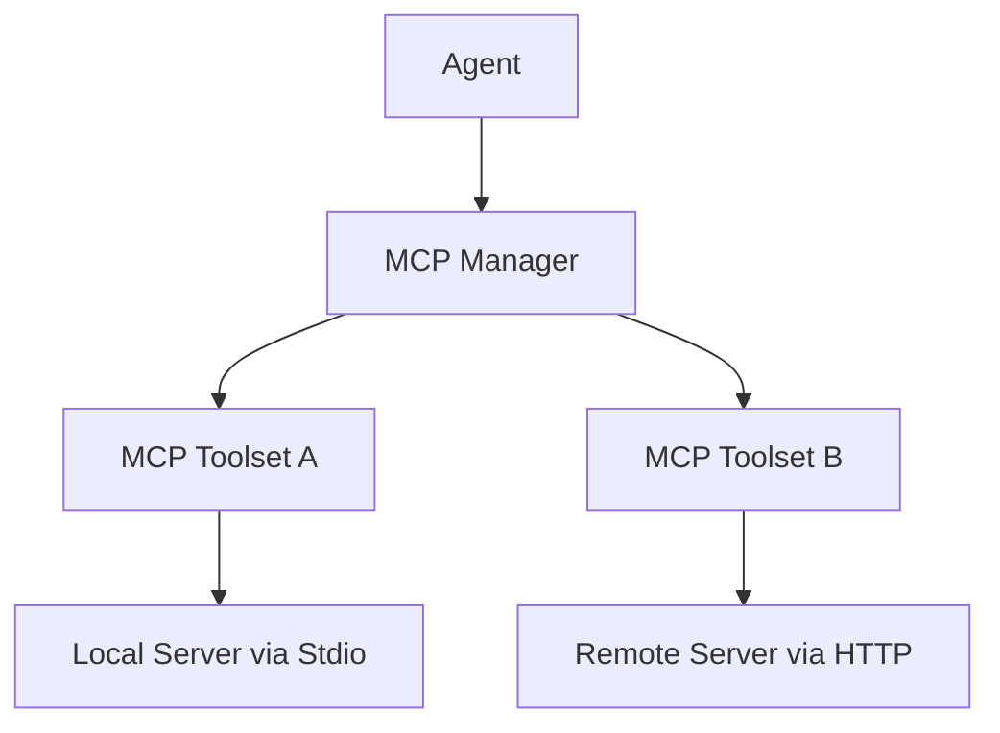

The [Model Context Protocol](https://modelcontextprotocol.io) (MCP) is an open standard that lets AI agents connect to external tool servers. A Vibes agent can consume any MCP-compatible server - local subprocesses, remote HTTP services, or a fleet of both - without writing any protocol code.

## Architecture



`MCPStdioClient` and `MCPHttpClient` both implement the `MCPClient` interface. `MCPToolset` wraps one client and bridges it to the agent's `Toolset` interface. `MCPManager` manages multiple `MCPToolset` instances and is itself a `Toolset` - pass it directly to an agent.

## MCPStdioClient

Use `MCPStdioClient` to launch a local subprocess that speaks MCP over stdin/stdout. This is the standard pattern for tools like `@modelcontextprotocol/server-filesystem`.

```typescript
import { Agent, MCPStdioClient, MCPToolset } from "jsr:@vibesjs/sdk";
import { anthropic } from "npm:@ai-sdk/anthropic";

const model = anthropic("claude-opus-4-5");

const client = new MCPStdioClient({
  command: "npx",
  args: ["-y", "@modelcontextprotocol/server-filesystem", "/tmp"],
});

await client.connect();
const toolset = new MCPToolset(client);
const agent = new Agent({ model, toolsets: [toolset] });

try {
  const result = await agent.run("List files in /tmp");
  console.log(result.output);
} finally {
  await client.disconnect();
}
```

### MCPStdioConfig fields

| Field | Type | Required | Description |
|-------|------|----------|-------------|
| `command` | `string` | Yes | Executable to run (e.g. `"npx"`, `"python"`) |
| `args` | `string[]` | No | Arguments passed to the command |
| `env` | `Record<string, string>` | No | Additional environment variables for the subprocess |

### Constructor

```typescript
new MCPStdioClient(config: MCPStdioConfig, options?: { elicitationCallback? })
```

## MCPHttpClient

Use `MCPHttpClient` to connect to a remote MCP server over HTTP with Server-Sent Events (SSE).

```typescript
import { Agent, MCPHttpClient, MCPToolset } from "jsr:@vibesjs/sdk";

const client = new MCPHttpClient({
  url: "https://search-mcp.example.com/mcp",
  headers: {
    Authorization: `Bearer ${Deno.env.get("MCP_API_KEY")}`,
  },
});

await client.connect();
const toolset = new MCPToolset(client);
const agent = new Agent({ model, toolsets: [toolset] });

try {
  const result = await agent.run("Search for recent news about Deno");
  console.log(result.output);
} finally {
  await client.disconnect();
}
```

### MCPHttpConfig fields

| Field | Type | Required | Description |
|-------|------|----------|-------------|
| `url` | `string` | Yes | Full URL of the MCP HTTP server |
| `headers` | `Record<string, string>` | No | HTTP headers (e.g. `Authorization`) |

### Constructor

```typescript
new MCPHttpClient(config: MCPHttpConfig, options?: { elicitationCallback? })
```

## MCPToolset

`MCPToolset` wraps a single `MCPClient` and adapts it to the agent `Toolset` interface. It adds optional caching so the tool list is not re-fetched on every agent turn.

```typescript
import { MCPToolset } from "jsr:@vibesjs/sdk";

const toolset = new MCPToolset(client, {
  toolCacheTtlMs: 30_000,   // cache tool list for 30 seconds (default: 60,000)
  instructions: true,        // pass server instructions to the agent
});
```

### MCPToolsetOptions

| Option | Type | Default | Description |
|--------|------|---------|-------------|
| `toolCacheTtlMs` | `number` | `60000` | How long to cache the tool list (ms). Set to `0` to disable. |
| `instructions` | `boolean` | `false` | Include server instructions in the agent context |

### Methods

| Method | Description |
|--------|-------------|
| `tools(ctx)` | Returns the (possibly cached) tool list |
| `getServerInstructions()` | Returns the server's instruction text, if any |
| `invalidateCache()` | Forces the next `tools()` call to re-fetch from the server |

## MCPManager - multiple servers

When your agent needs tools from more than one MCP server, use `MCPManager`. It collects multiple `MCPToolset` instances, connects them all at once, and merges their tool lists. Because `MCPManager` implements `Toolset`, you pass it directly to the agent - no extra wrapping needed.

<Warning>
**Common mistakes to avoid:**

- Do NOT pass arguments to the constructor: `new MCPManager()` takes no arguments.
- Do NOT call `manager.connectAll()` - the method is `manager.connect()`.
- Do NOT call `manager.toolset()` - the manager itself is the toolset; pass `manager` directly.
- Do NOT use `MCPManager.fromConfig()` - use the standalone `createManagerFromConfig(path)` function instead.
</Warning>

```typescript
import {
  Agent,
  MCPHttpClient,
  MCPManager,
  MCPStdioClient,
} from "jsr:@vibesjs/sdk";
import { anthropic } from "npm:@ai-sdk/anthropic";

const model = anthropic("claude-opus-4-5");

const manager = new MCPManager();

manager.addServer(
  new MCPStdioClient({ command: "npx", args: ["-y", "@mcp/filesystem", "/data"] }),
  { name: "filesystem" },
);
manager.addServer(
  new MCPHttpClient({ url: "https://search-mcp.example.com/mcp" }),
  { name: "search" },
);

await manager.connect();

const agent = new Agent({ model, toolsets: [manager] });

try {
  const result = await agent.run("Search for docs and list /data/results");
  console.log(result.output);
} finally {
  await manager.disconnect();
}
```

`addServer()` returns `this`, so you can chain calls:

```typescript
const manager = new MCPManager()
  .addServer(new MCPStdioClient({ command: "npx", args: ["-y", "@mcp/filesystem", "/data"] }), { name: "filesystem" })
  .addServer(new MCPHttpClient({ url: "https://search-mcp.example.com/mcp" }), { name: "search" });
```

### MCPManager methods

| Method / Property | Description |
|-------------------|-------------|
| `addServer(client, opts?)` | Register a client. `opts` accepts `MCPToolsetOptions & { name?: string }`. Returns `this`. |
| `connect()` | Connects all registered servers in parallel |
| `disconnect()` | Disconnects all servers. Throws `AggregateError` if any fail. |
| `tools(ctx)` | Returns merged tool list (last-wins on name collision across servers) |
| `getServerInstructions()` | Aggregated instructions, prefixed with `[name]` if server was named |
| `serverCount` | Number of registered servers |

## Config file loading

For production deployments, store your MCP server configuration in a JSON file and load it at startup using `createManagerFromConfig`. This returns a fully connected `MCPManager` ready to pass to your agent.

```typescript
import { Agent, createManagerFromConfig } from "jsr:@vibesjs/sdk";

const manager = await createManagerFromConfig("./mcp.config.json");
const agent = new Agent({ model, toolsets: [manager] });

try {
  const result = await agent.run("List available tools and describe them.");
  console.log(result.output);
} finally {
  await manager.disconnect();
}
```

Two JSON formats are supported:

<CodeGroup>

```json Array format
[
  { "type": "stdio", "command": "npx", "args": ["-y", "@mcp/filesystem", "/data"] },
  { "type": "http", "url": "https://search-mcp.example.com" }
]
```

```json Claude Desktop format
{
  "mcpServers": {
    "filesystem": {
      "command": "npx",
      "args": ["-y", "@mcp/filesystem", "/data"]
    },
    "remote": {
      "url": "https://mcp.example.com",
      "headers": { "Authorization": "Bearer ${API_KEY}" }
    }
  }
}
```

</CodeGroup>

Environment variable interpolation (`${ENV_VAR}`) is supported in both formats.

For custom setup, use `loadMCPConfig` and `createClientsFromConfig` individually:

```typescript
import {
  createClientsFromConfig,
  loadMCPConfig,
  MCPManager,
} from "jsr:@vibesjs/sdk";

const configs = await loadMCPConfig("./mcp.config.json");
const clients = createClientsFromConfig(configs); // creates clients but does NOT connect

const manager = new MCPManager();
for (const client of clients) {
  manager.addServer(client);
}
await manager.connect();
```

## Lifecycle: connect and disconnect

<Warning>
Always call `connect()` before using a client or manager. Failing to connect will cause tool calls to fail silently or throw.

Always call `disconnect()` in a `finally` block to clean up subprocess-based servers. Without it, orphaned MCP server processes will continue running after your application exits.
</Warning>

```typescript
const manager = new MCPManager();
manager.addServer(new MCPStdioClient({ command: "npx", args: ["-y", "my-server"] }));

// Must connect before use
await manager.connect();

try {
  const agent = new Agent({ model, toolsets: [manager] });
  const result = await agent.run("Do something useful");
  console.log(result.output);
} finally {
  // Always disconnect in a finally block
  await manager.disconnect();
}
```

## API reference

### MCPStdioClient

| Member | Signature | Description |
|--------|-----------|-------------|
| Constructor | `new MCPStdioClient(config, options?)` | Create a stdio client |
| `connect()` | `() => Promise<void>` | Launch subprocess and establish connection |
| `disconnect()` | `() => Promise<void>` | Terminate subprocess |
| `listTools()` | `() => Promise<MCPTool[]>` | Fetch available tools from server |
| `callTool(name, args)` | `(string, unknown) => Promise<unknown>` | Invoke a tool on the server |
| `getServerInstructions()` | `() => Promise<string \| undefined>` | Retrieve server instruction text |

### MCPHttpClient

Same interface as `MCPStdioClient`. Constructor takes `MCPHttpConfig` instead of `MCPStdioConfig`.

### MCPToolset

| Member | Signature | Description |
|--------|-----------|-------------|
| Constructor | `new MCPToolset(client, options?)` | Wrap a client as an agent toolset |
| `tools(ctx)` | `(RunContext) => Promise<Tool[]>` | Return cached tool list |
| `getServerInstructions()` | `() => Promise<string \| undefined>` | Return server instructions |
| `invalidateCache()` | `() => void` | Force tool list re-fetch on next call |

### MCPManager

| Member | Signature | Description |
|--------|-----------|-------------|
| Constructor | `new MCPManager()` | Create empty manager (no arguments) |
| `addServer(client, opts?)` | `(MCPClient, opts?) => this` | Register a server (chainable) |
| `connect()` | `() => Promise<void>` | Connect all registered servers in parallel |
| `disconnect()` | `() => Promise<void>` | Disconnect all; throws `AggregateError` on partial failure |
| `tools(ctx)` | `(RunContext) => Promise<Tool[]>` | Merged tool list from all servers |
| `getServerInstructions()` | `() => Promise<string \| undefined>` | Aggregated instructions |
| `serverCount` | `number` | Number of registered servers |

### createManagerFromConfig

| Member | Signature | Description |
|--------|-----------|-------------|
| `createManagerFromConfig(path)` | `(string) => Promise<MCPManager>` | Load config, create clients, connect, return ready manager |
