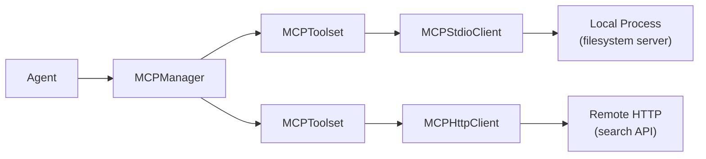

When you want your agent to read files, query databases, call external APIs, or use specialized computation, you have two choices: write a `tool()` for each operation, or connect to an MCP server. [MCP](https://modelcontextprotocol.io) — the Model Context Protocol — is an open standard that lets any MCP-compatible server expose tools to any MCP-compatible client. Connect once and your agent gets access to every tool that server offers, without writing a single tool definition.

The practical benefit is ecosystem leverage. There are MCP servers for the filesystem, GitHub, Postgres, Puppeteer, Slack, and hundreds more. Instead of writing a GitHub integration from scratch, you connect to a GitHub MCP server and your agent can search repos, read files, and open issues immediately.

Vibes implements the MCP client side in four classes: `MCPStdioClient`, `MCPHttpClient`, `MCPToolset`, and `MCPManager`. Each has a single job and they compose cleanly.

## How the pieces fit together



- **`MCPStdioClient`** — spawns a local subprocess and speaks MCP over stdin/stdout
- **`MCPHttpClient`** — connects to a remote MCP server over HTTP with streaming
- **`MCPToolset`** — wraps one client and bridges it to the `Toolset` interface agents expect
- **`MCPManager`** — manages multiple toolsets, connects them all at once, merges their tool lists

Each layer adds one thing. You can use them individually or let `MCPManager` handle the whole stack.

## Connecting to a local server with MCPStdioClient

The most common pattern is connecting to a local MCP server that runs as a subprocess. The filesystem MCP server is a good first example: you point it at a directory and your agent can list, read, and write files.

```typescript
import { Agent, MCPStdioClient, MCPToolset } from "jsr:@vibesjs/sdk";
import { anthropic } from "npm:@ai-sdk/anthropic";

const model = anthropic("claude-sonnet-4-6");

// (1) Describe the process to launch — MCPStdioClient handles spawning it
const client = new MCPStdioClient({
  command: "npx",
  args: ["-y", "@modelcontextprotocol/server-filesystem", "/tmp/my-project"],
});

await client.connect(); // (2) Spawn the process and complete MCP handshake

// (3) MCPToolset fetches the tool list from the server and caches it
const toolset = new MCPToolset(client);

const agent = new Agent({
  model,
  systemPrompt: "You are a file management assistant.",
  toolsets: [toolset], // (4) Pass the toolset, not individual tools
});

try {
  const result = await agent.run("List the files in the project and summarize what each one does.");
  console.log(result.output);
  // "The project contains 4 files:
  //  - main.ts: Entry point, sets up the HTTP server
  //  - agent.ts: Core agent configuration with search and summarize tools
  //  - config.json: Environment configuration for development and production
  //  - README.md: Setup instructions and API documentation"
} finally {
  await client.disconnect(); // (5) Always disconnect to terminate the subprocess
}
```

**(1)** `MCPStdioConfig` takes `command`, optional `args`, and optional `env`. The filesystem server accepts a path as its last argument — tools from that server will be scoped to that directory.<br/>
**(2)** `connect()` spawns the subprocess and completes the MCP initialization handshake. Always `await` it before doing anything else.<br/>
**(3)** `MCPToolset` discovers available tools lazily on first use and caches them for 60 seconds by default. You never call `listTools()` manually — the toolset handles that inside the agent's turn loop.<br/>
**(4)** Pass `toolsets` not `tools`. The toolset interface allows dynamic per-turn tool discovery with caching, which raw `tools` arrays don't support.<br/>
**(5)** `disconnect()` terminates the subprocess. Without this, the process keeps running after your code exits. Always call it in a `finally` block.

<Warning>
Always call `connect()` before using a client, and always call `disconnect()` in a `finally` block. Forgetting `connect()` causes all tool calls to throw immediately. Forgetting `disconnect()` leaks subprocess resources.
</Warning>

### MCPStdioClient options

`MCPStdioClient` accepts a config and an optional options object:

```typescript
new MCPStdioClient(
  {
    command: "npx",             // required: executable to run
    args: ["-y", "my-server"],  // optional: CLI arguments
    env: { API_KEY: "..." },    // optional: extra env vars for the subprocess
  },
  {
    elicitationCallback: async (request) => {
      // optional: handle MCP elicitation requests (server asking for user input)
      console.log("Server asks:", request.message);
      return { confirmed: true };
    },
  },
);
```

The `env` field merges additional variables into the subprocess environment — it does not replace the inherited environment.

## Connecting to a remote server with MCPHttpClient

`MCPHttpClient` connects to an MCP server running over HTTP with Server-Sent Events. The API is identical to `MCPStdioClient` — you swap the config shape and the transport handles the rest.

```typescript
import { Agent, MCPHttpClient, MCPToolset } from "jsr:@vibesjs/sdk";
import { anthropic } from "npm:@ai-sdk/anthropic";

const model = anthropic("claude-sonnet-4-6");

// (1) Point at the HTTP endpoint
const client = new MCPHttpClient({
  url: "https://search-mcp.example.com/mcp",
  headers: {
    Authorization: `Bearer ${Deno.env.get("MCP_API_KEY")}`,   // (2)
  },
});

await client.connect();
const toolset = new MCPToolset(client);

const agent = new Agent({
  model,
  systemPrompt: "You are a research assistant with access to a search API.",
  toolsets: [toolset],
});

try {
  const result = await agent.run("Find recent news about TypeScript 5.5 features.");
  console.log(result.output);
  // "TypeScript 5.5 introduced several significant features including
  //  inferred type predicates, which allow TypeScript to automatically
  //  infer the return type of type guard functions..."
} finally {
  await client.disconnect();
}
```

**(1)** `MCPHttpConfig` takes a `url` and optional `headers`.<br/>
**(2)** Authentication headers go here — `Authorization`, API keys, session tokens. Headers are sent with every request to the server.

`MCPHttpClient` uses the MCP Streamable HTTP transport, which supports both standard HTTP/2 and SSE-based streaming responses.

## MCPToolset — controlling caching and instructions

`MCPToolset` is the bridge between a raw `MCPClient` and the `Toolset` interface. Its two configuration options control performance and agent context:

```typescript
import { MCPToolset } from "jsr:@vibesjs/sdk";

const toolset = new MCPToolset(client, {
  toolCacheTtlMs: 30_000,  // (1) cache tool list for 30 seconds instead of 60
  instructions: true,       // (2) include the server's instruction text (default: true)
});
```

**(1)** The server's tool list doesn't change often, so the toolset caches it. For servers whose tools change frequently (dynamic tool registration), lower the TTL or call `toolset.invalidateCache()` to force a re-fetch on the next turn.<br/>
**(2)** Some MCP servers provide an instruction text during initialization — guidance the server author wrote for the AI agent consuming it. When `instructions: true` (the default), this text is available via `toolset.getServerInstructions()` and can be appended to your system prompt if desired.

```typescript
// Manually include server instructions in the system prompt
const toolset = new MCPToolset(client);
await client.connect();

const serverInstructions = toolset.getServerInstructions();

const agent = new Agent({
  model,
  systemPrompt: [
    "You are a file management assistant.",
    serverInstructions,     // includes server's own guidance, if any
  ].filter(Boolean).join("\n\n"),
  toolsets: [toolset],
});
```

## MCPManager — multiple servers at once

Most real applications need more than one MCP server. You might want the filesystem server for reading local files and a remote search server for web queries simultaneously. `MCPManager` handles this: register servers, call `connect()` once, and the manager connects all of them in parallel and merges their tool lists.

```typescript
import { Agent, MCPHttpClient, MCPManager, MCPStdioClient } from "jsr:@vibesjs/sdk";
import { anthropic } from "npm:@ai-sdk/anthropic";

const model = anthropic("claude-sonnet-4-6");

// (1) Create an empty manager — no constructor arguments
const manager = new MCPManager();

// (2) Register servers with addServer() — returns this for chaining
manager
  .addServer(
    new MCPStdioClient({ command: "npx", args: ["-y", "@modelcontextprotocol/server-filesystem", "/data"] }),
    { name: "filesystem" },  // (3) optional name for instruction aggregation
  )
  .addServer(
    new MCPHttpClient({
      url: "https://search-mcp.example.com/mcp",
      headers: { Authorization: `Bearer ${Deno.env.get("SEARCH_KEY")}` },
    }),
    { name: "search" },
  );

// (4) Connect all servers in parallel with a single call
await manager.connect();

// (5) Pass the manager directly as a toolset — it is a Toolset
const agent = new Agent({
  model,
  systemPrompt:
    "You have access to a local filesystem and a web search API. " +
    "Use them together to answer questions with both local context and current information.",
  toolsets: [manager],
});

try {
  const result = await agent.run(
    "Search for recent Deno documentation updates and then save a summary to /data/deno-notes.md",
  );
  console.log(result.output);
  // "I found recent updates to the Deno documentation and saved a summary.
  //  The key changes include: new Web API implementations, updated FFI docs,
  //  and the Deno KV documentation was expanded significantly..."
} finally {
  // (6) Disconnect all servers in parallel
  await manager.disconnect();
}
```

**(1)** `new MCPManager()` takes no arguments.<br/>
**(2)** `addServer()` returns `this` so you can chain calls. The second argument takes any `MCPToolsetOptions` plus an optional `name`.<br/>
**(3)** Naming a server matters when servers provide instruction text — named servers prefix their instructions with `[name]` in the aggregated output.<br/>
**(4)** `manager.connect()` calls `connect()` on every registered client in parallel. One call to connect everything.<br/>
**(5)** `MCPManager` implements the `Toolset` interface directly. Pass it to `toolsets` the same way you'd pass a `MCPToolset`.<br/>
**(6)** `manager.disconnect()` disconnects all servers in parallel. If any fail to disconnect, all failures are collected and thrown as a single `AggregateError` — so you see all problems, not just the first.

<Warning>
Do NOT use `new MCPManager(client)` — the constructor takes no arguments. Register clients with `addServer()` after construction.

Do NOT call `manager.connectAll()` — the method is `manager.connect()`.

Do NOT wrap the manager in another `MCPToolset` — pass `manager` directly to `toolsets`. The manager is already a `Toolset`.
</Warning>

### Handling tool name collisions

If two servers expose a tool with the same name, the last registered server wins. Control this by ordering `addServer()` calls from lowest to highest priority, or prefix server names when registering:

```typescript
const manager = new MCPManager();
manager.addServer(primaryClient);   // lower priority
manager.addServer(overrideClient);  // higher priority — its tools win on collision
```

## Declarative config with MCPConfig

For production deployments, store your MCP server list in a JSON config file and load it at startup. `createManagerFromConfig` reads the file, creates clients, connects them, and returns a ready `MCPManager`:

```typescript
import { Agent, createManagerFromConfig } from "jsr:@vibesjs/sdk";
import { anthropic } from "npm:@ai-sdk/anthropic";

const model = anthropic("claude-sonnet-4-6");

// (1) One function call: load → create clients → connect → return manager
const manager = await createManagerFromConfig("./mcp.config.json");

const agent = new Agent({ model, toolsets: [manager] });

try {
  const result = await agent.run("What tools do you have available?");
  console.log(result.output);
} finally {
  await manager.disconnect();
}
```

**(1)** `createManagerFromConfig` is a convenience wrapper around `loadMCPConfig` + `createClientsFromConfig` + `MCPManager`. The returned manager is already connected.

### Config file format

Two JSON formats are supported. The simpler **array format**:

```json
[
  {
    "type": "stdio",
    "name": "filesystem",
    "command": "npx",
    "args": ["-y", "@modelcontextprotocol/server-filesystem", "/data"]
  },
  {
    "type": "http",
    "name": "search",
    "url": "https://search-mcp.example.com/mcp",
    "headers": { "Authorization": "Bearer ${SEARCH_API_KEY}" }
  }
]
```

The **Claude Desktop format** (if you want to share config with Claude Desktop):

```json
{
  "mcpServers": {
    "filesystem": {
      "command": "npx",
      "args": ["-y", "@modelcontextprotocol/server-filesystem", "/data"]
    },
    "search": {
      "url": "https://search-mcp.example.com/mcp",
      "headers": { "Authorization": "Bearer ${SEARCH_API_KEY}" }
    }
  }
}
```

<Note>
String values in the config support `${ENV_VAR}` interpolation. Variables are read from `Deno.env` at load time. If a referenced variable is not set, `loadMCPConfig` throws immediately with a clear error message — your app fails fast at startup rather than silently at tool call time.
</Note>

### Lower-level config loading

If you need more control over the setup process, use `loadMCPConfig` and `createClientsFromConfig` individually:

```typescript
import {
  createClientsFromConfig,
  loadMCPConfig,
  MCPManager,
  MCPToolset,
} from "jsr:@vibesjs/sdk";

// Load and parse config file
const configs = await loadMCPConfig("./mcp.config.json");

// Create client instances (not yet connected)
const clients = createClientsFromConfig(configs);

// Set up manager manually — useful when you need custom MCPToolsetOptions per server
const manager = new MCPManager();
for (let i = 0; i < clients.length; i++) {
  manager.addServer(clients[i], {
    name: configs[i].name,
    toolCacheTtlMs: 5_000,   // custom cache TTL for every server
  });
}

await manager.connect();
```

## Connection lifecycle

Connecting and disconnecting correctly is the most error-prone part of MCP integration. The pattern is always the same:

```typescript
// 1. Create client(s)
const manager = new MCPManager();
manager.addServer(new MCPStdioClient({ command: "npx", args: ["-y", "my-server"] }));

// 2. Connect before any use
await manager.connect();

// 3. Run inside a try/finally
try {
  const agent = new Agent({ model, toolsets: [manager] });
  const result = await agent.run("Do something useful");
  console.log(result.output);
} finally {
  // 4. Always disconnect — even if agent.run() throws
  await manager.disconnect();
}
```

For long-running applications (HTTP servers, CLI tools that stay alive), connect at startup and disconnect in a shutdown handler:

```typescript
const manager = new MCPManager();
manager.addServer(new MCPStdioClient({ command: "npx", args: ["-y", "my-server"] }));
await manager.connect();

// Register cleanup for process signals
const cleanup = () => manager.disconnect().then(() => Deno.exit(0));
Deno.addSignalListener("SIGINT", cleanup);
Deno.addSignalListener("SIGTERM", cleanup);

// Now your agent can handle requests indefinitely
const agent = new Agent({ model, toolsets: [manager] });
```

---

<CardGroup cols={2}>
  <Card title="MCP Server" icon="server" href="/integrations/mcp-server">
    Expose your Vibes agent as an MCP server
  </Card>
  <Card title="Toolsets" icon="layers" href="/concepts/toolsets">
    Compose and conditionally expose groups of tools
  </Card>
</CardGroup>
